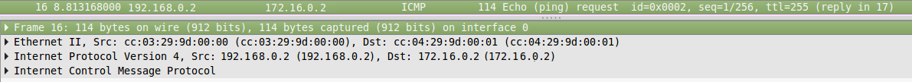
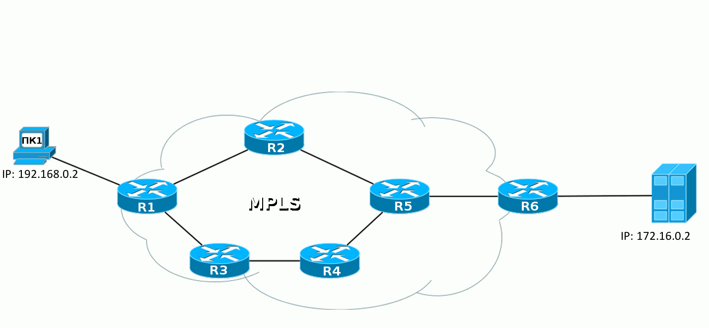

# Передача трафика в сети MPLS

Сам по себе чистый MPLS применяется редко. Выигрыш в производительности незначительный, потому что разница между тем, чтобы заглянуть в FIB/поменять некоторые поля в заголовках и посмотреть таблицу меток/поменять метку в заголовке MPLS не такая уж большая. Используются, конечно, его приложения, перечисленные выше.  
Но в этой статье мы всё-таки сконцентрируемся именно на чистом MPLS, чтобы понимать как это работает в самом базовом виде.  
[Ниже мы рассмотрим](03.-label_distribution/01.-protocols/01.-mpls_bgp.md) также одно применение чистого MPLS.

Несмотря на то, что MPLS не привязывается к типу сети, на которой он будет работать, в наше время он живёт в симбиозе только с IP. То есть сама сеть строится поверх IP, но переносить при этом она может данные многих других протоколов.  
Но давайте уже перейдём к сути, и сначала я хочу сказать, что **MPLS не заменяет IP-маршрутизацию**, а работает поверх неё.

Чтобы быть более конкретным, я возьму такую сеть.

Сейчас она в полностью рабочем состоянии, но без всяких намёков на MPLS. То есть R1, например, видит R6 и может пинговать его Loopback.  
ПК1 посылает ICMP-запрос на сервер 172.16.0.2. ICMP-запрос — это IP-пакет. На R1 согласно базовым принципам пакет уходит через интерфейс FE0/0 на R2 — так сказала Таблица Маршрутизации.  
R2 после получения пакета проверяет адрес назначения, просматривает свою FIB, видит следующий маршрутизатор и отправляет пакет в интерфейс FE0/0.  
И этот процесс повторяется раз за разом. Каждый маршрутизатор самостоятельно решает судьбу пакета.

Вот так совершенно привычно выглядит дамп трафика:

Что происходит, если мы активируем MPLS? Вот сразу же, в ту же секунду мир меняется. После этого на маршрутизаторах заполняются таблицы меток и строятся многочисленные LSP.

И теперь тот же путь будет проделан немного иначе.

Когда IP-пакет от ПК1 попадает в сеть MPLS первый маршрутизатор навешивает метку, дальше этот пакет идёт к точке назначения, а каждый следующий маршрутизатор меняет одну метку на другую. При выходе из сети MPLS метка снимается и дальше передаётся уже чистый IP-пакет, каким он был в самом начале.

Это основной принцип MPLS — маршрутизаторы коммутируют пакеты по меткам, не заглядывая внутрь пакета MPLS. Первый — добавляет, последний — удаляет.

Давайте рассмотрим шаг за шагом передачу пакета данных от ПК1 до узла назначения:

**1.** ПК1 — обычный компьютер — отправляет обычный пакет на удалённый сервер.

**2.** Пакет доходит до R1. Он добавляет метку 18. Она вставляется между заголовком IP и Ethernet.  
Эту информацию он может взять из FIB:

По FIB видно, что пакет с адресатом **6.6.6.6** нужно снабдить меткой **18** и отправить в интерфейс **FE0/0**.  
Собственно это он и делает: добавляет заголовок и прописывает в него 18:

**3.** R2 получает этот пакет, в заголовке Ethernet видит, что это MPLS-пакет \(Ethertype 8847\), считывает метку и обращается к своей таблице меток:

Читаем по буквам: если пакет MPLS пришёл с меткой 18, её нужно поменять на 20 и отправить пакет в интерфейс FE0/0.

**4.** R5 совершает аналогичные действия — видит, что пришёл пакет с меткой 20, её нужно поменять на 0 и отправить в FE1/0. Без всякого обращения к таблице маршрутизации.

**5.** R6, получив пакет MPLS, видит в своей таблице, что теперь метку надо снять. А, сняв её, видит уже, что адресат пакета — 172.16.0.2 — это Directly Connected сеть. Дальше пакет передаётся обычным образом по таблице маршрутизации уже безо всяких меток.

**То есть целиком процесс выглядит так:**

Пока, вроде, всё просто, пусть и непонятно зачем.

Сейчас домены IGP и MPLS совпадают и MPLS только обещает нам в дальнейшем какие-то плюшки: L2VPN, L3VPN, MPLS TE.  
Но, на самом деле, даже базовый MPLS дает нам преимущества, если мы вспомним, что мы провайдер.  
Как провайдер, мы ведь не используем протоколы IGP для маршрутизации между AS. Для этого мы используем BGP. И именно в связке с BGP станут понятны преимущества MPLS.  
Рассмотрим нашу сеть в связке с соседними AS:

Из выпуска о BGP мы знаем, что **на каждом** маршрутизаторе в нашей AS должен быть настроен BGP. Иначе мы не сможем передавать трафик соседних AS и наших клиентов, через нашу AS. Каждый маршрутизатор должен знать все маршруты.

Но это было до MPLS!  
Когда в нашей сети настроен MPLS, нам больше не обязательно настраивать BGP на каждом маршрутизаторе в сети. Достаточно настроить его только на пограничных маршрутизаторах в AS, на тех, которые подключены к другим клиентам или провайдерам.

Но это не все хорошие новости. Кроме того, что BGP теперь можно не настраивать на каждом маршрутизаторе в AS, маршрутизаторам также не нужно создавать метку для каждого префикса BGP. Достаточно знать как добраться до IP-адреса, который указан как next-hop. То есть, если сессия BGP настроена между Loopback0 R1 и Loopback0 R6, то в таблице меток ничего не изменится, даже если каждый из них передает по BGP сотни тысяч маршрутов:

Например, маршрутизатору R1 по BGP от маршрутизатора R6 пришло несколько маршрутов:

Посмотрим как будут обрабатываться пакеты, которые идут в сеть 100.0.0.0/16:

В выводе выше видно, что пакетам будет добавляться метка 27.  
И, если посмотреть в таблицу меток, то там нет меток для маршрутов, которые известны по BGP, но есть метка 27 и она соответствует 6.6.6.6/32. А это именно тот адрес, который мы видели в маршрутах, которые пришли по BGP от R6:

Пример настройки вы можете найти [ниже](03.-label_distribution/01.-protocols/01.-mpls_bgp.md).

Мы немного забежали вперед, но теперь, когда стало понятнее какие преимущества дает даже базовый MPLS, мы можем окунуться в понятийный аппарат в мире MPLS.

