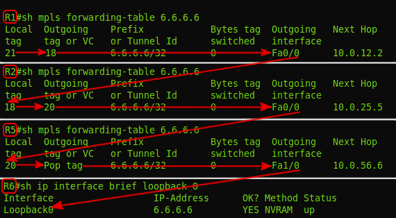

# Терминология

**Label** — метка — значение от 0 до 1 048 575. На основе неё LSR принимает решение, что с пакетом делать: какую новую метку повешать, куда его передать.  
Является частью заголовка MPLS.

**Label Stack** — стек меток. Каждый пакет может нести одну, две, три, да хоть 10 меток — одну над другой. Решение о том, что делать с пакетом принимается на основе верхней метки. Каждый слой играет какую-то свою роль.  
Например, при передаче пакета используется транспортная метка, то есть метка, организующая транзит от первого до последнего маршрутизатора MPLS.  
Другие могут нести информацию о том, что данный пакет принадлежит определённому VPN.  
В этом выпуске метка всегда будет только одна — больше пока не нужно.

**Push Label** — операция добавления метки к пакету данных — совершается в самом начале — на первом маршрутизаторе в сети MPLS \(в нашем примере — R1\).

**Swap Label** — операция замены метки — происходит на промежуточных маршрутизаторах в сети MPLS — узел получает пакет с одной меткой, меняет её и отправляет с другой \(R2, R5\).

**Pop Label** — операция удаления метки — выполняется последним маршрутизатором — узел получает пакет MPLS и убирает **верхнюю** метку перед передачей его дальше \(R6\).

> На самом деле метка может добавляться и удаляться где угодно внутри сети MPLS.  
> Всё зависит от конкретных сервисов. Правильнее будет сказать, что метка добавляется первым маршрутизатором пути \(LSP\), а удаляется последним.  
> Но в этой статье для простоты мы будем говорить о границах сети MPLS.  
> Кроме того, удаление верхней метки ещё не означает, что остался чистый IP-пакет, если речь идёт о стеке меток. То есть если над пакетом с тремя метками совершили операцию Pop Label, то меток осталось две и дальше он по-прежнему обрабатывается, как MPLS. А в нашем примере была одна, а после не останется ни одной — и это уже дело IP.

**LSR —** _**Label Switch Router**_ — это любой маршрутизатор в сети MPLS. Называется он так, потому что выполняет какие-то операции с метками. В нашем примере это все узлы: R1, R2, R3, R4, R5, R6.  
LSR делится на 3 типа:  
**Intermediate LSR** — промежуточный маршрутизатор MPLS — он выполняет операцию Swap Label \(R2, R5\).  
**Ingress LSR** — «входной», первый маршрутизатор MPLS — он выполняет операцию Push Label \(R1\).  
**Egress LSR** — «выходной», последний маршрутизатор MPLS — он выполняет операцию Pop Label \(R6\).  
**LER —** _**Label Edge Router**_ — это маршрутизатор на границе сети MPLS.  
В частности Ingress LSR и Egress LSR являются граничными, а значит они тоже LER.

**LSP —** _**Label Switched Path**_ — путь переключения меток. Это однонаправленный канал от Ingress LSR до Egress LSR, то есть путь, по которому фактически пройдёт пакет через MPLS-сеть. Иными словами — это последовательность LSR.  
Важно понимать, что LSP **на самом деле** однонаправленный. Это означает, что, во-первых, трафик по нему передаётся только в одном направлении, во-вторых, если существует «туда», не обязательно существует «обратно», в-третьих, «обратно» не обязательно идёт по тому же пути, что «туда». Ну, это как туннельные интерфейсы в GRE.

Как выглядит LSP?

Да, вот так непрезентабельно.  
Это компилированный вывод с четырёх LSR — R1, R2, R5, R6. То есть на LSR вы не увидите законченной последовательности узлов от входа до выхода, по типу атрибута AS-PATH в BGP. Здесь каждый узел знает только входную и выходную метки. Но LSP при этом существует.

Это похоже немного на IP-маршрутизацию. Несмотря на то, что существует путь от точки А до точки Б, таблица маршрутизации знает только следующий узел, куда надо отправлять трафик. Но разница в том, что LSR не принимает решение о каждом пакете на основе адреса назначения — путь определён заранее.

И одно из самых важный понятий, с которым необходимо разобраться — **FEC —** _**Forwarding Equivalence Class**_. Мне оно почему-то давалось очень тяжело, хотя по сути — всё просто. FEC — это классы трафика. В простейшем случае идентификатором класса является адресный префикс назначения \(грубо говоря, IP-адрес или подсеть назначения\).  
Например, есть потоки трафика от разных клиентов и разных приложений, которые идут все на один адрес — все эти потоки принадлежат одному классу — одному FEC — используют один LSP.  
Если мы возьмём другие потоки от других клиентов и приложений на другой адрес назначения — это будет соответственно другой класс и другой LSP.

> В теории помимо адреса назначения FEC может учитывать, например, метки QoS, адрес источника, идентификатор VPN или тип приложений. Важно понимать тут, что пакеты одного FEC не обязаны следовать на один и тот же адрес назначения. И в то же время, если даже и два пакета следуют в одно место, не обязательно они будут принадлежать одному FEC.  
>   
> Я поясню для чего всё это нужно. Дело в том, что для каждого FEC выбирается свой LSP — свой путь через сеть MPLS. И тогда, например, для WEB-сёрфинга вы устанавливаете приоритет [QoS BE](http://lookmeup.linkmeup.ru/#term509) — это будет один FEC — а для VoIP — [EF](http://lookmeup.linkmeup.ru/#term508) — другой FEC. И далее можно указать, что для FEC BE LSP должен идти широким, но долгим и негарантированным путём, а для FEC EF — можно узким, но быстрым.  
>   
> К сожалению или к счастью, но сейчас в качестве FEC может выступать только IP-префикс. Такие вещи, как маркировка QoS не рассматриваются.

Если вы обратите внимание на таблицу меток, FEC там присутствует, поскольку параметры замены меток определяются как раз таки на основе FEC, но делается это только в первый момент времени — когда эти метки распределяются. Когда же по LSP бежит реальный трафик, никто, кроме Ingress LSR, уже не смотрит на него — только метки и интерфейсы. Всю работу по определению FEC и в какой LSP отправить трафик берёт на себя Ingress LSR — получив чистый пакет, он его анализирует, проверяет какому классу тот принадлежит и навешивает соответствующую метку. Пакеты разных FEC получат разные метки и будут отправлены в соответствующие интерфейсы.  
Пакеты одного FEC получают одинаковые метки.

То есть промежуточные LSR — это молотилки, которые для всего транзитного трафика только и делают, что переключают метки. А всю интеллектуальную работу выполняют Ingress LSR.

**LIB —** _**Label Information Base**_ — таблица меток. Аналог таблицы маршрутизации \(RIB\) в IP. В ней указано для каждой входной метки, что делать с пакетом — поменять метку или снять её и в какой интерфейс отправить.  
**LFIB —** _**Label Forwarding Information Base**_ — по аналогии с FIB — это база меток, к которой обращается сетевой процессор. При получении нового пакета нет нужды обращаться к CPU и делать lookup в таблицу меток — всё уже под рукой.

Одна из первоначальных идей MPLS — максимально разнести Control Plane и Data Plane — ушла в небытие.  
Разработчикам хотелось, чтобы при передаче пакета через маршрутизатор не было никакого анализа — просто прочитал метку, поменял на другую, передал в нужный интерфейс.  
Чтобы добиться этого, как раз и было два разнесённых процесса — относительно долгое построение пути \(Control Plane\) и быстрая передача по этому пути трафика \(Data Plane\)

Но с появлением дешёвых чипов \(ASIC, FPGA\) и механизма FIB обычная IP-передача тоже стала быстрой и простой.  
Для маршрутизатора без разницы, куда смотреть при передаче пакета — в FIB или в LFIB.  
А вот что, несомненно, важно и полезно — так это, что безразличие MPLS к тому, что передаётся под его заголовком — IP, Ethernet, ATM. Не нужно городить GRE или какие-то другие до боли в суставах неудобные VPN. Но об этом ещё поговорим.

