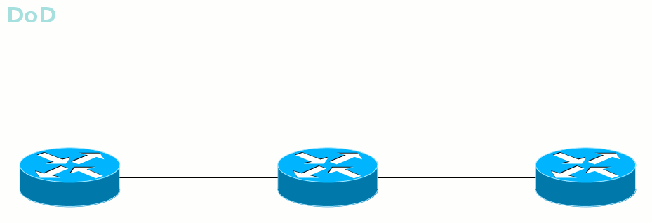

# DU против DoD

_**Во-первых**_, маршрутизатор может распространять метки всем своим соседям сразу же и без лишних вопросов, а может выдавать по запросу от вышестоящих \(мы помним, да, какое направление называется Upstream?\)  
Первый режим называется _\*\*DU — \_Downstream Unsolicited_\*\*\_. Как только LSR узнаёт про FEC, он рассылает всем своим MPLS-соседям метки для этого FEC.  
Выглядит это примерно так:

Все LSR узнают обо всех FEC по всем возможным путям. Сначала соответствие FEC-метка расходится по всей сети от соседа к соседу, почти как это происходит с сообщениями [BootStrap](http://lookmeup.linkmeup.ru/#term302) в PIM SM. А потом каждый LSR выбирает только тот, который пришёл по лучшему пути, и его использует для LSP — точно так же работает [Reverse Path Forwarding](http://lookmeup.linkmeup.ru/#term332) в том же [PIM SM](https://linkmeup.ru/blog/129.html#PIM-SM).

Быстро, просто, понятно, хотя и не всегда нужно, чтобы все знали обо всём.

Второй режим — _\*\*DoD — \_Downstream-on-Demand_\*\*\_. LSR знает FEC, у него есть соседи, но пока они не спросят, какая для данного FEC метка, LSR сохраняет молчание.

Этот способ удобен, когда к LSP предъявляются какие-то требования, например, по ширине полосы. Зачем слать метку просто так, если она тут же будет отброшена? Лучше вышестоящий LSR запросит у нижестоящего: мне нужна от тебя метка для данного FEC — а тот: «ок, на».

Режим выделения меток специфичен для интерфейса и определяется в момент установки соединения. В сети могут быть использованы оба способа, но на одной линии, соседи должны договориться только об одном конкретном.

