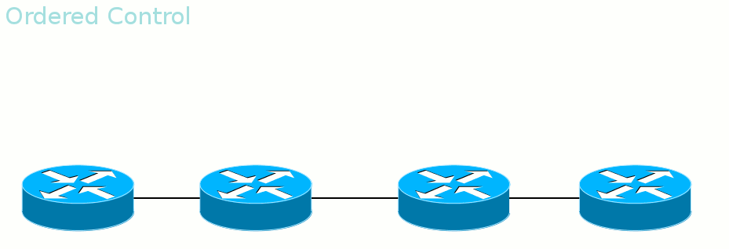
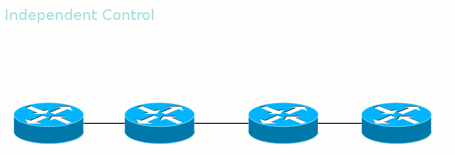

# Ordered Control против Independent Control

**Ordered Control против Independent Control**

_**Во-вторых**_, LSR может дожидаться, когда со стороны Egress LER придёт метка данного FEC, прежде чем рассказывать вышестоящим соседям. А может разослать метки для FEC, как только узнал о нём.

Первый режим называется _**Ordered Control**_

Гарантирует, что к моменту передачи данных весь путь вплоть до выходного LER будет построен.

Второй режим — _**Independent Control**_.

То есть метки передаются неупорядоченно. Удобен тем, что трафик можно начинать передавать ещё до того, как весь путь построен. Этим же и опасен.

