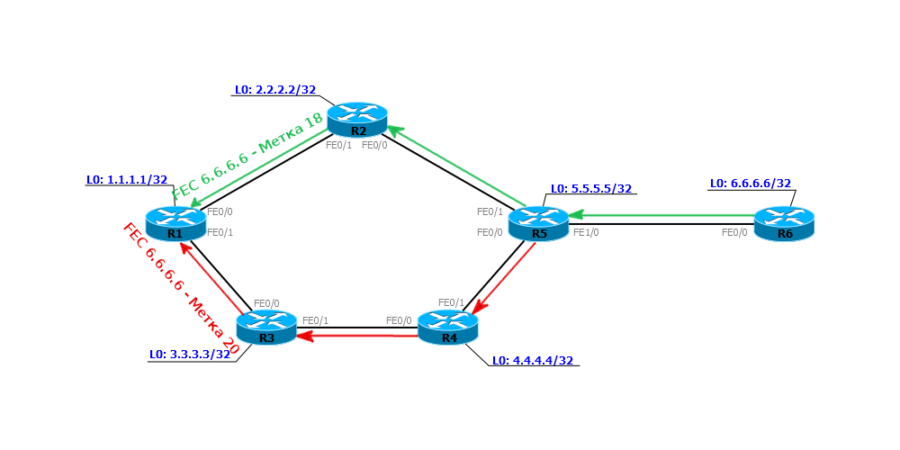

# Liberal Label Retention Mode против Conservative Label Retention Mode

**Liberal Label Retention Mode против Conservative Label Retention Mode**

_**В-третьих**_, важно, как LSR обращается с переданными ему метками.  
Например, в такой ситуации, должен ли R1 хранить хранить информацию о метке 20, полученной от соседа R3, который не является лучшим способом добраться до R6?

А это определяется режимом удержания меток.  
_**Liberal Label Retention Mode**_ — метки сохраняются. В случае, когда R3 станет следующим шагом \(например, проблемы с основным путём\), трафик будет перенаправлен скорее, потому что метка уже есть. То есть скорость реакции выше, но велико и количество использованных меток.  
_**Conservative Label Retention Mode**_ — лишняя метка отбрасывается сразу, как она получена. Это позволяет сократить количество используемых меток, но и MPLS среагирует медленнее в случае аварии.

