#### Практика LDP

Останемся верными сети linkmeup.


Запущен OSPF, маршрутизаторы видят Loopback'и друг друга, MPLS выключен.

[Файл начальной конфигурации.](https://docs.google.com/document/d/1YZUNAu3NmdXyTOt118jjxRrA-p61kUVcpkf6yS-WHxQ/pub)

Для включения MPLS глобально, необходимо дать две команды:

```text
R1(config)#ip cef
R1(config)#mpls ip
```

Первая — это уже стандарт де факто и де юре почти на любом сетевом оборудовании — она запускает механизм CEF на маршрутизаторе, вторая стартует MPLS и LDP глобально \(тоже может быть дана по умолчанию\).

Router ID \(а в более общей \(нецисковской\) терминологии LSR ID\) в MPLS выбирается незамысловато:

1. Самый большой адрес Loopback-интерфейсов
2. Если их нет — самый большой IP-адрес, настроенный на маршрутизаторе.

Естественно, не стоит доверять автоматике — настроим LSR ID вручную:

```text
R1(config)# mpls ldp router-id Loopback0 force
```

Если не добавлять ключевое слово **«force»**, Router ID изменится только при переустановлении LDP-сессии. **«Force»** заставляет маршрутизатор сменить Router ID насильно и при необходимости \(если тот поменялся\) переустанавливает соединение LDP.

Далее на нужных интерфейсах даём команду **mpls ip**:

```text
R1(config)#interface FastEthernet 0/0
R1(config-if)#mpls ip
R1(config)#interface FastEthernet 0/1
R1(config-if)#mpls ip
```

Cisco здесь опять использует свой принцип ленивого инженера — минимум усилий со стороны персонала. Команда **mpls ip** включает на интерфейсе LDP одновременно с MPLS, желаем мы этого или нет. Точно так же команда **ip pim sparse-mode** включает IGMP на интерфейсе, как я описывал это в статье про [мультикаст](https://linkmeup.ru/blog/129.html).  
После активации LDP маршрутизатор начинает прощупывать почву по UDP:

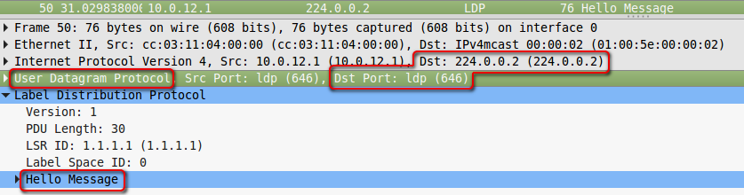  
Проверяки посылаются на мультикастовый адрес 224.0.0.2.

Теперь повторяем все те же манипуляции на R2

```text
R2(config)#ip cef
R2(config)#mpls ip
R2(config)# mpls ldp router-id Loopback0 force
R2(config)#interface FastEthernet 0/0
R2(config-if)#mpls ip
R2(config)#interface FastEthernet 0/1
R2(config-if)#mpls ip
```

и наслаждаемся результатом.  
R2 тоже ищет соседей.

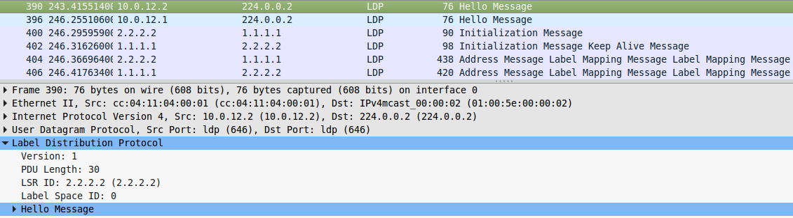

Узнали друг про друга, и R2 поднимает LDP-сессию:

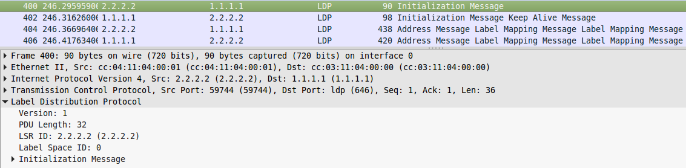

> **Если интересно, как они устанавливают TCP-соединение**
>
> 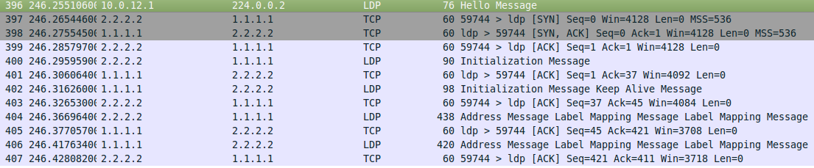

Теперь они соседи, что легко проверяется командой **show mpls ldp neighbor**.

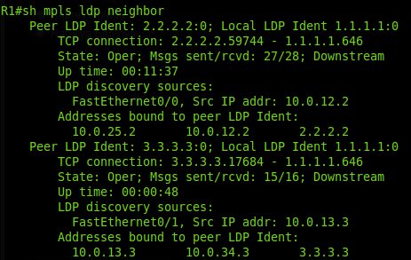

И далее один другому рассказывает о своих соответствиях FEC-метка:

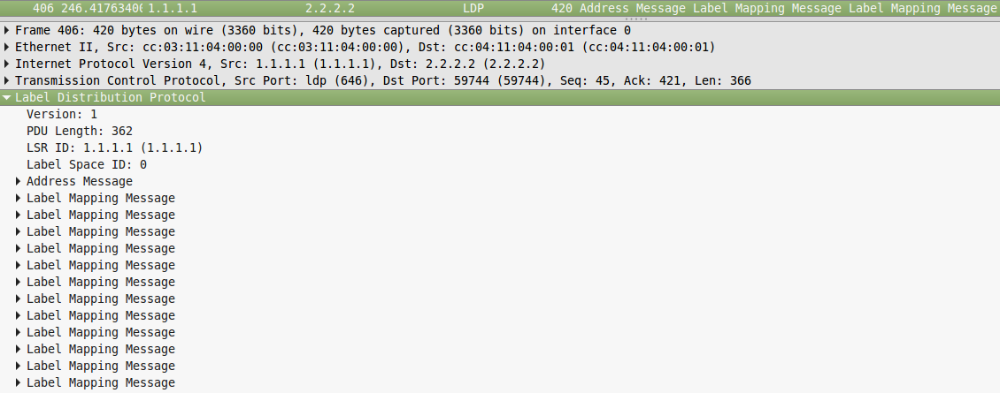

> Вот тут уже видно детали — R1 передаёт сразу 12 FEC — по одной для каждой записи в своей таблице маршрутизации. В такой же ситуации Huawei или Juniper передали бы только шесть FEC — адреса Loopback-интерфейсов, потому что они по умолчанию считают за FEC только /32-префиксы.  
> В этом плане Cisco очень неэкономно относится к ресурсу меток.  
> Впрочем, это поведение можно изменить на любом оборудовании. В нашем случае может помочь команда **mpls ldp advertise-labels**.  
>   
> Но как так, спросите вы? Разве достаточно иметь метки только в Loopback?  
>   
> Если вспомнить о том, что мы рассматривали вначале статьи, что BGP префиксы не получают свои метки, и что метки нужны только для next-hop, то становится понятно, что меток для Loopback вполне хватит.  
>   
> Для того чтобы добраться до других сетей внутри нашей AS, нам достаточно IGP.
>
> [**Задача № 3**](https://linkmeup.ru/blog/157.html)  
>   
> Если в Cisco по умолчанию анонсируются метки для всех сетей \(кроме полученных по BGP\), то в Juniper, по умолчанию анонсируется только loopback.  
>   
> 
>
> Все маршрутизаторы, кроме R5, это маршрутизаторы Juniper.  
>   
> Для приведенной ниже конфигурации маршрутизатора R5, донастроить его так, чтобы настройки маршрутизатора Cisco, соответствовало настройкам по умолчанию в Juniper.
>
> **Конфигурация R5**
>
> ```text
> ip cef
> !
> interface Loopback0
> ip address 5.5.5.5 255.255.255.255
> ip router isis
> !
> interface FastEthernet0/0
> description to R4
> ip address 10.0.45.5 255.255.255.0
> ip router isis
> mpls ip
> !
> interface FastEthernet0/1
> description to R2
> ip address 10.0.25.5 255.255.255.0
> ip router isis
> mpls ip
> !
> interface FastEthernet1/0
> description to R6
> ip address 10.0.56.5 255.255.255.0
> ip router isis
> mpls ip
> !
> router isis
> net 10.0000.0000.0005.00
> !
> mpls ldp router-id Loopback0 force
> ```
>
> Подробности задачи [тут](https://linkmeup.ru/blog/157.html).

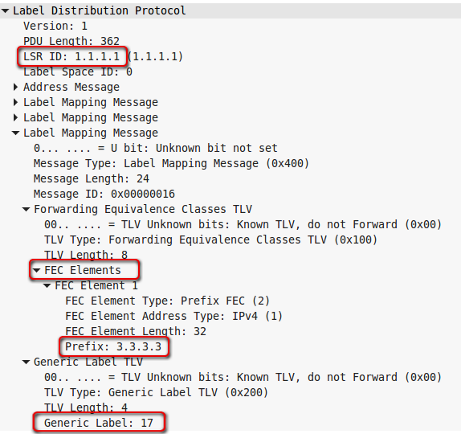

Итак, **R1** сообщает R2, что если тот хочет отправлять трафик для **FEC 3.3.3.3**, он должен использовать метку **17**.

Обратите внимание, что LDP на R3 ещё не поднят, то есть R1 анонсировал метку для FEC 3.3.3.3, не дождавшись её от R5, это говорит о том, что используется Independent Control.  
А то, что не было явного запроса от R2 на данный FEC, говорит о том, что режим — Downstrean unsolicited.  
Далее узлы будут продолжать мониторить новых соседей с помощью LDP Hello поверх UDP и обмениваться LDP Keepalive уже адресно:

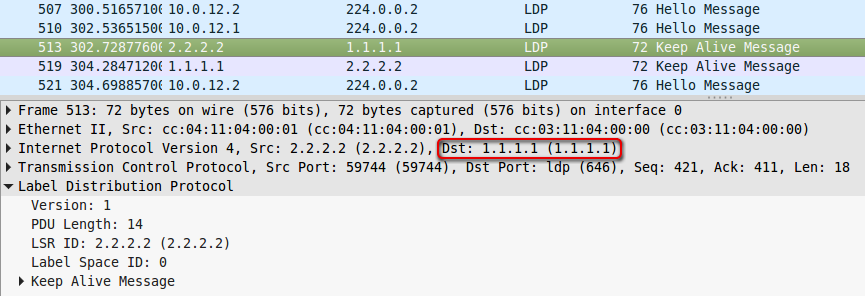

Теперь с помощью команды **show mpls forwarding-table** можно посмотреть, какие метки назначились для каждого FEC:

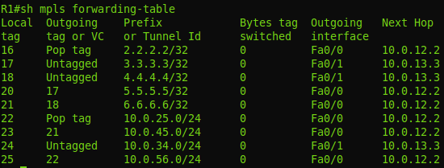

На второй строчке уже рассмотренный FEC 3.3.3.3, и мы видим, что для него локальная метка — 17, то есть R1 всем будет говорить, что для FEC 3.3.3.3 метка 17, что и было в дампе.  
А вот outgoing tag или выходная метка — _Untagged_ — это означает что пакеты пересылаются **чистым** IP \(без каких-либо оговорок на стек\). Причём _Untagged_ означает, что между R1 и R3 вообще никакого MPLS нет — правильно: мы же его не включили на R3.  
А вот с R2 \(первая строка\) ситуация другая. Локальная метка 16 — это то, что R1 будет передавать всем. А выходная — _Pop tag_. То есть при передаче пакета на R2 R1 должен снять метку. В нашем случае это означает, что будет передан чистый IP \(но в более общем случае снимается только верхняя метка\). В чём же разница с FEC 3.3.3.3? А разница в том, что между R1 и R2 есть MPLS и то, что мы видим — это тот самый PHP — Penultimate Hop Popping. Пакет, адресованный 2.2.2.2 всё равно будет обработан на R2, поэтому чтобы не плодить сущности сверх необходимого R1 услужливо снимет метку.

И тут возникает интересный вопрос, откуда R1 знает, что он предпоследний из могикан? Ведь мы же выше говорили, что LDP не пользуется протоколами маршрутизации, поэтому он и знать не может, что адрес 2.2.2.2 настроен на непосредственно подключенном R2 — он видит только то, что 2.2.2.2 доступен через 10.0.12.2.

На этот вопрос нам поможет ответить дамп трафика между R2 и R1:

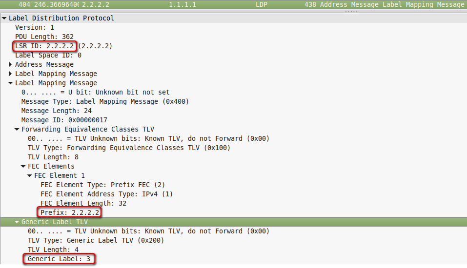

И тут всплывает та самая метка 3 — implicit-null. Таким образом R2 сообщает, что R1 при передаче пакета MPLS должен снять верхнюю метку.  
Хочу здесь повториться — R1 не передаст пакет с меткой 3 на R2 — он передаст его без верхней метки. В нашем случае это будет просто IP-пакет. А метка 3 никогда не появляется в заголовке MPLS.  
И вот эта метка 3 отображается в таблице коммутации MPLS, как _Pop Tag_.

Для узлов R5 и R6 у нас есть метки, хотя на них MPLS не включали, но это лишь потому, что маршрут до них лежит через R2, а R2 сгенерировал соответствие FEC-метка для них. В таком случае пакеты на R6 будут идти **с** заголовком MPLS между R1 и R2 и **без него** дальше.  
Заметьте, если бы использовался Ordered Control, R2 не смог бы отправить метку для R5 и R6, и пакеты ходили бы только по IP.

Предлагаю закончить настройку MPLS+LDP на всех элементах нашей скромной сети. Процессы там ничем не отличаются — те же Neighbor Discovery, Initialization, обмен метками, PHP.

Шаблон настройки следующий:

```text
mpls ip
!
interface Loopback0
ip address 1.1.1.1 255.255.255.255
ip router isis
!
interface FastEthernet0/0
description to R2
ip address 10.0.12.1 255.255.255.0
ip router isis
mpls ip
!
interface FastEthernet0/1
description to R3
ip address 10.0.13.1 255.255.255.0
ip router isis
mpls ip
!
router isis
net 10.0000.0000.0001.00
! 
mpls ldp router-id Loopback0 force
```

[Файл конфигурации LDP.](https://docs.google.com/document/d/1QgtI-U-EGp0no_vshOW5pDvO8pZoGb3eHenlt_qaPTU/pub)

И после этого посмотрим повторно на таблицу коммутации MPLS на **R1**:

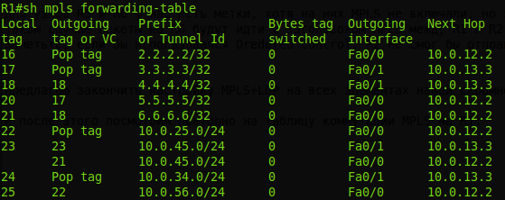

Для всех FEC уже появились метки.  
Давайте пройдёмся по LSP от R1 до R6 и посмотрим как меняются метки по пути

**R2:**  
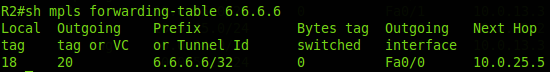

**R5:**  
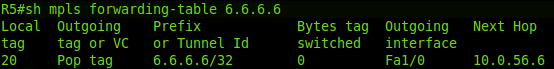

Значит  
1. Когда **R1** получает пакет MPLS с меткой **21**, он должен передать его в интерфейс **Fa0/0** и поменять метку на **18**.  
2. Когда **R2** получает пакет MPLS с меткой **18**, он должен передать его в интерфейс **Fa0/0** и поменять метку на **20**.  
3. Когда **R5** получает пакет MPLS с меткой **20**, он должен передать его в интерфейс **Fa1/0** и снять метку — **PHP**.

В этом случае LSR даже не задумываются о том, чтобы глянуть что-то в таблице маршрутизации или в ip cef — они просто жонглируют метками.

Таблица коммутации, которую мы уже смотрели командой **show mpls forwarding table** — это **LFIB** \(_**Lable Forwarding Information Base**_\) — почти что прописная истина для передачи данных — это Data Plane. Но что же там с Control Plane? Вряд ли LDP знает столько же? Наверняка у него ещё есть козыри в рукаве?  
Так и есть:

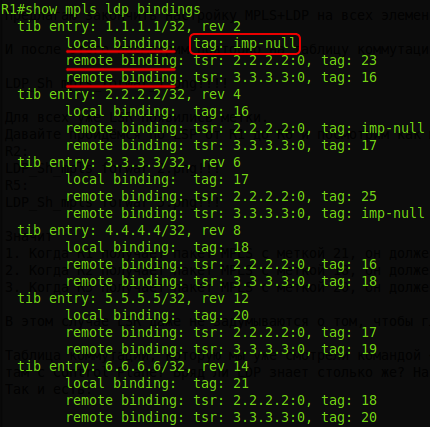

Для каждого FEC мы тут видим информацию о различных метках:  
_local binding_ — что этот LSR передаёт соседям  
_remote binding_ — что этот LSR получил от соседей.

На иллюстрации выше вы можете видеть слово «tib». **TIB — это** _**Tag Information Base**_, которая правильно называется Label Information Base — LIB.  
Это пережиток почившего в бозе [TDP](http://lookmeup.linkmeup.ru/#term510) — прародителя LDP.

Обратите внимание, что везде по 2 remote binding — это два пути получения меток. Например, до R2 можно добрать от R1 напрямую, а можно через R3-R4-R5-R2.  
То есть, понимаете да? Мало того, что он из каждой записи в таблице маршрутизации делает FEC, так этот негодяй ещё и Liberal Retention Mode использует для удержания меток.  
Давайте подытожим: по умолчанию LDP в Cisco работает в следующих режимах:

* DU
* Independent Control
* Liberal Retention Mode
* В качестве FEC выбираются все записи в таблице маршрутизации

Короче говоря, щедроты его не знают границ.

Есть ещё команда **show mpls ip binding**. Она показывает нечто похожее и позволяет кроме того быстро узнать, какой путь сейчас активен, то есть как построен LSP:

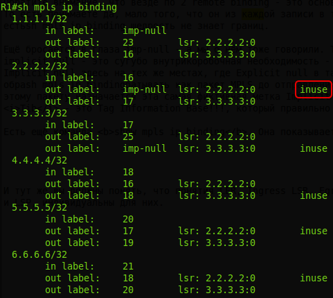

И последний, пожалуй, вопрос, который возникает в связи со всеми этими LSP — когда маршрутизатор сам является Ingress LSR, как он понимает, что нужно делать с пакетами, как выбрать LSP?  
А для этого вот и придётся заглянуть в IP CEF. Вообще именно на Ingress LSR ложится всё бремя обработки пакета, определения FEC и назначения правильных меток.

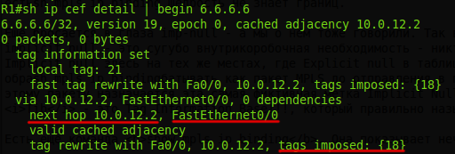

Тут вам и Next Hop и выходной интерфейс и выходная метка

И тут уже вы должны заметить, что в LDP понятия LER, Ingress LSR, Egress LSR — это не роль каких-то конкретных узлов или характеристика местоположения узла в сети. Они неотделимы от FEC и LSP, индивидуальны для них. То есть для каждого конкретного FEC есть один или несколько Egress LSR и множество Ingress LSR \(как правило, все маршрутизаторы\), до которых ведут LSP.  
Даже скажем так, понятия LER возникают когда мы говорим о конкретном LSP, тогда мы можем сказать, кто является Ingress, кто Egress.
