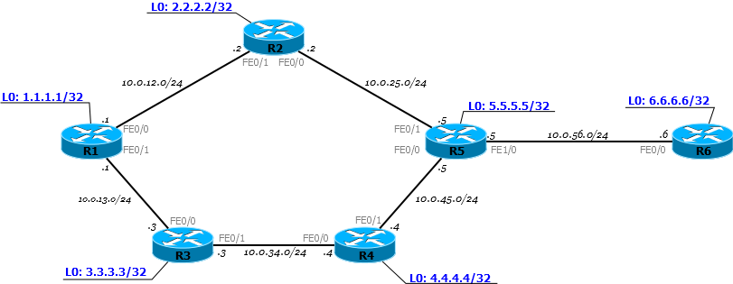
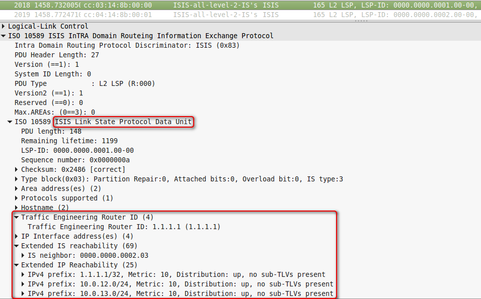
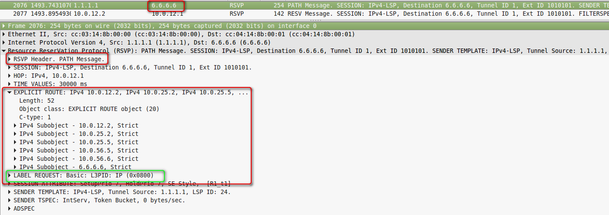
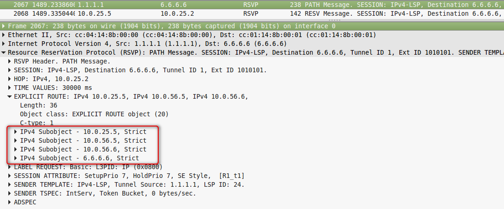
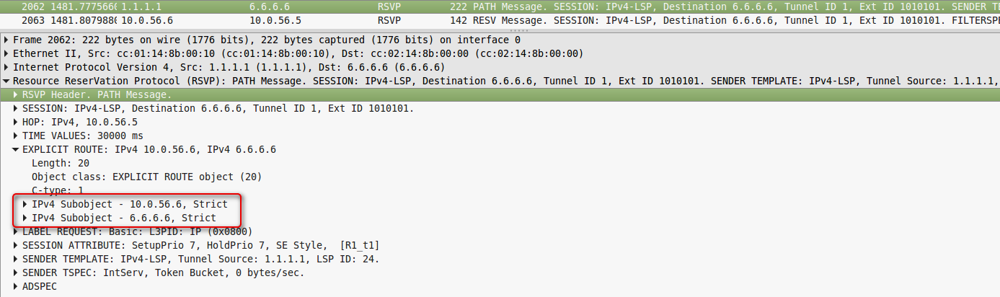
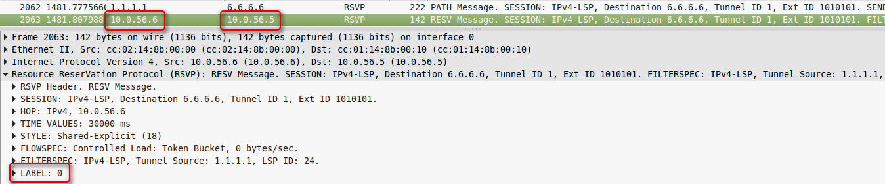
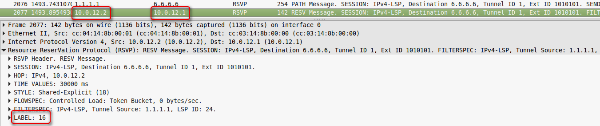
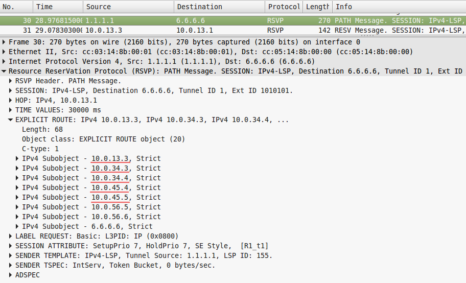
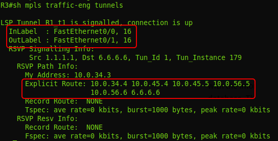

# Практика

## Практика RSVP TE



Команда **mpls ip** была нам нужна для работы LDP. Теперь в ней больше нет нужды — удаляем её и начинаем с [чистого листа](https://docs.google.com/document/d/1YZUNAu3NmdXyTOt118jjxRrA-p61kUVcpkf6yS-WHxQ/pub).  
Теперь нам понадобится **mpls traffic-eng tunnels**. Она глобально включает поддержку TE-туннелей и собственно RSVP TE:

```text
R1(config)#mpls traffic-eng tunnels
```

Также необходимо включить то же самое на интерфейсах:

```text
R1(config)# interface FastEthernet 0/0
R1(config-if)# mpls traffic-eng tunnels 
R1(config)# interface FastEthernet 0/1
R1(config-if)# mpls traffic-eng tunnels
```

Пока ничего не происходит. RSVP молчит.

Сейчас мы расширим IGP на передачу данных TE. В своём примере мы используем ISIS:

```text
R1(config)#router isis 
R1(config-router)# metric-style wide
R1(config-router)# mpls traffic-eng router-id Loopback0
R1(config-router)# mpls traffic-eng level-2
```

Включить режим расширенных меток — обязательно, иначе TE не заработает.  
Задать LSR-ID, как мы это делали и в LDP,  
Необходимо задать конкретный уровень ISIS, иначе, TE не заработает.

> **Если вдруг вы используете OSPF**
>
> R1\(config-router\)\# mpls traffic-eng area 0  
> R1\(config-router\)\# mpls traffic-eng router-id Loopback0

Эти шаги нужно повторить на других маршрутизаторах.

Сразу после этого ISIS начинает обмениваться информацией о TE:



Как видите передаётся информация о LSR-ID, расширенная информация о соседях \(которые поддерживают TE\), расширенная информация о интерфейсах.

На этом этапе сформирована TED.

Саму топологию вы можете посмотреть в ISIS: **\#show isis database verbose**

RSVP пока молчит.

Теперь настроим TE-туннель.

```text
R1(config)# interface Tunnel1
R1(config-if)# ip unnumbered Loopback0
R1(config-if)# tunnel destination 6.6.6.6
R1(config-if)# tunnel mode mpls traffic-eng
R1(config-if)# tunnel mpls traffic-eng path-option 10 dynamic
```

Туннельные интерфейсы — вещь очень универсальная на маршрутизаторах. Они могут использоваться для L2TP, GRE, IPIP и, как видите, для MPLS TE.  
**ip unnumbered Loopback0** означает, что отправной точкой туннеля должен быть адрес интерфейса Loopback0.  
**tunnel destination 6.6.6.6** — универсальная для туннельных интерфейсов команда, определяет точку терминации, окончания туннеля.  
**tunnel mode mpls traffic-eng** — задаёт тип. Именно здесь и определяется алгоритм работы туннеля, как его строить.  
**tunnel mpls traffic-eng path-option 10 dynamic** — эта команда позволяет CSPF построить путь динамически, без задания промежуточных узлов.

Если до этого вы всё сделали правильно, то туннельный интерфейс должен подняться:

```text
%LINEPROTO-5-UPDOWN: Line protocol on Interface Tunnel1, changed state to up
```

Что при этом произошло?  
**R1 отправил Path.**

  
_Дамп снят на линии R1-R2._

Нас в нём интересуют адрес назначения, объекты ERO и Label Request.  
**Адрес назначения** — 6.6.6.6, как и настроили в туннеле.  
**Explicit Route:**  
10.0.12.2 **-&gt;** 10.0.25.2 **-&gt;** 10.0.25.5 **-&gt;** 10.0.56.5 **-&gt;** 10.0.56.6.  
То есть в нём прописан линковый адрес выходного интерфейса и линковый же адрес следующего узла. Каждый LSR таким образом точно знает, в какой интерфейс нужно отправить Path.  
В данном ERO нет 10.0.12.1, потому что R1 уже удалил его перед отправкой.  
Факт наличия **Label Request** говорит о том, что LSR должен выделить метку для данного FEC.  
При этом он никак не отвечает на этот Path **пока** — он посылает обновлённый дальше.  
_Resv ниже посылается после того, как пришёл Resv от нижестоящего LSR._

То же самое происходит на R5:

  
_Дамп снят на линии R2-R5._

  
_Дамп снят на линии R2-R5._

Так Path доходит до R6. Тот отправляет назад RSPV Resv:

  
_Дамп снят на линии R5-R6._

На дампе хорошо видно, что Resv передаётся от узла к узлу.  
В объекте **Label** передаётся метка, выделенная данному FEC.

Обратите внимание, что R6 присвоил метку 0 — Expliсit Null. Вообще это нормальная ситуация — делается это для того, чтобы метка MPLS между R5 и R6 была \(для обработки пакета согласно значению в поле EXP, например\), но R6 сразу же понял, что метку 0 надо сбрасывать и обрабатывать то, что под ней, а не производил поиск в таблице меток.  
Проблема в том, что в пакете меток может быть больше одной \(например, для VPN\), но согласно [RFC 3032](http://tools.ietf.org/html/rfc3032) \(да и мы раньше об этом говорили\) R5 должен удалить весь стек меток, сколько бы их ни было, и передать пакет с одной меткой 0. При этом, конечно, всё сломается.  
На самом деле, требование того, чтобы метка 0 была единственной в стеке, выглядит неоправданным — применений этому нет. Поэтому в [RFC 4182](https://tools.ietf.org/html/rfc4182) это ограничение убрали. Теперь метка 0 может быть не единственной в стеке.  
Интересная особенность — PHP. Несмотря на то, что для этого есть специальная метка — 3 — LSR совершит PHP даже при получении метки 0. Подробнее у того же [Пепельняка](http://blog.ipspace.net/2008/09/mpls-te-if-you-want-standard-compliance.html).

R5 передаёт Resv на R2, а R2 на R1.  
  
_Дамп снят на линии R1-R2._

Тут, как видите, уже метка нормальная — 16.

> [**Задача № 5**](https://linkmeup.ru/blog/159.html)  
>   
> Как бы внимательно вы ни приглядывались к Resv, вы не увидите там пути, по которому нужно пройти, а список узлов должен быть тем же самым, чтобы успешно раздать метки и построить LSP. Как это решается?  
>   
> Подробности задачи [тут](https://linkmeup.ru/blog/159.html).

## Explicit Path

Давайте теперь попробуем поменять путь — трафик должен пройти через R1-R3-R4-R5-R6.  
Проще простого: нужно всего-лишь настроить explicit-path:

```text
R1(config)# ip explicit-path name R1-to-R6-primary 
R1(cfg-ip-expl-path)# next-address 10.0.13.3 
R1(cfg-ip-expl-path)# next-address 10.0.34.4 
R1(cfg-ip-expl-path)# next-address 10.0.45.5 
R1(cfg-ip-expl-path)# next-address 10.0.56.6
```

И применить его на туннельный интерфейс:

```text
R1(config)# Interface Tunnel 1
R1(config-if)# tunnel mpls traffic-eng path-option 5 explicit name R1-to-R6-primary
```

Заметьте, что приоритет мы ему поставили выше, чем предыдущему правилу — 5 против 10. То есть сначала будет использоваться explicit-path, а если с ним какие-то проблемы, тогда R1 попытается построить LSP динамически \(уж как-нибудь\).

Конфигурация туннеля выглядит сейчас так:

```text
interface Tunnel1
ip unnumbered Loopback0
tunnel destination 6.6.6.6
tunnel mode mpls traffic-eng
tunnel mpls traffic-eng path-option 5 explicit name R1-to-R6-primary
tunnel mpls traffic-eng path-option 10 dynamic
no routing dynamic
```

А так выглядит сообщение Path, несущее в себе новый ERO:



Чтобы просмотреть информацию о туннеле, выполните команду **show mpls traffic-eng tunnels**:


Можно это посмотреть и на промежуточном:



Как LSP формируется при наличии требований по ресурсам, что такое Loose и Strict, FRR и make before break, Affinity и прочее, читайте через пару выпусков в статье про MPLS TE.

[Файл итоговой конфигурации RSVP-TE](https://docs.google.com/document/d/1A2xZ9kXWEUrrUYc5fcRwd_9U-lgXZQ0L3N1b3GLg1FA/pub).

