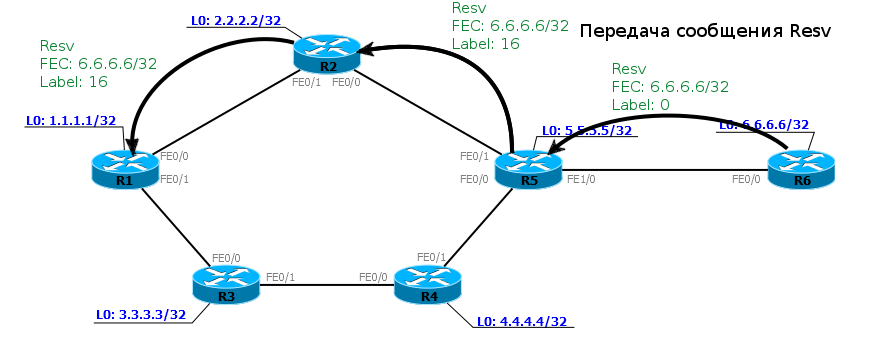
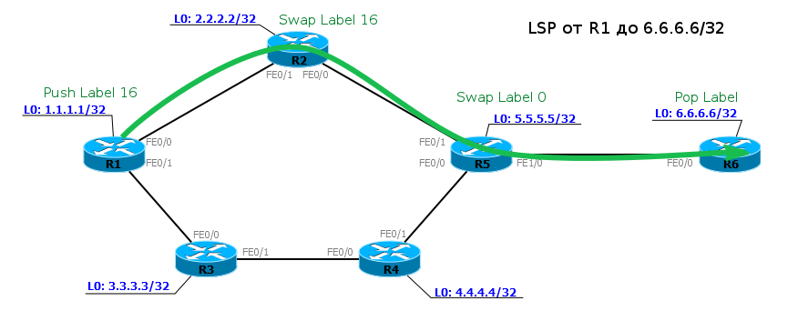
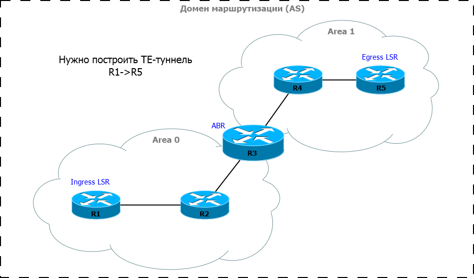

# RSVP-TE

LDP хорош. Работает он просто и понятно. Но есть такая технология, как MPLS TE — Traffic Engineering. И ей недостаточно лучшего маршрута, который может обеспечить LDP.  
Управление трафиком подразумевает, что вы можете направить трафик между узлами как вам угодно, учитывая различные ограничения.  
Например, в нашей сети клиент имеет две точки подключения своих узлов — на R1 и на R6. И между ними он просит предоставить ему VPN с гарантированной шириной канала в 100 Мб/с. Но при этом у нас в сети ещё и обычные ШПДшники видео гоняют с вконтактика и дюжина других клиентов, которые VPN арендуют, но полосу им резервировать не надо.  
Если не вмешаться в эту ситуацию, где-нибудь на R2 может возникнуть перегруз, и 100 Мб/с для дорогого клиента не достанется.

MPLS TE позволяет пройти по всей сети от отправителя до получателя и зарезервировать ресурсы на каждом узле. Если вы знакомы с концепцией IntServ, то да, это именно она — организовать QoS на всём протяжении пути, вместо того, чтобы позволить каждому маршрутизатору самому принимать решение для проходящего пакета.  
Собственно, протокол **RSVP** \(_**Resource ReSerVation Protocol**_\) изначально \(в 1993-м году\) и был задуман для организации IntServ в IP-сетях. Он должен был донести информацию о QoS для какого-то конкретного потока данных до каждого узла и заставить его зарезервировать ресурсы.

В первом приближении работает он просто.

1\) Узел-источник хочет отправить поток данных со скоростью 5 Мб/с. Но перед этим он посылает RSVP запрос на резервирование полосы до получателя — **Path Message**. Это сообщение содержит некие идентификаторы потока, по которым узел потом сможет идентифицировать принадлежность полученных IP-пакетов потоку, и требуемую ширину полосы.  
2\) Сообщение Path передаётся от узла к узлу до самого получателя. Куда его послать, определяется на основе таблицы маршрутизации.  
3\) Каждый маршрутизатор, получив Path, проверяет свои ресурсы. Если у него есть достаточно свободной полосы, он настраивает свои внутренние алгоритмы так, чтобы пакеты потока были обработаны как следует и пропускной способности всегда хватало.  
4\) Если же у него нет необходимых 5 Мб/с \(занято другими потоками\), он отказывает в выделении ресурсов и возвращает соответствующее сообщение отправителю.  
5\) Пакет Path доходит до получателя потока, тот отправляет назад сообщение **Resv**, подтверждая выделение ресурсов на всём протяжении пути.  
6\) Изначальный отправитель, получив Resv, понимает, что всё для него готово, и он может отправлять данные.

На самом деле под этими четырьмя простыми шагами лежат гораздо более сложные процессы, но нам это не интересно.

А вот что нам интересно — так это расширение **RSVP для Traffic Engineering**, или проще — **RSVP TE**, которое было разработано специально для MPLS TE.  
Его задача такая же, как у LDP — распределить метки между LSR и скомпилировать в итоге LSP от получателя до отправителя. Но теперь, как вы уже поняли, появляются нюансы — LSP должен удовлетворять определённым условиям.

RSVP TE позволяет строить основной и запасной LSP, резервировать ресурсы на всех узлах, обнаруживать аварии на сети, строить заранее обходные пути, делать быстрое перенаправление трафика, избегать каналов, которые физически проходят по одному пути.  
Но всё это мы будем обсуждать в статье о MPLS TE через пару выпусков. А сегодня же мы сосредоточимся на принципах, согласно которым RSVP TE строит LSP.

> От смены протокола не меняется то, что LSP — однонаправленный, соответственно и ресурсы будут резервироваться только в одном направлении. Хочешь в другом — создавай обратный LSP.

Для начала мы отбросим функционал резервирования ресурсов — пусть наша задача только создать LSP, то есть распределить метки между LSR.

Чтобы это стало возможно, стандартный RSVP расширяется добавлением нескольких объектов. Рассмотрим простейший вариант.  
0\) R1 нужен LSP до FEC 6.6.6.6/32. Это выглядит как интерфейс Tunnel на R1, у которого адрес назначений 6.6.6.6 и тип Traffic Engineering.  
1\) Он посылает сообщение RSVP Path в направлении 6.6.6.6. В этом сообщении появляется новый объект — **Label Request**. Сообщение Path провоцирует узел выделить метку для данного FEC — то есть это запрос метки.  
2\) Следующий узел формирует новое сообщение Path и также отправляет его в сторону 6.6.6.6. Итд.  
3\) Path достигает Egress LSR. Тот видит, что пакет-то ему адресован, выделяет метку и отправляет источнику сообщение Resv. В последнем тоже добавлен новый объект — **Label**. В нём Egress LSR передаёт свою метку для этого FEC предпоследнему, предпоследний предпредпоследнему свою итд.  
4\) Resv достигает источника, распределяя по пути метки. Таким образом создан LSP, а источник уведомлён, что всё готово.

Метки запрашиваются вниз по течению \(сообщение Path от отправителя к получателю\), а передаются вверх по течению \(сообщение Resv от получателя к отправителю\).  
При этом обратите ваше внимание на то, что это уже самый что ни на есть Downstream on Demand + Ordered Control. Path выступает запросом метки, а Resv идёт от получателя шаг за шагом и, пока метку не выслал нижестоящий LSR, вышестоящий не может её отправить своим соседям.

Стоп! Мы говорили, что RSVP TE в отличие от LDP позволяет строить как мы хотим, не привязываясь к таблице маршрутизации и IGP, а тут пока просто «в направлении 6.6.6.6».  
И вот тут мы подошли вплотную к фундаментальному отличию RSVP TE от LDP. RSVP TE очень тесно связан с протоколами динамической маршрутизации, он не просто опирается на результат их работы — он адаптирует их под себя, эксплуатирует в прямом смысле слова.  
**Во-первых**, годятся только протоколы, основанные на алгоритмах по состоянию связи \(link-state\), то есть OSPF и ISIS.  
**Во-вторых**, OSPF и ISIS расширяются введением новых элементов в протоколы. Так в OSPF появляется новый тип _LSA — Opaque LSA_, а в ISIS — новые _TLV IS Neighbor_ и _IP Reachability_.  
**В-третьих**, для расчёта пути между Ingress LSR и Egress LSR используется специальная модификация алгоритма SPF — CSPF \(_Constrained Shortest Path First_\).

Теперь подробнее.

Сообщение Path в принципе передаётся юникастом адресно. То есть адрес отправителя у него — адрес R1, а получателя — 6.6.6.6. И оно могло бы дойти и просто по таблице маршрутизации.


Но фактически Path передаётся по сети не как FIB на душу положит на каждом узле, ведь мы тогда не сможем ни резервирование обеспечить, ни поиск запасных маршрутов. Нет, он следует определённому пути.  
Этот путь определяется на Ingress LSR с точностью до каждого узла.  
Чтобы построить этот путь, RSVP TE нужно знать топологию сети. Понимаете да, к чему мы приближаемся? Сам RSVP не утруждает себя её изучением, да и зачем, когда её можно получить у OSPF или ISIS. И тут же становится очевидно, почему сюда не подходят RIP, IGRP и EIGRP — ведь они не изучают топологию, максимум на что они способны — это Feasible Successor.  
Но классический алгоритм SPF на входе имеет топологию сети, а на выходе может выдать только наибыстрейший маршрут с учётом метрик и [AD](http://lookmeup.linkmeup.ru/#term503), хотя просчитать может и все возможные пути.  
И тут на сцену выходит CSPF. Именно этот алгоритм может посчитать лучший путь, второй по приоритетности путь и, например, ещё какой-нибудь запасной, чтобы хоть как-то добраться, пусть и [через Китай](https://linkmeup.ru/topic/edit/150/).  
То есть RSVP TE может обращаться к CSPF с просьбой вычислить для него какой-либо путь между двумя узлами.  
Ну хорошо, а зачем для этого менять сами протоколы IGP? Вооот. А это уже Constraints — ограничения. RSVP TE может предъявлять требования к пути — ширина полосы пропускания, минимально доступная ширина, тип линии или даже узлы, через которые LSP должен пролегать. Так вот, чтобы CSPF мог учитывать ограничения, он должен знать и о них и о доступных ресурсах на узлах всей сети. Входными данными для него являются ограничения, заданные в туннеле и топология сети — логично будет, если топология будет содержать кроме префиксов и метрик ещё и информацию о доступных ресурсах.  
Для этой цели маршрутизаторы обмениваются между собой через сообщения OSPF и ISIS не только базовой информацией, но и характеристиками линий, интерфейсов итд. Как раз в новых типах сообщений и передаётся эта информация.  
Например, в OSPF для этого ввели 3 дополнительных типа LSA:

* **Type 9** — link-local scope
* **Type 10** — area-local scope
* **Type 11** — AS scope

_**Opaque**_ значит непрозрачный \(для OSPF\). Это специальные типы LSA, которые никак не учитываются в самом OSPF при расчёте таблицы маршрутизации. Их могут использовать любые другие протоколы для своих нужд. Так TE их использует для построения своей топологии \(она называется **TED —** _**Traffic Egineering Database**_\). Но теоретически за TE они не закреплены — если вы напишете своё приложение для маршрутизаторов, которое будет требовать обмена какой-то информацией о топологии, вы тоже можете использовать Opaque LSA.  
Точно так же работает и ISIS. Новые сообщения: IS-IS TLV 22 \(Extended IS Reachability\), 134 \(Traffic Engineering router ID\), 135 \(Extended IP reachability\).

Итак, взглянем более детализированно на весь этот процесс.

**0\)** На R1 мы включили MPLS TE и настроили ISIS \(OSPF\) на передачу данных для поддержки TE. Маршрутизаторы обменялись информацией о доступных ресурсах. На этом шаге сформирована TED. RSVP молчит.


**1\)** Мы создали туннельный интерфейс, где указали его тип \(Traffic Engineering\), адрес назначения \(6.6.6.6\) и необходимые требования по ресурсам. LSR запускает CSPF: нужно вычислить кратчайший путь от R1 до 6.6.6.6 с учётом накладываемых условий. На этом шаге мы получаем оптимальный путь — список узлов от источника до получателя \(R2, R5, R6\).

**2\)** Результат предыдущего шага скармливается RSVP и трансформируется в объект **ERO**. R1 компилирует RSPV Path, куда, естественно, добавляет ERO. Адресат пакета — 6.6.6.6. Кроме того, имеется и объект Label Request, сообщающий о том, что при получении пакета нужно выделить метку для данного FEC \(6.6.6.6/32\).

> **ERO — Explicit Route Object** — специальный объект сообщения RSVP Path. Он содержит список узлов, через которые суждено пройти этому сообщению.

**3\)** Сообщение RSVP Path передаётся специальным образом — не по таблице маршрутизации, а по списку ERO. В нашем случае лучший маршрут IGP и ERO совпадают, поэтому пакет посылается на R2.

**4\)** R2, получив RSVP Path, проверяет наличие требуемых ресурсов и, если они есть, выделяет метку MPLS для FEC 6.6.6.6/32. Старый пакет Path уничтожается и создаётся новый, причём объект ERO меняется — из него удаляется сам R2. Делается это для того, чтобы следующий узел не пытался вернуть пакет на R2. То есть новый ERO выглядит уже так: \(R5, R6\). В соответствии с ним R2 отправляет обновлённый Path на R5.

**5\)** R5 совершает аналогичные операции: проверяет ресурсы, выделяет метку, удаляет себя из ERO, пересоздаёт пакет Path и передаёт в интерфейс, через который ему известен следующий объект ERO — R6.


**6\)** R6, получив пакет, понимает, что он виновник всей суматохи. Он уничтожает Path, выделяет метку для FEC 6.6.6.6 и вставляет её как объект **Label** в ответное сообщение Resv.  
Заметьте, до этого шага метки только выделялись, но не распространялись, теперь же они начинают анонсироваться тем LSR, которые их запрашивали.  
**7\)** Сообщение RESV продвигается к R1 \(Ingress LSR\), оставляя за собой растущий хвост LSP. Resv должно пройти через те же узлы, что Path, но в обратном порядке.



**8\)** В конце концов LSP от R1 до 6.6.6.6 сформирован. Данные по нему могут передаваться только от R1 к R6. Чтобы позволить передачу данных в обратном направлении, нужно создать туннельный интерфейс на R6 с адресом назначения 1.1.1.1 — все действия будут точно такими же.



Возникает вопрос — почему адресат пакета Path 6.6.6.6, если передаётся он узел за узлом и их адреса известны? Вопрос этот не праздный — он ведёт нас к одной важной особенности. Объект ERO может на самом деле содержать не все узлы от Ingress LSR до Egress LSR — некоторые могут быть опущены. Поэтому каждый LSR должен знать, куда в итоге направляется сообщение. И происходить это может не потому что Ingress LSR лень просчитать весь путь.  
Проблема в зонах IGP. Вы знаете, что и в OSPF и в ISIS существует это понятие для того, чтобы упростить маршрутизацию. В больших сетях \(сотни и тысячи узлов\) встаёт проблема широковещательных рассылок служебных пакетов и просчёт огромного количества комбинация алгоритмом SPF. Поэтому один глобальный домен делится на зоны маршрутизации.  
И вся загвоздка в том, что если внутри зоны IGP и является протоколом по состоянию связи \(link-state\), то между ними — он самый настоящий дистанционно-векторный — топология сети строится только внутри зоны, любые внутренние маршрутизаторы не знают, как устроены другие зоны — они только поставлены в известность, что для того, чтобы попасть в ту или иную сеть, им нужно отправлять пакеты на конкретный [ABR](http://lookmeup.linkmeup.ru/#term504).  
Иными словами, если у вас сеть поделена на зоны, то с MPLS TE возникают затруднения — CSPF не может просчитать весь путь, потому что в его топологии адресат из другой зоны — это облако, а не конкретный узел.

И тут на помощь приходит **Explicit Path** \(не путать с объектом ERO\). Это самый, что ни на есть, прямой способ управления путём построения LSP — администратор может самостоятельно и явно задать те узлы, через которые нужно проложить LSP. Ingress LSR должен точно следовать таким указаниям. Это вносит в жизнь алгоритма CSPF ещё немного разнообразия.  
Как Explicit Path помогает пробить зону? Давайте на примере.



Мы возьмём и укажем, что обязательно должны быть промежуточные точки:  
Explicit-path: R1, R3, R5.

Когда этот Explicit Path мы скармливаем CSPF, он строит тот кусок, который может, то есть в пределах Area 0: от R1 до R3.  
То, что он насчитал, заносится в ERO, плюс в него добавляются и ещё один узел из Explicit-path — R5. Получается: R1, R2, R3. Path отправляется по сети согласно ERO, доходит до R3. Тот видит, что он в общем-то не адресат, а только перевалочный пункт, берёт заданные условия по требуемым ресурсам и адрес узла-получателя из Explicit-path и запускает CSPF. Последний выдаёт полный список узлов до адресата \(R3, R4, R5\), который преобразуется в ERO, и дальше всё происходит по стандартному сценарию.  
То есть в случае нахождения Ingress LSR и Egress LSR в разных зонах вычисление пути выполняется отдельно для каждой зоны, а контрольной точкой является ABR.

Следует понимать, что Explicit Path используется не только для этого случая, но это вообще удобный инструмент, ведь вы можете явно указать, как нужно проложить LSP или наоборот, через какие узлы не надо прокладывать LSP.  
Этого и много другого мы коснёмся детально в выпуске, посвящённом MPLS TE.

> Меня могут упрекнуть в лукавстве, сказав, что не настолько уж и обязателен Link-State IGP. Ну вот хочется на моноцисочной сети запустить EIGRP, сил нет. Или вообще некрофильные позывы заставляют откопать RIP. И что теперь? Отказаться от TE?  
> В общем есть спасение, но только на оборудовании Cisco — называется оно [Verbatim](http://www.cisco.com/c/en/us/td/docs/ios/mpls/configuration/guide/12_2sy/mp_12_2sy_book/mp_te_verbatim_path.html).  
>   
> Ведь для чего нам нужен Link-State протокол? Он собирает информацию о топологии TE, а CSPF строит путь от Ingress LSR до Egress LSR. Таак. Отлично. А что если мы возьмём и состряпаем Explicit Path, где перечислим все узлы один за другим? Ведь тогда не надо ничего считать.  
> На самом деле, как бы подробно вы ни составили явный путь, он всё равно будет передан CSPF.  
> Но такое поведение можно отключить. Как раз для случаев, описанных выше.  
> Поможет такая команда:
>
> ```text
> Router(config-if)# tunnel mpls traffic-eng path-option 1 explicit name test verbatim
> ```
>
> То ест данный путь будет взят как заведомо верный безо всяких проверок и пересчётов CSPF.  
> Такой сценарий стоит под большим вопросом, а его плюсы весьма призрачны. Однако возможность есть, и не говорите потом, что я вам про неё не рассказал.

