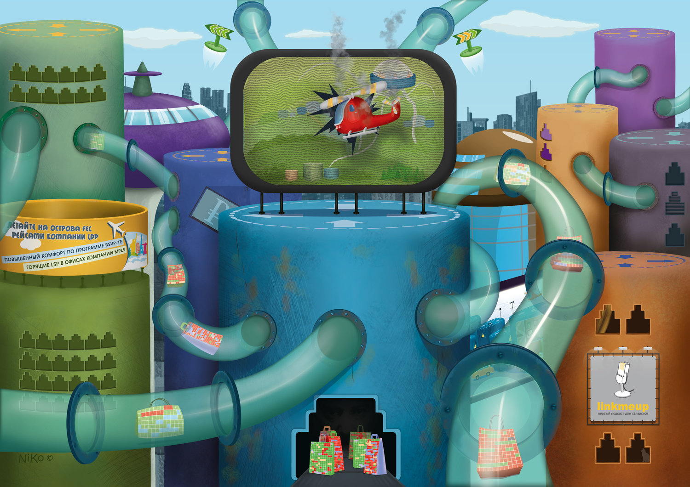

# 10. Базовый MPLS

## Сети для самых маленьких. Часть десятая. Базовый MPLS

Сеть нашей воображаемой компании linkmeup растёт. У неё есть уже магистральные линии в различных городах, клиентская база и отличный штат инженеров, выросших на цикле СДСМ.  
Но всё им мало. Услуги ШПД — это хорошо и нужно, но есть ещё огромный потенциальный рынок корпоративных клиентов, которым нужен VPN.  
Думали ребята над этим, ломали голову и пришли к выводу, что никак тут не обойтись без MPLS.

Если мультикаст был первой темой, которая требовала некоторого перестроения понимания IP-сетей, то, изучая MPLS, вам точно придётся забыть почти всё, что вы знали раньше — это особенный мир со своими правилами.

Сегодня в выпуске:

* [Что такое MPLS](https://github.com/satandyh/SDSM/tree/fea4e13f93bf616820a4152b1a64f25cda8de67b/10.-base-mpls/00.-about_mpls.md)
* [Передача трафика в сети MPLS](https://github.com/satandyh/SDSM/tree/fea4e13f93bf616820a4152b1a64f25cda8de67b/10.-base-mpls/01.-forwarding.md)
* [Терминология](https://github.com/satandyh/SDSM/tree/fea4e13f93bf616820a4152b1a64f25cda8de67b/10.-base-mpls/02.-glossary.md)
* [Распространение меток](https://github.com/satandyh/SDSM/tree/fea4e13f93bf616820a4152b1a64f25cda8de67b/10.-base-mpls/03.-label_distribution/README.md)
  * [Методы распространение меток](https://github.com/satandyh/SDSM/tree/fea4e13f93bf616820a4152b1a64f25cda8de67b/10.-base-mpls/03.-label_distribution/00.-modes/README.md)
    * [DU против DoD](https://github.com/satandyh/SDSM/tree/fea4e13f93bf616820a4152b1a64f25cda8de67b/10.-base-mpls/03.-label_distribution/00.-modes/00.-du_dod.md)
    * [Ordered Control против Independent Control](https://github.com/satandyh/SDSM/tree/fea4e13f93bf616820a4152b1a64f25cda8de67b/10.-base-mpls/03.-label_distribution/00.-modes/01.-label_control.md)
    * [Liberal Label Retention Mode против Conservative Label Retention Mode](https://github.com/satandyh/SDSM/tree/fea4e13f93bf616820a4152b1a64f25cda8de67b/10.-base-mpls/03.-label_distribution/00.-modes/02.-retention_mode.md)
    * [PHP](https://github.com/satandyh/SDSM/tree/fea4e13f93bf616820a4152b1a64f25cda8de67b/10.-base-mpls/03.-label_distribution/00.-modes/03.-php.md)
  * [Протоколы распространения меток](https://github.com/satandyh/SDSM/tree/fea4e13f93bf616820a4152b1a64f25cda8de67b/10.-base-mpls/03.-label_distribution/01.-protocols/README.md)
    * [LDP](https://github.com/satandyh/SDSM/tree/fea4e13f93bf616820a4152b1a64f25cda8de67b/10.-base-mpls/03.-label_distribution/01.-protocols/00.-ldp/README.md)
      * [Практика](https://github.com/satandyh/SDSM/tree/fea4e13f93bf616820a4152b1a64f25cda8de67b/10.-base-mpls/03.-label_distribution/01.-protocols/00.-ldp/00.-ldp_practice.md)
    * [Применение чистого MPLS в связке с BGP](https://github.com/satandyh/SDSM/tree/fea4e13f93bf616820a4152b1a64f25cda8de67b/10.-base-mpls/03.-label_distribution/01.-protocols/01.-mpls_bgp.md)
    * [RSVP-TE](https://github.com/satandyh/SDSM/tree/fea4e13f93bf616820a4152b1a64f25cda8de67b/10.-base-mpls/03.-label_distribution/01.-protocols/02.-rsvp-te/README.md)
      * [Практика](https://github.com/satandyh/SDSM/tree/fea4e13f93bf616820a4152b1a64f25cda8de67b/10.-base-mpls/03.-label_distribution/01.-protocols/02.-rsvp-te/00.-rsvp_practice.md)
* [ВиО](https://github.com/satandyh/SDSM/tree/fea4e13f93bf616820a4152b1a64f25cda8de67b/10.-base-mpls/04.-faq.md)
* [Полезные ссылки](https://github.com/satandyh/SDSM/tree/fea4e13f93bf616820a4152b1a64f25cda8de67b/10.-base-mpls/05.-useful.md)

А начнём мы с вопроса: «Что не так с IP?»



