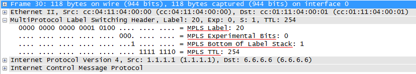

# Заголовок MPLS

Весь заголовок MPLS — это 32 бита. Формат полей и их длина фиксированы. Часто весь заголовок называют меткой, хотя это не совсем и верно.

_**Label**_ — собственно сама метка. Длина — 20 бит.  
_**TC**_ — Traffic Class. Несёт в себе приоритет пакета, как поле DSCP в IP.  
Длина 3 бита. То есть может кодировать 8 различных значений.  
Например, при передаче IP-пакета через сеть MPLS значению в поле DSCP определённым образом ставится в соответствие значение TC. Таким образом пакет может почти одинаково обрабатываться в очередях на всём протяжении своего пути, как на участке чистого IP, так и в MPLS.  
Но, естественно, это преобразование с потерями — шести битам DSCP тесно в 3 битах TC: 64 против 8. Поэтому существует специальная таблица соответствий, где целый диапазон — это всего лишь одно значение.

> Первоначально поле носило название EXP \(экспериментальное\), а его содержимое не было регламентировано. Предполагалось, что оно может быть использовано для исследований, внедрения нового функционала. Но это в прошлом.  
> Если кто-то с вами спорит, что это поле экспериментальное и не утверждено формально за функцией QoS — он ~~не шарит~~ порядочно [отстал от жизни](http://packetlife.net/blog/2009/mar/2/mpls-qos-no-longer-experimental/).

_**S**_ — Bottom of Stack — индикатор дна стека меток длиной в 1 бит. Заголовков MPLS на пакете может быть несколько, например, внешняя для коммутации в сети MPLS, а внутренняя указывает на определённый VPN. Чтобы LSR понимал с чем он имеет дело. В бит S записывается «1», если это последняя метка \(достигнуто дно стека\) и «0», если стек содержит больше одной метки \(ещё не дно\). То есть LSR не знает, сколько всего меток в стеке, но знает, одна она или больше — да этого и достаточно на самом-то деле. Ведь любые решения принимаются на основе только самой верхней метки, независимо от того, что там под ней. Зато, снимая метку, он уже знает, что дальше сделать с пакетом: продолжить работу с процессом MPLS или отдать его какому-то другому \(IP, Ethernet, ATM, FR итд\).

> Вот к этой фразе: “Зато, снимая метку, он уже знает, что дальше сделать с пакетом” — надо дать пояснение. В заголовке MPLS, как вы заметили, нет информации о содержимом \(как Ethertype в Ethernet’е или Protocol в IP\).  
> Это с одной стороны хорошо — внутри может быть что угодно — выше гибкость, а с другой стороны, как без анализа содержимого теперь определить, какому процессу передавать всё это хозяйство?  
> А тут небольшая хитрость — маршрутизатор, как вы увидите дальше, всегда сам выделяет метку и передаёт её своим соседям, поэтому он знает, для чего её выделял — для IP или для Ethernet или ещё для чего-то. Поэтому он просто добавляет эту информацию в свою таблицу меток. И в следующий раз, когда делает операцию Pop Label, он уже из таблицы \(а не из пакета\) знает, что дальше делать.

В общем, стек тут в классическом понимании — последним положили, первым взяли \(LIFO — Last Input — First Output\).

В итоге, несмотря на то, что длина заголовка MPLS фиксированная, самих заголовков может быть много — и все они располагаются друг за другом.

_**TTL**_ — Time To Live — полный аналог [IP TTL](http://lookmeup.linkmeup.ru/#term47). Даже той же самой длиной обладает — 8 бит. Единственная задача — не допустить бесконечного блуждания пакета по сети в случае петли. При передаче IP-пакета через сеть MPLS значение IP TTL может быть скопировано в MPLS TTL, а потом обратно. Либо отсчёт начнётся опять с 255, а при выходе в чистую сеть IP значение IP TTL будет таким же, как до входа.

Как видите, заголовок MPLS втискивается между канальным уровнем и теми данными, которые он несёт — в случае IP — сетевым. Поэтому метафорически MPLS называется технологией 2,5 уровня, а заголовок — Shim-header — заголовок-клин.  
\_К слову, метка не обязательно должна быть в заголовке MPLS. Согласно решению IETF, она может встраиваться в заголовки ATM, AAL5, Frame Relay.

Вот как оно выглядит в жизни:

