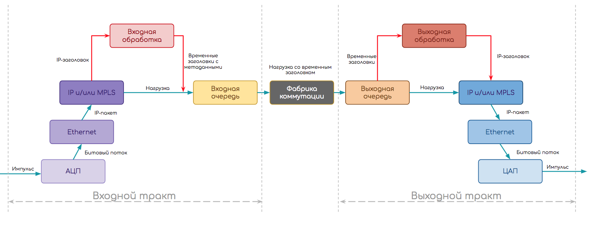

# 0. Коротко о судьбе и пути пакета

> Под пакетом будем понимать PDU любого уровня — IP-пакеты, фреймы, сегменты итд. Для нас важно, что это сформированный пакет информации.  
> Всю статью мы будем рассматривать некий модульный узел, который пересылает пакеты. Для того, чтобы не запутать читателя, определим, что **это маршрутизатор**.  
>   
> Все рассуждения данной статьи, с поправками на заголовки, протоколы и конкретные действия с пакетом, применимы к любым сетевым устройствам, будь то маршрутизатор, файрвол или коммутатор — их задача: передать пакет следующему узлу ближе к назначению.  
> Дабы избежать кривотолков и неуместной критики: автор отдаёт себе отчёт в том, что реальная ситуация зависит от конкретного устройства. Однако задача статьи — дать общее понимание принципов работы сетевого оборудования.

Следующую схему мы выберем в качестве отправной точки.

Независимо от того, что за устройство, как реализована обработка трафика, пакету нужно пройти такой путь.

1. Путь делится на две части: входной и выходной тракты.
2. На входе происходит сначала декапсуляция — отделение заголовка от полезной нагрузки и прочие присущие протоколу вещи \(например, вычисление контрольной суммы\)
3. Далее стадия входной обработки \(Ingress Processing\) — сам пакет без заголовка \(нагрузка\) томится в буфере, а заголовок анализируется. Здесь могут к пакетам применяться политики, происходить поиск точки назначения и выходного интерфейса, создаваться копии итд.
4. Когда анализ закончен, заголовок превращается в метаданные \(временный заголовок\), склеивается с пакетом и они передаются на входную очередь. Она позволяет не слать на выходной тракт больше, чем тот может обработать.
5. Далее пакет может ждать \(или запрашивать\) явное разрешение на перемещение в выходную очередь, а может просто туда передаваться, а там, поди, разберутся.
6. Выходных трактов может быть несколько, поэтому пакет далее попадает на фабрику коммутации, цель которой, доставить его на правильный.
7. На выходном тракте также есть очередь — выходная. В ней пакеты ожидают выходной обработки \(Egress Processing\): политики, QoS, репликация, шейпинг. Здесь же формируются будущие заголовки пакета. Также выходная очередь может быть полезной для того, чтобы на интерфейсы не передавать больше, чем они могут пропустить.
8. И завершающая стадия — инкапсуляция пакета в приготовленные заголовки и передача его дальше.

Эта упрощённая схема более или менее универсальна.  
Немного усложним её, рассмотрев стек протоколов.  
Например, IP-маршрутизатор должен сначала из электрического импульса восстановить поток битов, далее распознать, какой тип канального протокола используется, определить границы кадра, снять заголовок Ethernet, узнать что под ним \(пусть IP\), передать IP-пакет на дальнейшую обработку.

Тогда схема примет такой вид:

1. Сначала отработал модуль **физического уровня**.
   * С помощью [АЦП](http://lookmeup.linkmeup.ru/#term573) восстановил поток битов — в некоторым смысле декапсуляция физического уровня.
   * Работая на определённом типе порта \(Ethernet\), он понимает, что выходным интерфейсом будет модуль Ethernet.
2. Далее происходит декапсуляция и Входная Обработка на **Ethernet-модуле**:
   * Определение границ кадра, преамбулы, [IFG](http://lookmeup.linkmeup.ru/#term603), [FCS](http://lookmeup.linkmeup.ru/#term604)
   * Подсчёт контрольной суммы
   * Снятие заголовков, разбор на поля
   * Применение политик
   * Определение адреса назначения — он локальный — и тогда выходной интерфейс — к модулю IP.
3. Входная обработка **IP**:
   * Снятие заголовков, разбор на поля
   * Применение политик
   * Анализ адреса назначения
   * Поиск выходного интерфейса в Таблице Пересылки
   * Формирование временных внутренних заголовков
   * Склейка временных заголовков с данными и отправка пакета на выходной тракт.
4. **Обработка во входной очереди.**
5. Пересылка через **фабрику коммутации.**
6. **Обработка в выходной очереди.**
7. На выходном тракте модуль **IP** совершает Выходную Обработку:
   * Применение политик, шейпинг
   * Формирование конечного заголовка на основе метаданных \(временного заголовка\) и передача его модулю Ethernet.
8. Далее Выходная Обработка на **модуле Ethernet**
   * Поиск в ARP-таблице MAC-адреса следующего узла
   * Формирование заголовка Ethernet
   * Подсчёт контрольной суммы
   * Применение политик
   * Спуск на физический модуль.
9. А **модуль физического уровня** в свою очередь разбивает поток битов на электрические импульсы и передаёт в кабель.

\*Порядок выполнения операция приблизительный и может зависеть от реализации.

Все перечисленные выше шаги декомпозируются на сотни более мелких, каждый из которых должен быть реализован в железе или в ПО.

**Вот и вопрос — в железе или ПО**. Он преследует мир IP-сетей с момента их основания и, как это водится, развитие происходит циклически.

Есть вещи тривиальные, для которых элементная база существует… ммм… с 60-х. Например, [АЦП](http://lookmeup.linkmeup.ru/#term573), аппаратные очереди или CPU.  
А есть те, которые стали прорывом относительно недавно.  
Часть функций всегда была и будет аппаратной, часть — всегда будет программной, а часть — мечется, как та обезьяна.

> В этой статье мы будем преимущественно говорить об аппаратных устройствах, лишь делая по ходу ремарки по поводу виртуальных.

