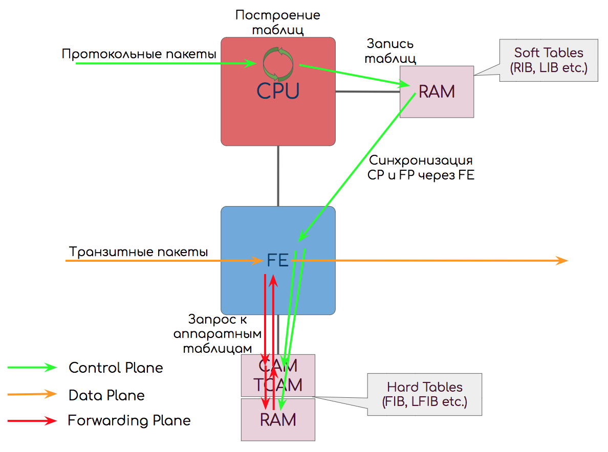

# Forwarding/Data Plane

**Плоскость пересылки**  
Главная задача сети — доставить трафик от одного приложения другому. И сделать это максимально быстро, как в плане пропускной способности, так и задержек.  
Соответственно главная задача узла — максимально быстро передать вошедший пакет на правильный выходной интерфейс, успев поменять ему заголовки и применив политики.  
Поэтому существуют заранее заполненные таблицы передачи пакетов — таблицы коммутации, таблицы маршрутизации, таблицы меток, таблицы соседств итд.  
Реализованы они могут быть на специальных чипах CAM, TCAM, работающих на скорости линии \(интерфейса\). А могут быть и программными.

> Примеры:
>
> 1. Принять Ethernet-кадр, посчитать контрольную сумму, проверить есть ли [SMAC](http://lookmeup.linkmeup.ru/#term605) в таблице MAC-адресов. Найти [DMAC](http://lookmeup.linkmeup.ru/#term606) в таблице MAC-адресов, определить интерфейс, передать кадр.
> 2. Принять MPLS-пакет, определить входной интерфейс и входную метку. Выполнить поиск в таблице меток, определить выходной интерфейс и выходную метку. Свопнуть. Передать.
> 3. Пришёл поток пакетов. Выходным интерфейсом оказался [LAG](http://lookmeup.linkmeup.ru/#term443). Решение, в какие из интерфейсов их отправить, тоже принимается на Forwarding Plane.

## **Разница между Data и Forwarding Plane**

В абсолютном большинстве случаев считается, что Data и Forwarding Plane — это одно и то же.  
Однако иногда их разделяют.  
Тогда Data Plane означает именно манипуляции с полезной нагрузкой: процесс доставки пакета от входного интерфейса к выходному и обработку его в буферах.  
А Forwarding Plane — это обработка заголовков и принятие решения о пересылке.

Примерно так:

