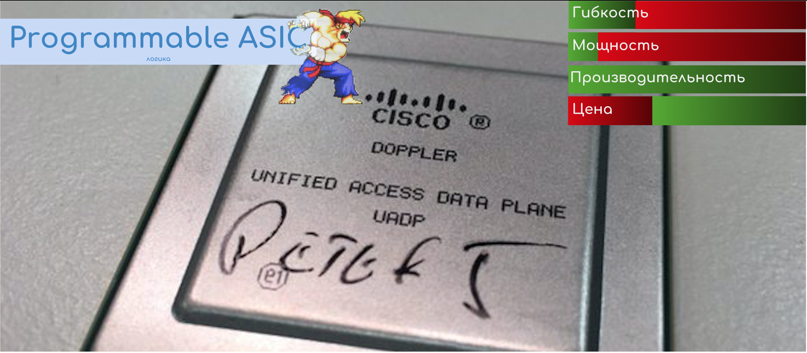

# Programmable ASIC

В последние годы наблюдается тенденция к реализации большинства функций на ASIC. Однако хочется оставить возможность программировать поведение. Поэтому появились так называемые Программируемые ASIC, которые обладают низкой стоимостью, высокой производительность и некоторой гибкостью.

