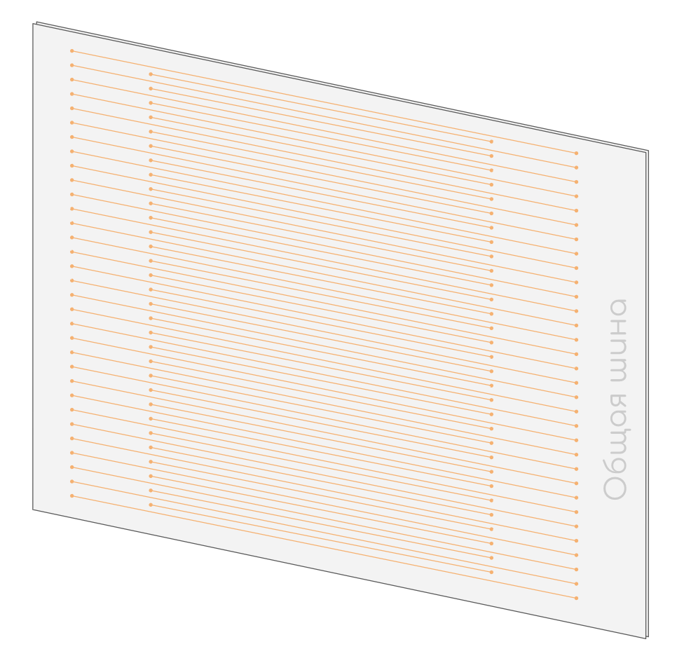

# Общая шина

Общая шина \(она же Back Plane, она же Midplane\) устройства, связывающая друг с другом все модули.  
Обычно, это просто батарея медных контактов без каких-либо микросхем.

Так выглядит задняя часть платы, которая вставляется в шину

Так выглядит общая шина Juniper

Так выглядит общая шина Huawei

Вот эти две полоски посередине, набитые медными контактами — слоты для [фабрик коммутации](0-obshaya-shina.md).

