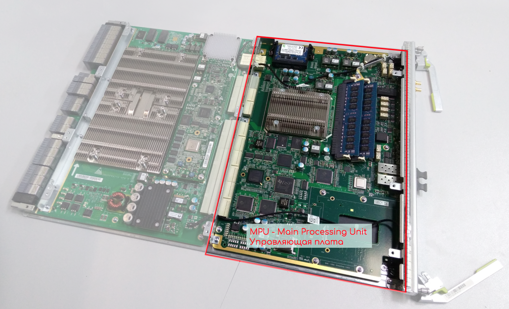

# Управляющий модуль

На нём расположены CPU, оперативная память, постоянная память для хранения ПО, конфигурации и логов, интерфейсы для управления.  
Он отвечает за Management Plane и за Control Plane.  
С ним мы работаем, когда подключаемся к устройству по telnet/ssh.  
Он загружает ПО в оперативную память и запускает все другие модули при подаче питания.  
Он следит за Heart beat других модулей — специальными пакетами, получение которых говорит о том, что модуль жив и работоспособен.  
Он же может перезагрузить модуль, если Heart beat не получил \(как программно, так и выключить питание на плате\).  
Протокольные пакеты доставляются на CPU и тот, обрабатывав их, совершает какое-то действие, как то: записать обновления в таблицы коммутации, сформировать ответный пакет, запросить информацию о каком-либо компоненте итд.  
Управляющий модуль занимается расчётом SPF, LSP, установлением соседств по разным протоколам. Он записывает таблицы коммутации в Soft Tables оперативной памяти.

Так выглядят управляющие платы разных устройств

Та половина, что ближе к нам. Та, что ближе к шине, — это фабрика коммутации.

На всех фотографиях вы можете легко найти CPU, RAM и батарейку BIOS. На некоторых есть HDD, на других Compact Flash. Да, вы правы — это обычный ПК. Причём современные управляющие платы действительно имеют производительность на уровне компьютера 5-6 летнего возраста.

