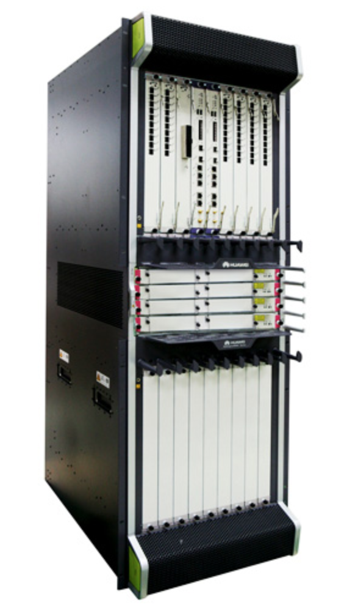

# 4. Аппаратная архитектура коммутирующего устройства

Обычно всё-таки даже на недорогих коммутаторах не практикуют реализацию всего и вся на одном чипе. Это скорее, каскад из разных их типов, каждый из которых решает какую-то часть общей задачи.  
Дальше мы посмотрим на референсную модель, как это «может» работать.

Для этой модели возьмём модульное шасси, состоящее из интерфейсных и управляющих модулей и фабрики коммутации.

**Вроде такого**

Работать оно будет со стандартной связкой IP, Ethernet.

