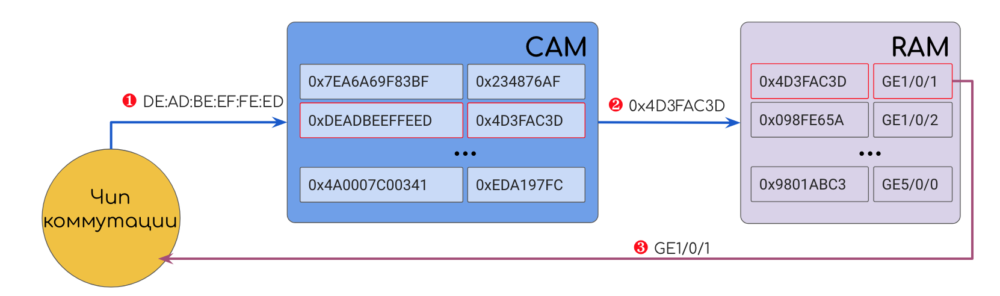
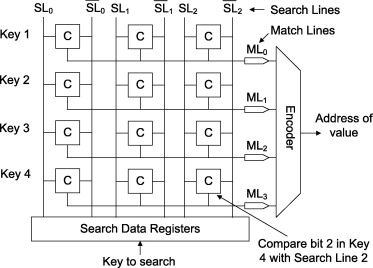
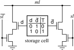

# CAM — Content-Addressable Memory

Это особо-хитрый вид памяти.  
Вы ей — значение, а она вам — адрес ячейки.  
Content-Addressable означает, что адресация базируется на значениях \(содержимом\).

Значением, например, может быть, например DMAC. CAM прогоняет DMAC по всем своим записям и находит совпадение. В результате CAM выдаст адрес ячейки в классической RAM, где хранится номер выходного интерфейса. Дальше устройство обращается к этой ячейке и отправляет кадр, куда положено.  
Для достижения максимальной скорости CAM и RAM располагаются очень близко друг к другу.

> Не путать данную RAM с RAM, содержащей Soft Tables, описанной выше — это разные компоненты, расположенные в разных местах.

Прелесть CAM в том, что она возвращает результат за фиксированное время, не зависящее от количества и размера записей в таблице — О\(1\), выражаясь в терминах сложностей алгоритмов.  
Достигается это за счёт того, что значение сравнивается **одновременно** со всеми записями. Одновременно! А не перебором.

На входе каждой ячейки хранения в CAM стоят сравнивающие элементы \(мне очень нравится термин компараторы\), которые могут выдавать 0 \(разомкнуто\) или 1 \(замкнуто\) в зависимости от того, что на них поступило и что записано.  
В сравнивающих элементах записаны как раз искомые значения.  
Когда нужно найти запись в таблице, соответствующую определённому значению, это значение прогоняется одновременно через ВСЕ сравнивающие элементы. Буквально, электрический импульс, несущий значения, попадает на все элементы, благодаря тому, что они подключены параллельно. Каждый из них выполняет очень простое действие, выдавая для каждого бита 1, если биты совпали, и 0, если нет, то есть замыкая и размыкая контакт. Таким образом та ячейка, адресом которой является искомое значение, замыкает всю цепь, электрический сигнал проходит и запитывает её.

Вот архитектура такой памяти:

[Источник картинки](https://www.sciencedirect.com/science/article/pii/S0141933113001348).

Вот пример работы

Картинка из прелюбопытнейшего [документа](http://www.eecg.toronto.edu/~roman/teaching/1388/2004/finalProj/2004_ECE1388_FP_www/LRU_Cache/).

А это схема реализации:

[Источник картинки](https://www.pagiamtzis.com/cam/camintro/).

Это чем-то похоже на пару ключ-замок. Только ключ с правильной геометрией может поставить штифты замка в правильные положения и провернуть цилиндр.  
Вот только у нас много копий одного ключа и много разных конфигураций замков. И мы вставляем их все одновременно и пытаемся провернуть, а нужное значение лежит за той дверью, замок которой ключ откроет.

Для гибкого использования CAM мы берём не непосредственно значения из полей заголовков, а вычисляем их хэш.  
Хэш-функция используется для следующих целей:

1. Длина результата значительно меньше, чем у входных значений. Так пространство MAC-адресов длиной 48 бит можно отобразить в 16-ибитовое значение, тем самым в 2^32 раза уменьшив длину значений, которые нужно сравнивать, и соответственно, размер CAM. Основная идея хэш-функции в том, что результат её выполнения для одинаковых входных данных всегда будет одинаков \(например, как остаток от деления одного числа на другое — это пример элементарной хэш функции\).
2. Результат её выполнения на всём пространстве входных значений — это ± плоскость — все значения равновероятны. Это важно для снижения вероятности конфликта хэшей, когда два значения дают одинаковый результат. Конфликт хэшей, кстати, весьма любопытная проблема, которая описана в [парадоксе дней рождения](https://ru.wikipedia.org/wiki/Парадокс_дней_рождения). Рекомендую почитать [Hardware Defined Networking](https://www.juniper.net/uk/en/training/jnbooks/distinguished-engineering/hardware-defined-networking/) Брайна Петерсена, где помимо всего прочего он описывает механизмы избежания конфликта хэшей.
3. Независимо от длины исходных аргументов, результат будет всегда одной длины. То есть на вход можно подать сложное сочетание аргументов, например, DMAC+EtherType, и для хранения не потребуется выделять более сложную структуру памяти.

Именно хэш закодирован в сравнивающие элементы. Именно хэш искомого значения будет сравниваться с ними.  
По принципу CAM схож с хэш-таблицами в программировании, только реализованными на чипах.

В этот принцип отлично укладывается также MPLS-коммутация, почему MPLS и сватали в своё время на IP.

Например:

1. Пришёл самый первый Ethernet-кадр на порт коммутатора.
2. Коммутатор извлёк [SMAC](http://lookmeup.linkmeup.ru/#term605), вычислил его хэш.
3. Данный хэш он записал в сравнивающие элементы CAM, номер интерфейса откуда пришёл кадр в RAM, а в саму ячейку CAM адрес ячейки в RAM.
4. Выполнил рассылку изначального кадра во все порты.
5. Повторил пп. 1-5 ....
6. Заполнена вся таблица MAC-адресов.
7. Приходит Ethernet-кадр. Коммутатор сначала проверяет, известен ли ему данный [SMAC](http://lookmeup.linkmeup.ru/#term605) \(сравнивает хэш адреса с записанными хэшами в CAM\) и, если нет, сохраняет.
8. Извлекает [DMAC](http://lookmeup.linkmeup.ru/#term606), считает его хэш.
9. Данный хэш он прогоняет через все сравнивающие элементы CAM и находит единственное совпадение.
10. Узнаёт номер порта, отправляет туда изначальный кадр.

**Резюме:**

* Ячейки CAM адресуются хэшами.
* Ячейки CAM содержат \(обычно\) адрес ячейки в обычной памяти \(RAM\), потому что хранить конечную информацию — дорого.
* Каждая ячейка CAM имеет на входе сравнивающий элемент, который сравнивает искомое значение с хэш-адресом. От этого размер и стоимость CAM значительно больше, чем RAM.
* Проверка совпадения происходит **одновременно** во всех записях, отчего CAM дюже греется, зато выдаёт результат за константное время.
* CAM+RAM хранят **Hard Tables** \(аппаратные таблицы\), к которым обращается чип коммутации.

