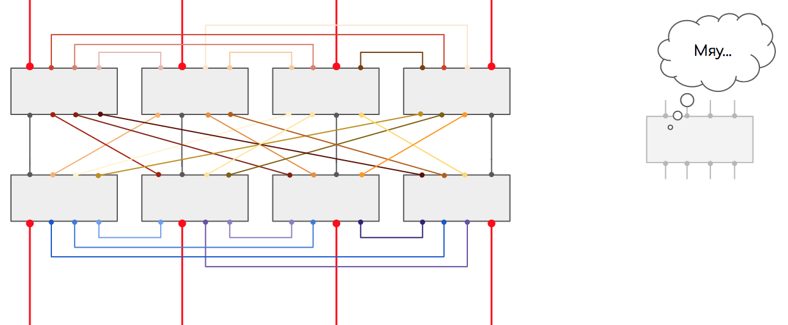

# Фабрика коммутации

Если мы возьмём Hi-End маршрутизатор операторского класса, то обычно в нём может насчитываться до двух десятков интерфейсных плат, в каждой из которых установлен как минимум один чип коммутации FE. Каждый чип коммутации смотрит частью своих ног в сторону интерфейсов, а частью в сторону задней шины. И ног там предостаточно, потому что медная среда имеет свой предел по пропускной способности — нам не хватит одного-двух выходов.

Как связать друг с другом два чипа коммутации? Ну просто же:

Как связать друг с другом три чипа? Ну, наверное, как-то так?

Как связать 8?

Уверены? Ничего не смущает?

Пропускная способность системы из 8 чипов остаётся той же, что и у пары — ведь каждый раз мы уменьшаем количество ног для связи.  
Второй момент, как нам вообще создать полносвязную топологию, если чипов, допустим, 16, и каждый из них имеет по 32 контакта? 16\*15/2 пучков кабелей по 32 жилы в каждом?

Эта проблема была адресована неблокирующимся сетям Клоза или сетям без переподписки.  
У нас есть входные коммутационные элементы \(Ingress FE\), выходные \(Egress FE\) и транзитные. Задача транзитных — связать входные с выходными. Любой входной связан с любым выходным через транзитный.

Входные и выходные не связаны друг с другом напрямую, транзитные также не имеют связи.  
Нужно больше входных и выходных коммутационных элементов — добавляем транзитных. Нужно ещё больше? Добавляем новый каскад транзитных:

Вот этим и напичканы платы коммутации в современных маршрутизаторах — очень тупые ASIC, которые только и умеют, что быстро перекладывать пакеты со входа на выход.  
Плата коммутации подключается к задней шине и имеет связность со всеми другими платами.  
Обычно они работают в режиме N+1 — то есть все разделяют нагрузку, но при выходе из строя одной платы, оставшиеся берут всё на себя.  
Кстати, сами платы можно вполне назвать верхним каскадом иерархии фабрики Клоза.

Остался только вопрос по ячейкам. Ну и перекладывали бы эти ASICи пакеты сразу, зачем их ещё нарезать?  
Здесь можно провести аналогию с [ECMP](http://lookmeup.linkmeup.ru/#term435). Если кто-то когда-либо настраивал попакетную балансировку между различными путями, то он, наверняка, помнит, сколько боли это доставляло. Неупорядоченная доставка пакетов, с которой с горем пополам справляется TCP, может основательно поломать IP-телефонию или видео, например.  
Проблема в попакетной балансировке в том, что два пакета одного потока спокойно могут пойти разными путями. При этом один из них маленький и очень быстро долетит до получателя, а другой акселерат-переросток — застрянет в узком буфере. Вот они и разупорядочились.

То же происходит и на фабрике.

Неплохой метод борьбы с этим — попоточная балансировка — вычисляется хэш по кортежу значений \(SMAC, DMAC, SIP, DIP, Protocol, SPort, DPort, MPLS-метка итд.\) и все пакеты одного потока начинают передаваться одним путём.

Но это работает неидеально. Зачастую один очень жирный поток может нагрузить один линк в то время, как другие будут простаивать. И с этим можно смириться на сети оператора, но нельзя в пределах этого синего ящика.

Элегантное решение выглядит следующим образом:  
Пакеты нарезаются на ячейки одинакового маленького размера.  
Ячейки балансируются поячеечно. То есть одна ячейка сюда, другая — туда, третья — в следующий линк итд.  
Каждая ячейка пронумерована, поэтому, когда она приходит на нужный FE — легко собирается обратно в целостный пакет.  
Поскольку расстояние от входа до выхода примерно одинаковое, размеры ячеек одинаковые, время их доставки тоже примерно одинаковое.

Идея Чарльза Клоза, которая сначала была реализована на телефонных станциях, затем была заимствована в Ethernet-коммутаторы и далее маршрутизаторы, ныне нашла своё место в сетях ЦОДов, заменив собой классическую трёхуровневую модель.

Так выглядят фабрики коммутации

Часто фабрика совмещается с управляющим модулем в одном слоту для экономии пространства в шасси и оптимизации вентиляции.

