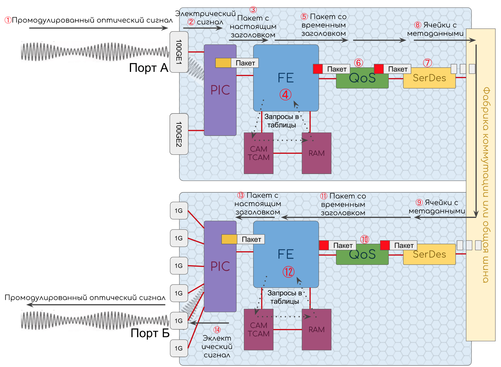

# Транзитные пакеты

Пусть мы имеем дело со стандартным Ethernet/IP-пакетом.  
Узел — IP-маршрутизатор.  
Пакет следует транзитом из L3-порта А в L3-порт Б.

1. Оптический сигнал приходит в порт. Здесь он преобразуется в электрические импульсы.
2. Импульсы попадают на PIC, где [АЦП](http://lookmeup.linkmeup.ru/#term573) восстанавливает из них поток битов. Поток битов модуль Ethernet разбивает на отдельные Ethernet-кадры. В этом ему помогает преамбула, которая тут же за ненадобностью отбрасывается. По ходу дела Ethernet вычисляет контрольную сумму кадра. А потом сравнивает с хвостовым заголовком FCS. Если совпало, пакет без FCS передаётся дальше. Если нет — тут же отбрасывается, а счётчик ошибок на интерфейсе увеличивается на 1. Здесь же на PIC вычисляется статистика трафика: количество, объём, скорость с разбивкой на Unicast, Broadcast, Multicast.
3. Далее этот Ethernet кадр ещё со всем заголовками отправляется на FE.
4. FE извлекает [DMAC](http://lookmeup.linkmeup.ru/#term606) из заголовка, обращается в CAM и ищет, есть ли там такая запись.  
   Она находится и CAM сообщает адрес в RAM.  
   Поскольку Ethernet терминируется на маршрутизаторе, данный DMAC — это MAC-адрес самого узла. Поэтому запись в RAM сообщает, что порт назначения — сам этот маршрутизатор и нужно передать Payload модулю IP \(об этом говорит анализ поля EtherType в заголовке\).

   Далее FE отделяет заголовок IP от нагрузки \(Payload\). Нагрузка будет томиться в буфере, а заголовок разорвут и растащут по полям для анализа.  
   Какие же данные из заголовка понадобятся?

5. Адрес назначения \(IP в нашем случае, но может быть MAC, MPLS-метка итд.\)
6. Приоритет \(DSCP, IEEE802.1p, EXP итд.\)
7. Значение TTL.
8. Возможно понадобятся и другие поля, такие как адрес источника, информация о вложенных данных \(протокол, порт, приложение\).

Далее, пока пакет греется во внутричиповом буфере, происходит обработка изученных данных.

* Уменьшение TTL на 1 и проверка, не равен ли он 0. Если равен — то запрос на CPU для генерации [ICMP TTL Expired in Transit](http://lookmeup.linkmeup.ru/#term13).
* Проверка по ACL — можно ли вообще передавать этот трафик.
* Приняните решение о назначении пакета на основе [DIP](http://lookmeup.linkmeup.ru/#term53).

  Ingress FE здесь обращается к TCAM с просьбой найти маршрут, соответствующий данному IP-адресу. Тот находит и передаёт адрес ячейки в RAM.

  FE от RAM получает Egress FE, выходной интерфейс и NextHop.

  В большинстве случаев Ingress FE выясняет на этом шаге MAC-адрес Next-Hop'а из таблицы соседей \(Adjacenies Tables\).

  Тут же FE узнаёт необходима ли репликация пакетов и в какие порты \(BUM-трафик в случае, например сценариев L2VPN\), считает хэш для определения в какой из интерфейсов [LAG](http://lookmeup.linkmeup.ru/#term443) или [ECMP](http://lookmeup.linkmeup.ru/#term435) послать этот пакет.

> Если адрес назначения локальный то или парсится следующий заголовок \(как это и было выше с Ethernet\), или принимаются какие-то меры аппаратные \(BFD, например\) или пакет передаётся на CPU \(BGP, OSFP итд.\)

* Преобразование приоритета из заголовков пакета во внутреннюю CoS-метку, в соответствии с которой пакет будет обрабатываться в пределах данного узла. Может навешиваться приоритет обработки в очередях и приоритет отбрасывания пакета.

Всё это станет метаданными и будет помещено во временный заголовок, сопровождающий пакет до Egress FE:

* Egress FE
* Выходной интерфейс
* Приоритет
* TTL
* Next Hop \(MAC-адрес\)

Egress FE нужен для того, чтобы доставить пакет до нужного чипа коммутации; выходной интерфейс — чтобы сообщить ему, куда пакет передать; приоритет — говорит, как с трафиком поступать в пределах устройства и, возможно, что записать в заголовок пакета \(DSCP\); TTL — тоже понадобится для того, чтобы потом его вписать в заголовок; а Next Hop MAC позволит затем определить, что писать в поле DMAC Ethernet-заголовка.

1. Данный метазаголовок приклеивается обратно к пакету перед помещением его во входную очередь. К этому моменту уже создано нужное количество копий пакета и они направляются к нужным Egress FE.
2. В зависимости от реализации далее входная очередь может запрашивать разрешение у выходной на передачу пакета, ожидать явное подтверждение или вовсе передавать безусловно.
3. Непосредственно перед передачей на общую шину, пакет разрезается чипом SerDes на ячейки.
4. Далее ячейки попадают на общую шину. Оттуда на плату коммутации, если она есть.  Если чипов коммутации не много \(2-4\), то фабрики могут быть встроены в интерфейсные карты. Если больше, то это или отдельностоящиме платы или составная часть управляющих. Для нас всё это не принципиально — важно знать, что ячейки передаются через эти фабрики.
5. С общей шины ячейки приходят на чип SerDes выходной платы, где благодаря их номерам они обратно собираются в пакет.
6. Пакет помещается в выходную очередь. Выходная очередь служит защитой FE от чрезмерного потока трафика \(Back Pressure\). Очередь позволяет отбрасываться пакеты контролируемо и прогнозируемо. Как раз в ней будет иметь значение приоритет CoS, указанный в метазаголовке. Чем ниже приоритет, тем выше вероятность отбрасывания при перегрузках. Таким образом на чип коммутации никогда не придёт больше трафика, чем он способен обработать.  Здесь уже вступают в дело механизмы QoS: обработка пакетов в очередях, предотвращение перегрузок, управление перегрузками, шейпинг.  Возвращаясь к VOQ \(Virtual Output Queue\), можно заметить, что данная очередь часто совмещается с очередями на интерфейсы: чтобы в порт 10 Гб/с не пытаться просунуть 13. Однако интерфейсные очереди могут быть выполнены и на отдельных чипах ближе к интерфейсам или даже на PIC.
7. После выходной очереди пакет с метазаголовком попадает на Egress FE.
8. Здесь теперь разбирается метазаголовок и Egress FE готовит уже окончательный вид настоящих заголовков: Заполняет поля приоритета, записывает правильный TTL, передаёт пакет уровню Ethernet, где формируется полностью новый заголовок с [SMAC](http://lookmeup.linkmeup.ru/#term605) данного устройства, а [DMAC](http://lookmeup.linkmeup.ru/#term606) из временного заголовка \(однако, если MAC не был разрезолвлен на Ingress FE, это происходит здесь\). Здесь же может выполняться полисинг, настроенный на выходном интерфейсе \(ограничение скорости, например\).
9. Далее пакет попадает на чип PIC, где вычисляется контрольная сумма, которая записывается в FCS, добавляются преамбула и IFG, и вычисляется статистика отправленных пакетов.
10. Ну и потом, наконец, пакет отправляется в свой последний путь, реинкарнировав снова в импульс.

