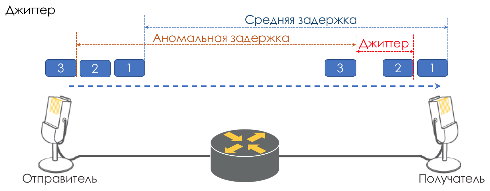

# Джиттер

Разница в задержках между доставкой последовательных пакетов называется джиттером.

Как и задержка, джиттер для многих приложений не имеет значения. И даже, казалось бы, какая разница — пакет доставлен, чего же боле?

Однако для интерактивных сервисов он важен.  
Возьмём в качестве примера ту же телефонию. По сути она является оцифровкой аналоговых сигналов с разбиением на отдельные чанки \(порции\) данных. На выходе получается достаточно равномерный поток пакетов. На принимающей стороне есть небольшой буфер фиксированного размера, в который укладываются последовательно поступающие пакеты. Для восстановления аналогового сигнала необходимо определённое их количество. В условиях плавающих задержек следующий чанк данных может не прийти вовремя. Что равносильно потере, и сигнал не удаcтся восстановить.

Наибольший вклад в вариативность задержки вносит как раз QoS. Об этом тоже много и нудно в тех же главах [Управление перегрузками](https://github.com/eucariot/SDSM/tree/ef6db47d24b261587c7463bea30d1e7c7b6ece89/15.-qos/7.-upravlenie-peregruzkami-congestion-management) и [Ограничение скорости](https://github.com/eucariot/SDSM/tree/ef6db47d24b261587c7463bea30d1e7c7b6ece89/15.-qos/8.-ogranichenie-skorosti). Потери, Задержки и Джиттер - основные характеристики качества сети, но есть две другие, которые тоже играют не последнюю роль.

