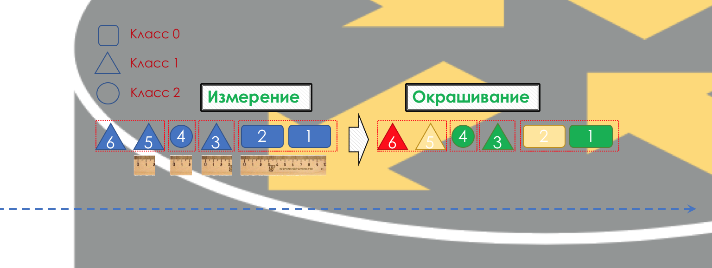
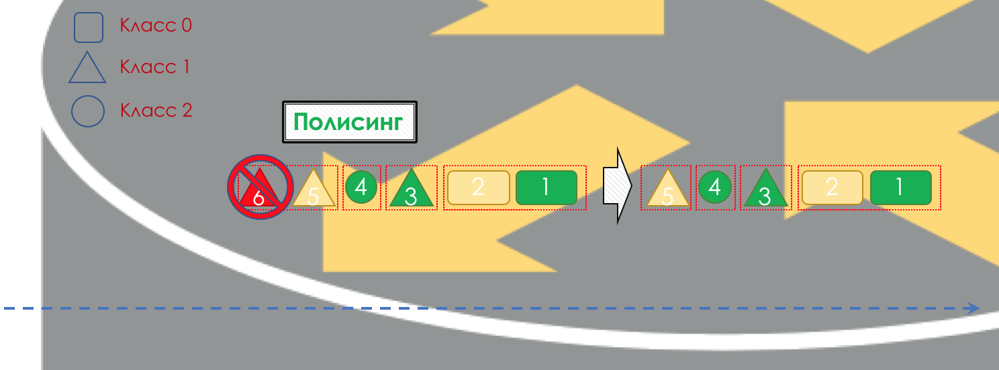
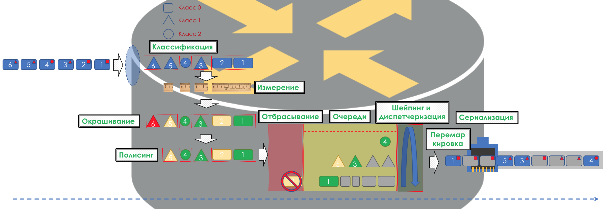

# 2. Механизмы DiffServ

Что же собой являет DiffServ и почему он выигрывает у IntServ?

Если очень просто, то трафик делится на классы. Пакет на входе в каждый узел классифицируется и к нему применяется набор инструментов, который по-разному обрабатывает пакеты разных классов, таким образом обеспечивая им разный уровень сервиса.

Но просто [не будет](https://cs5.pikabu.ru/images/big_size_comm/2015-11_1/1446439461128686990.jpg).

В основе DiffServ лежит идеологически выдержанная в традициях IP концепция **PHB — Per-Hop Behavior**. Каждый узел по пути трафика самостоятельно принимает решение о том, как вести себя относительно пришедшего пакета, на основе его заголовков.  
Действия маршрутизатора с пакетом назовём моделью поведения \(**Behavior**\). Количество таких моделей детерминировано и ограничено. На разных устройствах модели поведения по отношению к одному и тому же трафику могут отличаться, поэтому они и per-hop.  
Понятия **Behavior** и **PHB** я буду использовать в статье как синонимы.

> Тут есть лёгкая путаница. PHB — это с одной стороны общая концепция независимого поведения каждого узла, с другой — конкретная модель на конкретном узле. С этим мы ещё разберёмся.

Модель поведения определяется набором инструментов и их параметров: Policing, Dropping, Queuing, Scheduling, Shaping.  
Используя имеющиеся модели поведения, сеть может предоставлять различные классы сервиса \(**Class of Service**\).

То есть разные категории трафика могут получить разный уровень сервиса в сети путём применения к ним разных PHB.

Соответственно прежде всего нужно определить к какому классу сервиса относится трафик — классификация \(**Classification**\).

Каждый узел самостоятельно классифицирует поступающие пакеты.

После классификации происходит измерение \(**Metering**\) — сколько битов/байтов трафика данного класса пришло на маршрутизатор.

На основе результатов пакеты могут окрашиваться \(**Coloring**\): зелёный \(в рамках установленного лимита\), жёлтый \(вне лимита\), красный \(совсем берега попутал\).

Если необходимо, далее происходит полисинг \(**Policing**\) \(уж простите за такую кальку, есть вариант лучше — пишите, я поменяю\). Полисер на основе цвета пакета назначает действие по отношению к пакету — передать, отбросить или перемаркировать.

После этого пакет должен попасть в одну из очередей \(**Queuing**\). Для каждого класса сервиса выделена отдельная очередь, что и позволяет их дифференцировать, применяя разные PHB.

Но ещё до того, как пакет попадёт в очередь, он может быть отброшен \(**Dropper**\), если очередь заполнена.

Если он зелёный, то он пройдёт, если жёлтый, то его вполне вероятно, отбросят, если очередь полна, а если красный — это верный смертник. Условно, вероятность отбрасывания зависит от цвета пакета и наполненности очереди, куда он собирается попасть.

На выходе из очереди работает шейпер \(**Shaper**\), задача которого очень похожа на задачу полисера — ограничить трафик до заданного значения.

Можно настроить произвольные шейперы для отдельных очередей или даже внутри очередей.  
Об отличии шейпера от полисера в главе [Ограничение скорости](https://github.com/eucariot/SDSM/tree/18977ba74c4c0ba820de2c89dcdb904360d5c5d2/15.-qos/8.-ogranichenie-skorosti/sheiping-protiv-polisinga.md).

Все очереди в итоге должны слиться в единый выходной интерфейс.

Вспомните ситуацию, когда на дороге 8 полос сливаются в 3. Без регулировщика это превращается в хаос. Разделение по очередям не имело бы смысла, если бы на выходе мы имели то же, что на входе.  
Поэтому есть специальный диспетчер \(**Scheduler**\), который циклически вынимает пакеты из разных очередей и отправляет в интерфейс \(**Scheduling**\).  
На самом деле связка набора очередей и диспетчера — самый главный механизм QoS, который позволяет применять разные правила к разным классам трафика, одним обеспечивая широкую полосу, другим низкие задержки, третьим отсутствие дропов.

Далее пакеты уже выходят на интерфейс, где происходит преобразование пакетов в поток битов — сериализация \(**Serialization**\) и далее сигнал среды.

В DiffServ поведение каждого узла независимо от остальных, нет протоколов сигнализации, которые бы сообщили, какая на сети политика QoS. При этом в пределах сети хотелось бы, чтобы трафик обрабатывался одинаково. Если всего лишь один узел будет вести себя иначе, вся политика QoS псу под хвост.

Для этого, во-первых, на всех маршрутизаторах, настраиваются одинаковые классы и PHB для них, а во-вторых, используется маркировка \(**Marking**\) пакета — его принадлежность определённому классу записывается в заголовок \(IP, MPLS, 802.1q\).  
И красота DiffServ в том, что следующий узел может довериться этой маркировке при классификации.

Такая зона доверия, в которой действуют одинаковые правила классификации трафика и одни модели поведения, называется домен DiffServ \(**DiffServ-Domain**\).

Таким образом на входе в домен DiffServ мы можем классифицировать пакет на основе 5-Tuple или интерфейса, промаркировать \(**Remark/Rewrite**\) его согласно правилам домена, и дальнейшие узлы будут доверять этой маркировке и не делать сложную классификацию.

То есть явной сигнализации в DiffServ нет, но узел может сообщить все следующим, какой класс нужно обеспечить этому пакету, ожидая, что тот доверится.

На стыках между DiffServ-доменами нужно согласовывать политики QoS \(или не нужно\).  
Целиком картина будет выглядеть примерно так:


Чтобы было понятно, приведу аналог из реальной жизни.

Перелёт на самолёте \(не Победой\).

Есть три класса сервиса \(CoS\): Эконом, Бизнес, Первый.

При покупке билета происходит классификация \(Classification\) — пассажир получает определённый класс сервиса на основе цены.

В аэропорту происходит маркировка \(Remark\) — выдаётся билет с указанием класса.

Есть две модели поведения \(PHB\): Best Effort и Premium.

Есть механизмы, реализующие модели поведения: Общий зал ожидания или VIP Lounge, микроавтобус или общий автобус, удобные большие сиденья или плотностоящие ряды, количество пассажиров на одну борт-проводницу, возможность заказать алкоголь.

В зависимости от класса назначаются модели поведения — эконому Best Effort, Бизнесу — Premium базовый, а Первому — Premium SUPER-POWER-NINJA-TURBO-NEO-ULTRA-HYPER-MEGA-MULTI-ALPHA-META-EXTRA-UBER-PREFIX! При этом два Premium отличаются тем что, в одном дают бокал полусладкого, а в другом безлимит Бакарди.

Далее по приезду в аэропорт все заходят через одни двери. Тех, кто попытался провезти с собой оружие или не имеет билета, не пускают \(Drop\). Бизнес и эконом попадают в разные залы ожидания и разный транспорт \(Queuing\). Сначала на борт пускают Первый класс, потом бизнес, потом эконом \(Scheduling\), однако потом они в пункт назначения все летят одним самолётом \(интерфейс\).

В этом же примере перелёт на самолёте — это задержка передачи \(Propagation\), посадка — задержка сериализации \(Serialization\), ожидание самолёта в залах — Queuing, а паспортный контроль — Processing. Заметьте, что и тут Processing Delay обычно пренебрежимо мал в масштабах общего времени.

Следующий аэропорт может обойтись с пассажирами совсем иначе — его PHB отличается. Но при этом если пассажир не меняет авиакомпанию, то, скорее всего, отношение к нему не поменяется, потому что одна компания — один DiffServ-domain.


Как вы могли уже заметить, DiffServ предельно \(или беспредельно\) сложен. Но всё описанное выше, мы разберём. При этом в статье я не буду вдаваться в нюансы физической реализации \(они могут различаться даже на двух платах одного маршрутизатора\), не буду рассказывать про HQoS и MPLS DS-TE.

Порог входа в круг инженеров, понимающих технологию, для QoS значительно выше, чем для протоколов маршрутизации, MPLS, или, прости меня Радья, STP.  
И несмотря на это DiffServ заслужил признание и внедрение на сетях по всему миру, потому что, как говорится, хайли скэлэбл.  
Всю дальнейшую часть статьи я буду разбирать только DiffServ.

Ниже мы разберём все инструменты и процессы, указанные на иллюстрации.

По ходу раскрытия темы некоторые вещи я буду показывать на практике.

Работать мы будем вот с такой сетью:

Trisolarans — это клиент провайдера linkmeup с двумя точками подключения.

Жёлтая область — это DiffServ-домен сети linkmeup, где действует единая политика QoS.  
Linkmeup\_R1 — это CPE устройство, которое находится под управлением провайдера, а потому в доверенной зоне. С ним поднят OSPF и взаимодействие происходит через чистый IP.  
В пределах ядра сети MPLS+LDP+MP-BGP с L3VPN, растянутый от Linkmeup\_R2 до Linkmeup\_R4.  
Все остальные комментарии я буду давать по мере необходимости.

[_Файл начальной конфигурации_](https://docs.google.com/document/d/e/2PACX-1vRmqX4Zn20LhoAj-cmlZJq9XIB3YCE6VVgrh0Fa1E3cCW22R2S2xM4xIZu4PiTjBFvqulNLilmoaH7J/pub).

