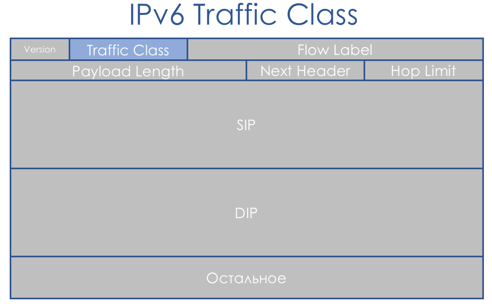
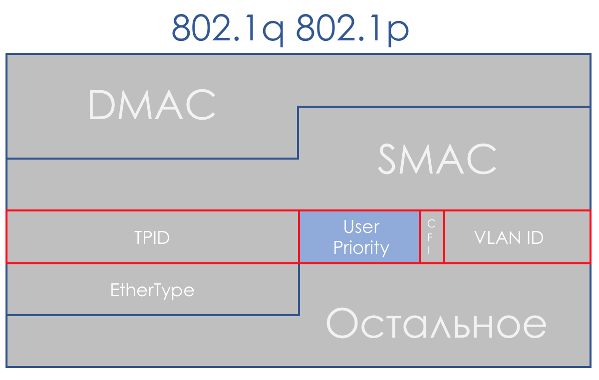

# Behavior Aggregate

В BA используется очень простая классификация — вижу цифру — понимаю класс.

Так что же за цифра? И в какое поле она записывается?

* IPv4 TOS/IPv6 Traffic Class
* MPLS Traffic Class
* Ethernet 802.1p

  В основном классификация происходит по коммутирующему заголовку.  
  Коммутирующим я называю заголовок, на основе которого устройство определяет, куда отправить пакет, чтобы он стал ближе к получателю.  
  То есть если на маршрутизатор пришёл IP-пакет, анализируется заголовок IP и поле DSCP. Если пришёл MPLS, анализируется — MPLS Traffic Class.  
  Если на обычный L2-коммутатор пришёл пакет Ethernet+VLAN+MPLS+IP, то анализироваться будет 802.1p \(хотя это можно и поменять\).

## IPv4 TOS

Поле QoS сопутствует нам ровно столько же, сколько и IP. Восьмибитовое поле TOS — Type Of Service — по задумке должно было нести приоритет пакета.  
Ещё до появления DiffServ [RFC 791](https://tools.ietf.org/html/rfc791) \(INTERNET PROTOCOL\) описывал поле так:

IP Precedence \(IPP\) + DTR + 00.


То есть идёт приоритет пакета, далее биты требовательности к Delay, Throughput, Reliability \(0 — без требований, 1 — с требованиями\).

Последние два бита должны быть нулём.


Приоритет определял следующие значения

111 — Network Control  
110 — Internetwork Control  
101 — CRITIC/ECP  
100 — Flash Override  
011 — Flash  
010 — Immediate  
001 — Priority  
000 — Routine


Чуть позже в [RFC 1349](https://tools.ietf.org/html/rfc1349) \(_Type of Service in the Internet Protocol Suite_\) поле TOS немного переопределили:


Левые три бита остались IP Precedence, четыре следующих превратились в TOS после добавления бита Cost.


Вот как следовало читать единицы в этих битах TOS:

* D — «minimize **d**elay»,
* T — «maximize **t**hroughput»,
* R — «maximize **r**eliability»,
* C — «minimize **c**ost».


Туманные описания не способствовали популярности этого подхода.

Системный подход к QoS на всём протяжении пути отсутствовал, чётких рекомендаций, как использовать поле приоритета тоже не было, описание битов Delay, Throughput и Reliability было крайне туманным.

Поэтому в контексте DiffServ поле TOS ещё раз переопределили в [RFC 2474](https://tools.ietf.org/html/rfc2474) \(_Definition of the Differentiated Services Field \(DS Field\) in the IPv4 and IPv6 Headers_\):


Вместо битов IPP и DTRC ввели шестибитовое поле DSCP — **Differentiated Services Code Point**, два правых бита не были использованы.

С этого момента именно поле DSCP должно было стать главной маркировкой DiffServ: в него записывается определённое значение \(код\), которое в пределах данного DS-домена характеризует конкретный класс сервиса, необходимый пакету и его приоритет отбрасывания. Это та самая цифра.

Все 6 бит DSCP администратор может использовать, как ему заблагорассудится, разделяя максимум до 64 классов сервиса.  
Однако в угоду совместимости с IP Precedence за первыми тремя битами сохранили роль Class Selector.

То есть, как и в IPP, 3 бита Class Selector позволяют определить 8 классов.


Однако это всё же не более, чем договорённость, которую в пределах своего DS-домена, администратор может легко игнорировать и использовать все 6 бит по усмотрению.

[Далее](rekomendacii-ietf-kategorii-trafika-klassy-servisa-i-modeli-povedeniya.md) также замечу, что согласно рекомендациям IETF, чем выше значение, записанное в CS, тем требовательнее этот трафик к сервису.

Но и это не стоит воспринимать как неоспоримую истину.

Если первые три бита определяют класс трафика, то следующие три используются для указания приоритета отбрасывания пакета \(**Drop Precedence** или **Packet Loss Priority** - **PLP**\).


Восемь классов — это много или мало? На первый взгляд мало — ведь так много разного трафика ходит в сети, что так и хочется каждому протоколу выделить по классу. Однако оказывается, что восьми достаточно для всех возможных сценариев. Для каждого класса нужно определять PHB, который будет обрабатывать его как-то отлично от других классов. Да и при увеличении делителя, делимое \(ресурс\) не увеличивается. Я намеренно не говорю о том, какие значения какой именно класс трафика описывают, поскольку здесь нет стандартов и формально их можно использовать по своему усмотрению. Ниже я расскажу, какие классы и соответствующие им значения рекомендованы.



Биты ECN…

Двухбитовое поле ECN появилось только в [RFC 3168](https://tools.ietf.org/html/rfc3168) \(_Explicit Congestion Notification_\). Поле было определено с благой целью — сообщить конечным хостам в явном виде о том, что кто-то по пути испытывает перегрузку.  
Например, когда в очередях маршрутизатора задерживаются пакеты надолго и заполняют их, например, на 85%, он меняет значение ECN, сообщая конечному хосту, что нужно помедленнее — что-то вроде Pause Frames в Ethernet.  
В этом случае отправитель должен уменьшить скорость передачи и снизить нагрузку на страдающий узел.

При этом теоретически поддержка этого поля всеми транзитными узлами не обязательна. То есть использование ECN не ломает сеть без его поддержки.  
Цель благая, но прежде применения в жизни ECN особо не находил. В наше время мега- и гиперскейлов на эти два бита смотрят с [новым интересом](https://tools.ietf.org/html/rfc8257).

ECN является одним из механизмов предотвращения перегрузок, о которых [ниже](https://github.com/eucariot/SDSM/tree/c42ae44b73eda2a58b6f63e8838c9dfa88ece63d/15.-qos/7.-upravlenie-peregruzkami-congestion-management).


### Практика по классификации DSCP

Не помешает немного практики.

Схема та же.


Для начала просто отправим запрос ICMP:

```text
Linkmeup_R1#ping ip 172.16.2.2 source 172.16.1.1
Type escape sequence to abort.
Sending 5, 100-byte ICMP Echos to 172.16.2.2, timeout is 2 seconds:
Packet sent with a source address of 172.16.1.1 
!!!!!
Success rate is 100 percent (5/5), round-trip min/avg/max = 1/1/1 ms
```

**Linkmeup\_R1. E0/0.**


[_pcapng_](https://yadi.sk/d/qunzFzOZ3YkE3W)

А теперь с установленным значением DSCP:

```text
Linkmeup_R1#ping ip 172.16.2.2 source 172.16.1.1 tos 184
Type escape sequence to abort.
Sending 5, 100-byte ICMP Echos to 172.16.2.2, timeout is 2 seconds:
Packet sent with a source address of 172.16.1.1 
!!!!!
Success rate is 100 percent (5/5), round-trip min/avg/max = 1/1/1 ms
```

Значение 184 — это десятичное представление двоичного 10111000. Из них первые 6 бит — это 101110, то есть десятичные 46, а это класс EF.


Таблица стандартных значений TOS для удобных попингушек:




[_Подробнее_](https://www.tucny.com/Home/dscp-tos)

Ниже по тексту в главе Рекомендации IETF я расскажу, откуда взялись и эти цифры и названия.

**Linkmeup\_R2. E0/0**


[_pcapng_](https://yadi.sk/d/dCu1DUFS3YkEA3)

Любопытное замечание: адресат попингушек в ICMP Echo reply устанавливает такое же значение класса, как было в Echo Request. Это логично — если отправитель послал пакет с определённым уровнем важности, то, очевидно, он хочет получить его гарантировано назад.

**Linkmeup\_R2. E0/0**


[_Файл конфигурации DSCP классификации_](https://docs.google.com/document/d/e/2PACX-1vTrtK-fnUH8KO8UjTlScnv4xT-5FAsp7mDITqtDjtFHDZXJYg4UPvQnhQ5B9JqydfNuY_1-Ho9_RjIH/pub)

## IPv6 Traffic Class

IPv6 мало чем в вопросе QoS отличается от IPv4. Восьмибитовое поле, называемое Traffic Class, также разбито на две части. Первые 6 бит — DSCP — играют ровно ту же роль.  
Да, появился Flow Label. Говорят, что его можно было бы использовать для дополнительной дифференциации классов. Но применения в жизни эта идея пока нигде не нашла.



## MPLS Traffic Class

Концепция DiffServ была ориентирована на IP-сети с маршрутизацией на основе IP-заголовка. Вот только незадача — через 3 года опубликовали [RFC 3031](https://tools.ietf.org/html/rfc3031) \(_Multiprotocol Label Switching Architecture_\). И MPLS начал захватывать сети провайдеров.

DiffServ нельзя было не распространить на него.

По счастливой случайности в MPLS заложили трёхбитовое поле EXP на всякий экспериментальный случай. И несмотря на то, что уже давным-давно в [RFC 5462](https://tools.ietf.org/html/rfc5462) \(_«EXP» Field Renamed to «Traffic Class» Field_\) официально стало полем Traffic Class, по инерции его называют ИЭксПи.

С ним есть одна проблема — его длина три бита, что ограничивает число возможных значений до 9. Это не просто мало, это на 3 двоичных порядка меньше, чем у DSCP.


Учитывая, что часто MPLS Traffic Class наследуется из DSCP IP-пакета, имеем архивацию с потерей. Или же… Нет, вы не хотите этого знать… [L-LSP](http://linkmeup.ru/blog/302.html#MPLS-TE-DIFFSERV). Использует комбинацию Traffic Class + значение метки.

> Вообще согласитесь, ситуация странная — MPLS разрабатывался как помощь IP для быстрого принятия решения — метка MPLS мгновенно обнаруживается в CAM по Full Match, вместо традиционного Longest Prefix Match. То есть и про IP знали, и в коммутации участие принимает, а нормальное поле приоритета не предусмотрели.

На самом деле выше мы уже увидели, что для определения класса трафика используется только первые три бита DSCP, а три другие — Drop Precedence \(или PLP — Packet Loss Priority\).

Поэтому в плане классов сервиса всё же имеем соответствие 1:1, теряя только информацию о Drop Precedence.

В случае MPLS классификация так же как и в IP может быть на основе интерфейса, MF, значения DSCP IP или Traffic Class MPLS.

Маркировка означает запись значения в поле Traffic Class заголовка MPLS.

Пакет может содержать несколько заголовков MPLS. Для целей DiffServ используется только верхний.  
Существуют три разных сценария перемаркировки при продвижении пакета из одного чистого IP-сегмента в другой через MPLS-домен:

\(это просто выдержка из [статьи](http://linkmeup.ru/blog/302.html#MPLS-QOS-MODES)\).

1. Uniform Mode
2. Pipe Mode
3. Short-Pipe Mode

### Режимы работы

> #### Uniform Mode
>
> Это плоская модель End-to-End.  
>   
>   
>   
> На Ingress PE мы доверяем IP DSCP и копируем \(строго говоря, отображаем, но для простоты будем говорить «копируем»\) его значение в MPLS EXP \(как туннельный, так и VPN заголовки\). На выходе с Ingress PE пакет уже обрабатывается в соответствии со значением поля EXP верхнего заголовка MPLS.  
> Каждый транзитный P тоже обрабатывает пакеты на основе верхнего EXP. Но при этом он может его поменять, если того хочет оператор.  
> Предпоследний узел снимает транспортную метку \(PHP\) и копирует значение EXP в VPN-заголовок. Не важно, что там стояло — в режиме Uniform, происходит копирование.  
> Egress PE снимая метку VPN, тоже копирует значение EXP в IP DSCP, даже если там записано другое.  
> То есть если где-то в середине значение метки EXP в туннельном заголовке изменилось, то это изменение будет унаследовано IP-пакетом.
>
> #### Pipe Mode
>
>   
>   
> Если же на Ingress PE мы решили не доверять значению DSCP, то в заголовки MPLS вставляется то значение EXP, которое пожелает оператор.  
> Но допустимо и копировать те, что были в DSCP. Например, можно переопределять значения — копировать всё, вплоть до EF, а CS6 и CS7 маппировать в EF.  
> Каждый транзитный P смотрит только на EXP верхнего MPLS-заголовка.  
> Предпоследний узел снимает транспортную метку \(PHP\) и **копирует** значение EXP в заголовок VPN.  
> Egress PE сначала производит обработку пакета, опираясь на поле EXP в заголовке MPLS, и только потом его снимает, при этом **не копирует**значение в DSCP.  
> То есть независимо от того, что происходило с полем EXP в заголовках MPLS, IP DSCP остаётся неизменным.  
>   
> Такой сценарий можно применять, когда у оператора свой домен Diff-Serv, и он не хочет, чтобы клиентский трафик как-то мог на него влиять.
>
> #### Short-Pipe Mode
>
>   
> Этот режим вы можете рассматривать вариацией Pipe-mode. Разница лишь в том, что на выходе из MPLS-сети пакет обрабатывается в соответствие с его полем IP DSCP, а не MPLS EXP.  
> Это означает, что приоритет пакета на выходе определяется клиентом, а не оператором.  
> Ingress PE не доверяет IP DSCP входящих пакетов  
> Транзитные P смотрят в поле EXP верхнего заголовка.  
> Предпоследний P снимает транспортную метку и копирует значение в VPN-метку.  
> Egress PE сначала снимает метку MPLS, потом обрабатывает пакет в очередях.  
>   
> Объяснение от [cisco](http://www.cisco.com/c/en/us/support/docs/multiprotocol-label-switching-mpls/mpls/47815-diffserv-tunnel.html).

### **Практика классификации MPLS Traffic Class**

Схема та же:


[_Файл конфигурации тот же_](https://docs.google.com/document/d/e/2PACX-1vTrtK-fnUH8KO8UjTlScnv4xT-5FAsp7mDITqtDjtFHDZXJYg4UPvQnhQ5B9JqydfNuY_1-Ho9_RjIH/pub)

В схеме сети linkmeup есть переход из IP в MPLS на Linkmeup\_R2.

Посмотрим, что происходит с маркировкой при пинге **ping ip 172.16.2.2 source 172.16.1.1 tos 184**.

**Linkmeup\_R2. E0/0.**


[_pcapng_](https://yadi.sk/d/CN3OUB8y3Ykb3o)

Итак, мы видим, что изначальная метка EF в IP DSCP трансформировалась в значение 5 поля EXP MPLS \(оно же Traffic Class, помним это\) как VPN-заголовка, так и транспортного.

Тут мы являемся свидетелями режима работы Uniform.

## Ethernet 802.1p

Отсутствие поля приоритета в 802.3 \(Ethernet\) находит своё объяснение в том, что Ethernet изначально планировался исключительно как решение для LAN-сегмента. За скромные деньги можно получить избыточную пропускную способность, и узким местом всегда будет аплинк — не за чем беспокоиться о приоритизации.

Однако очень скоро стало ясно, что финансовая привлекательность Ethernet+IP выводит эту связку на уровень магистрали и WAN. Да и сожительство в одном LAN-сегменте торрентов и телефонии нужно разруливать.  
По счастью к этому моменту подоспел 802.1q \(VLAN\), в котором выделили 3-битовое \(опять\) поле под приоритеты.  
В плане DiffServ это поле позволяет определить те же 8 классов трафика.



При получении пакета сетевое устройство DS-домена в большинстве случаев берёт в рассмотрение тот заголовок, который оно использует для коммутации:

* Ethernet-коммутатор — 802.1p
* MPLS-узел — MPLS Traffic Class
* IP-маршрутизатор — IP DSCP

  Хотя это поведение можно и изменить: Interface-Based и Multi-Field классификация. А можно иногда даже явно сказать, в поле CoS какого заголовка смотреть.

