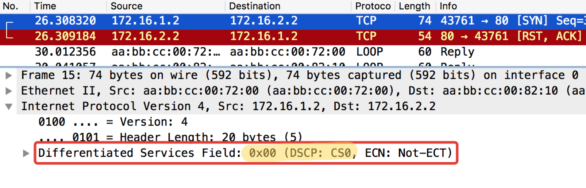
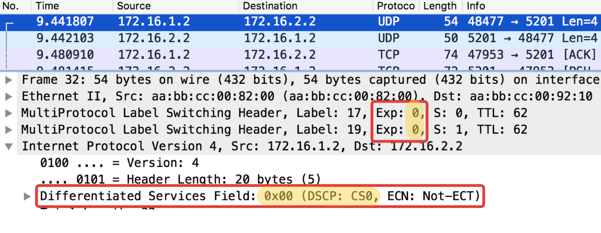

# Multi-Field

Наиболее часто встречающийся тип классификации на входе в DS-домен. Не доверяем имеющейся маркировке, а на основе заголовков пакета присваиваем класс.

Зачастую это способ вообще «включить» QoS, в случае, когда отправители не проставляют маркировку.  
Достаточно гибкий инструмент, но в то же время громоздкий — нужно создавать непростые правила для каждого класса. Поэтому внутри DS-домена актуальнее BA.

## **Практика по MF классификации**

Схема та же:


Из практических примеров выше видно, что устройства сети по умолчанию доверяют маркировке приходящих пакетов.

Это прекрасно внутри DS-домена, но неприемлемо в точке входа.  
А давайте теперь не будем слепо доверять? На **Linkmeup\_R2** ICMP будем метить как EF \(исключительно для примера\), TCP как AF12, а всё остальное CS0.  
Это будет MF \(Multi-Field\) классификация.

1. Процедура та же, но теперь матчить будем по ACL, которые выцепляют нужные категории трафика, поэтому сначала создаём их.  
   **На Linkmeup\_R2:**

   ```text
   ip access-list extended TRISOLARANS_ICMP_ACL
   permit icmp any any
   ip access-list extended TRISOLARANS_TCP_ACL
   permit tcp any any
   ip access-list extended TRISOLARANS_OTHER_ACL
   permit ip any any
   ```

2. Далее определяем классификаторы:

   ```text
   class-map match-all TRISOLARANS_TCP_CM
   match access-group name TRISOLARANS_TCP_ACL
   class-map match-all TRISOLARANS_OTHER_CM
   match access-group name TRISOLARANS_OTHER_ACL
   class-map match-all TRISOLARANS_ICMP_CM
   match access-group name TRISOLARANS_ICMP_ACL
   ```

3. А теперь определяем правила перемаркировки в политике:

   ```text
   policy-map TRISOLARANS_ADMISSION_CONTROL
   class TRISOLARANS_ICMP_CM
   set ip dscp ef
   class TRISOLARANS_TCP_CM
   set ip dscp af11
   class TRISOLARANS_OTHER_CM
   set ip dscp default
   ```

4. И вешаем политику на интерфейс. На input, соответственно, потому что решение нужно принять на входе в сеть.

   ```text
   interface Ethernet0/1
   service-policy input TRISOLARANS_ADMISSION_CONTROL
   ```

ICMP-тест с конечного хоста Trisolaran1. Никак сознательно не указываем класс — по умолчанию 0.

**Политику с Linkmeup\_R1 я уже убрал, поэтому трафик приходит с маркировкой CS0, а не CS7.**


Вот два дампа рядом, с Linkmeup\_R1 и с Linkmeup\_R2:

**Linkmeup\_R1. E0/0.**


[_pcapng_](https://yadi.sk/d/dT8QCu7n3YkjZ4)

**Linkmeup\_R2. E0/0.**


[_pcapng_](https://yadi.sk/d/3OOzH2Ww3YkjZ9)

Видно, что после классификаторов и перемаркировки на Linkmeup\_R2 на ICMP-пакетах не только DSCP поменялся на EF, но и MPLS Traffic Class стал равным 5.  
Аналогичный тест с telnet 172.16.2.2. 80 — так проверим TCP:


**Linkmeup\_R1. E0/0.**



[_pcapng_](https://yadi.sk/d/M21gTk2f3Ykkaa)

**Linkmeup\_R2. E0/0.**


[_pcapng_](https://yadi.sk/d/GdyZtBI-3YkkZa)

ЧИТО — Что И Требовалось Ожидать. TCP передаётся как AF11.  
Следующим тестом проверим UDP, который должен попасть в CS0 согласно нашим классификаторам. Для этого воспользуемся iperf \(привезти его в Linux Tiny Core изи через Apps\). На удалённой стороне **iperf3 -s** — запускаем сервер, на локальной **iperf3 -c -u -t1** — клиент \(**-c**\), протокол UDP \(**-u**\), тест в течение 1 секунды \(**-t1**\).


**Linkmeup\_R1. E0/0.**


[_pcapng_](https://yadi.sk/d/FG9eNhV93YkoD7)

**Linkmeup\_R2. E0/0**



[_pcapng_](https://yadi.sk/d/t3hRvRMk3YkoDR)

С этого момента всё, что приходит в этот интерфейс, будет классифицировано согласно настроенным правилам.

