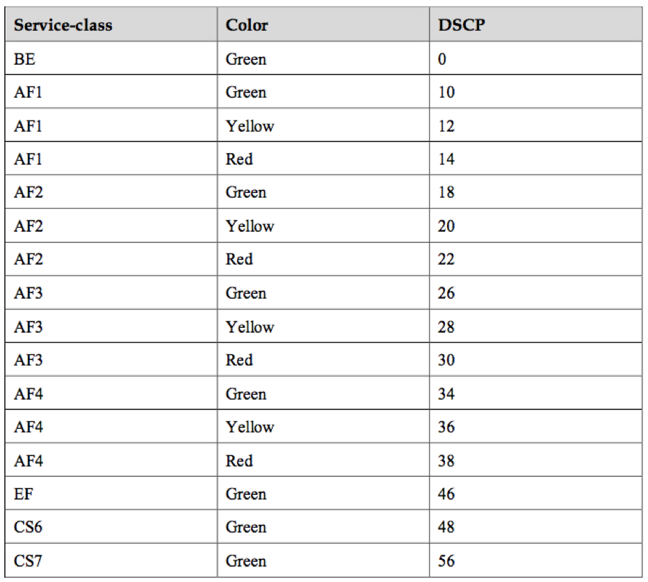
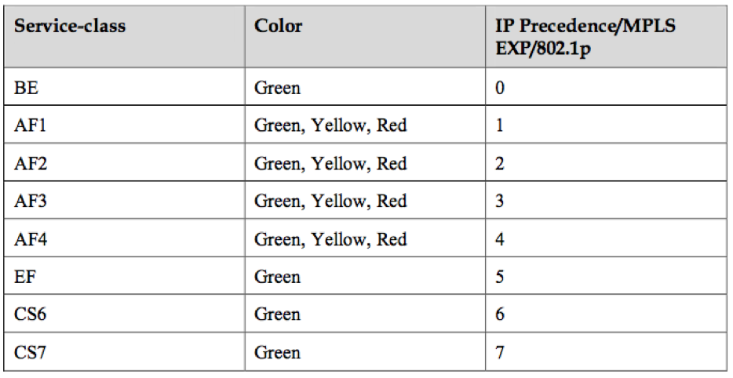

# Маркировка внутри устройства

Ещё раз: на входе в DS-домен может происходить классификация MF, Interface-based или BA.

Между узлами DS-домена пакет в заголовке несёт знак о необходимом ему классе сервиса и классифицируется по BA.

Независимо от способа классификации после неё пакету присваивается внутренний класс в пределах устройства, в соответствии с которым он и обрабатывается. Заголовок при этом снимается, и голый \(нет\) пакет путешествует к выходу.

А на выходе внутренний класс преобразуется в поле CoS нового заголовка.

То есть _Заголовок 1 ⇒ Классификация ⇒ Внутренний класс сервиса ⇒ Заголовок 2_.

В некоторых случаях нужно отобразить поле заголовка одного протокола в поле заголовка другого, например, DSCP в Traffic Class.

Происходит это как раз через промежуточную внутреннюю маркировку.

Например, _Заголовок DSCP ⇒ Классификация ⇒ Внутренний класс сервиса ⇒ Заголовок Traffic Class_.

Формально, внутренние классы могут называться как угодно или просто нумероваться, а им в соответствие только ставится определённая очередь.

На глубине, до которой мы погружаемся в этой статье, не важно, как они называются, важно, что конкретным значениям полей QoS ставится в соответствие определённая модель поведения.

Если мы говорим о конкретных реализациях QoS, то количество классов сервиса, которое устройство может обеспечить, не больше, чем количество доступных очередей. Зачастую их восемь \(не то под влиянием IPP, не то по неписанной договорённости\). Однако в зависимости от вендора, устройства, платы, их может быть как больше, так и меньше.

То есть если очередей 4, то классов сервиса просто нет смысла делать больше четырёх.

Чуть поподробнее об этом поговорим в [аппаратной главе](https://github.com/eucariot/SDSM/tree/ef6db47d24b261587c7463bea30d1e7c7b6ece89/15.-qos/9.-apparatnaya-realizaciya-qos.md).

## **Вот несколько условных таблиц соответствия между различными маркировками**


Таблицы ниже могут показаться удобными для первого взгляда на соотношение между полями QoS и внутренними классами, однако вводят несколько в заблуждение, называя классы именами PHB. Всё-таки PHB - это то, какая модель поведения назначается трафику определённого класса, имя которого, грубо говоря, произвольно.

Поэтому относитесь к таблицам ниже с долей скепсиса.


На примере Huawei. Здесь Service-Class — это та самая внутренняя маркировка пакета.  
То есть, если на входе происходит классификация BA, то значения DSCP будут транслироваться в соответствующие им значения Service-Class и Color.

Здесь стоит обратить внимание на то, что многие значения DSCP не используются, и пакеты с такой маркировкой фактически обрабатываются, как BE.  
Вот таблица обратного соответствия, которая показывает, какие значения DSCP будут установлены трафику при перемаркировке на выходе.

Обратите внимание, что только у AF есть градация по цветам. BE, EF, CS6, CS7 — все только Green.  
Это таблица преобразования полей IPP, MPLS Traffic Class и Ethernet 802.1p во внутренние классы сервиса.

И обратно.

Заметьте, что здесь вообще теряется какая-либо информация о приоритете отбрасывания.  
Следует повториться — это только конкретный пример соответствий по умолчанию от _наугад_ выбранного вендора. У других это может отличаться. На своей сети администраторы могут настроить совершенно отличные классы сервисов и PHB.

В плане PHB нет абсолютно никакой разницы что используется для классификации — DSCP, Traffic Class, 802.1p.

Внутри устройства они превращаются в классы трафика, определённые администратором сети.  
То есть все эти маркировки — это способ сообщить соседям, какой класс сервиса им следует назначить этому пакету. Это примерно, как BGP Community, которые не значат ничего сами по себе, пока на сети не определена политика их интерпретации.

