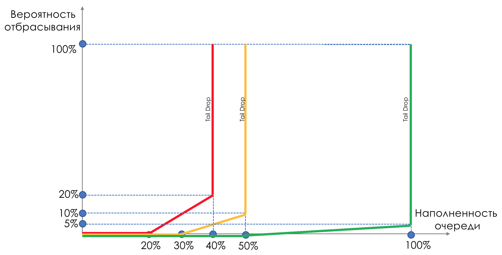

# WRED — Weighted Random Early Detection

Но на слуху у всех, наверно, всё-таки **WRED**. Проницательный читатель linkmeup уже предположил, что это тот же RED, но взвешенный по очередям. И оказался не совсем прав.

RED работает в пределах одной очереди. Нет смысла оглядываться на EF, если переполнилась BE. Соответственно и взвешивание по очередям ничего не принесёт.  
Здесь как раз работает Drop Precedence.

И в пределах одной очереди у пакетов с разным приоритетом отбрасывания будут разные кривые. Чем ниже приоритет, тем больше вероятность того, что его прихлопнут.

Здесь есть три кривые:

Красная — менее приоритетный трафик \(с точки зрения отбрасывания\), жёлтая — более, зелёная — максимально.  
Красный трафик начинает отбрасываться уже при заполнении буфера на 20%, с 20 до 40 он дропается вплоть до 20%, далее — Tail Drop.  
Жёлтый стартует попозже — с 30 до 50 он отбрасывается вплоть до 10%, далее — Tail Drop.  
Зелёный наименее подвержен: с 50 до 100 плавно растёт до 5 %. Далее — Tail Drop.  
В случае с DSCP это могли бы быть AF11, AF12 и AF13, соответственно зелёная, жёлтая и красная.

Очень важно здесь то, что это работает с TCP и это абсолютно неприменимо к UDP.

Либо приложение использующее UDP игнорирует потери, как в случае телефонии или потокового видео, и это отрицательно сказывается на том, что видит пользователь.  
Либо приложение само осуществляет контроль доставки и попросит повторно отправить тот же самый пакет. При этом оно совсем не обязано просить источник снизить скорость передачи. И вместо уменьшения нагрузки получается увеличение из-за ретрансмитов.  
Именно поэтому для EF применяется только Tail Drop.  
Для CS6, CS7 тоже применяется Tail Drop, поскольку там не предполагается больших скоростей и WRED ничего не решит.  
Для AF применяется WRED. AFxy, где x — класс сервиса, то есть очередь, в которую он попадает, а y — приоритет отбрасывания — тот самый цвет.  
Для BE решение принимается на основе преобладающего в этой очереди трафика.

В пределах одного маршрутизатора используются специальная внутренняя маркировка пакетов, отличная от той, что несут заголовки. Поэтому MPLS и 802.1q, где нет возможности кодировать Drop Precedence, в очередях могут обрабатываться с различными приоритетами отбрасывания.

Например, MPLS пакет пришёл на узел, он не несёт маркировки Drop Precedence, однако по результатам полисинга оказался жёлтым и перед помещением в очередь \(которая может определяться полем Traffic Class\), может быть отброшен.  
При этом стоит помнить, что вся эта радуга существует только внутри узла. В линии между соседями нет понятия цвета.  
Хотя закодировать цвет в Drop Precedence-часть DSCP, конечно, возможно.

> Отбрасывания могут появиться и в незагруженной сети, где казалось бы никакого переполнения очередей быть не должно. Как?  
> Причиной этому могут быть кратковременные всплески — бёрсты — трафика. Самый простой пример — 5 приложений одновременно решили передать трафик на один конечный хост.  
> Пример посложнее — отправитель подключен через интерфейс 10 Гб/с, а получатель — 1 Гб/с. Сама среда позволяет крафтить пакеты быстрее на отправителе. Ethernet Flow Control получателя просит ближайший узел притормозить, и пакеты начинают скапливаться в буферах.

Ну а что же делать, когда плохо всё-таки стало?

