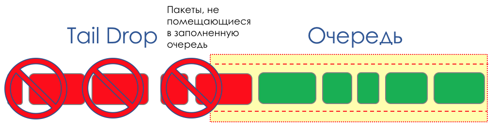

# Tail Drop и Head Drop

**Tail Drop** — наиболее простой механизм управления очередью — отбрасываем все вновь пришедшие пакеты, не помещающиеся в буфер.

**Head Drop** отбрасывает пакеты, которые стоят в очереди уже очень долго. Их уже лучше выбросить, чем пытаться спасти, потому что они, скорее всего, бесполезны. Зато у более актуальных пакетов, пришедших в конец очереди, будет больше шансов прийти вовремя. Плюс к этому Head Drop позволит не загружать сеть ненужными пакетами. Естественным образом самыми старыми пакетами оказываются те, что в самой голове очереди, откуда и название подхода.

У Head Drop есть и ещё одно неочевидное преимущество — если пакет отбросить в начале очереди, то получатель быстрее узнает о перегрузке на сети и сообщит отправителю. В случае Tail Drop информация об отброшенном пакете дойдёт, возможно, на сотни миллисекунд позже — пока будет добираться с хвоста очереди до её головы.  
Оба механизма работают с дифференциацией по очередям. То есть на самом деле не обязательно, чтобы весь буфер переполнился. Если 2-ая очередь пустая, а нулевая под завязку, то отбрасываться буду только пакеты из нулевой.

Tail Drop и Head Drop могут работать одновременно.

Tail и Head Drop — это Congestion Avoidance «в лоб». Даже можно сказать — это его отсутствие.

Ничего не предпринимаем, пока очередь не заполнится на 100%. А после этого все вновь прибывшие \(или надолго задержавшиеся\) пакеты начинаем отбрасывать.

Если для достижения цели не нужно ничего делать, значит где-то есть нюанс.

И этот нюанс — TCP.  
Вспомним \([поглубже](http://linkmeup.ru/blog/300.html) и [экстремально глубоко](http://www.tcpipguide.com/free/index.htm)\), как работает TCP — речь про современные реализации.  
Есть Скользящее окно\(Sliding Window или **rwnd — Reciever's Advertised Window**\), которым управляет получатель, сообщая отправителю, сколько можно посылать.  
А есть окно перегрузки \(**CWND — Congestion Window**\), которое реагирует на проблемы в сети и управляется отправителем.

Процесс передачи данных начинается с медленного старта \(**Slow Start**\) с экспоненциальным ростом CWND. С каждым подтверждённым сегментом к CWND прибавляется 1 размер MSS, то есть фактически оно удваивается за время, равное RTT \(туда данные, обратно ACK\) \(Речь про Reno/NewReno\).

Например,

Экспоненциальный рост продолжается до значения, называемого **ssthreshold** \(Slow Start Threshold\), которое указывается в конфигурации TCP на хосте.

Далее начинается линейный рост по 1/CWND на каждый подтверждённый сегмент до тех пор, пока либо не упрётся в RWND, либо не начнутся потери \(о потерях свидетельсв повторное подтверждение \(Duplicated ACK\) или вообще отсутствие подтверждения\).  
Как только зафиксирована потеря сегмента, происходит **TCP Backoff** — TCP резко уменьшает окно, фактически снижая скорость отправки, — и запускается механизм **Fast Recovery**:

1. отправляются потерянные сегменты \(Fast Retransmission\),
2. окно скукоживается в два раза,
3. значение ssthreshold тоже становится равным половине достигнутого окна,
4. снова начинается линейный рост до первой потери,
5. Повторить.

Потеря может означать либо полный развал какого-то сегмента сети и тогда считай, что пропало, либо перегрузку на линии \(читай переполнение буфера и отбрасывание сегмента данной сессии\).

Таков у TCP метод максимальной утилизации доступной полосы и борьбы с перегрузками. И он достаточно эффективен.

Однако к чему приводит Tail Drop?

1. Допустим через маршрутизатор лежит путь тысячи TCP-сессий. В какой-то момент трафик сессий достиг 1,1 Гб/с, скорость выходного интерфейса — 1Гб/с.
2. Трафик приходит быстрее, чем отправляется, буферы заполняются [всклянь](https://dic.academic.ru/dic.nsf/efremova/149600/Всклень).
3. Включается Tail Drop, пока диспетчер не выгребет из очереди немного пакетов.
4. Одновременно десятки или сотни сессий фиксируют потери и уходят в Fast Recovery \(а то и в Slow Start\).
5. Объём трафика резко падает, буферы прочищаются, Tail Drop выключается.
6. Окна затронутых TCP-сессий начинают расти, и вместе с ними скорость поступления трафика на узкое место.
7. Буферы переполняются.
8. Fast Recovery/Slow Start.
9. Повторить.

   Подробнее об изменениях в механизмах TCP в [RFC 2001](https://tools.ietf.org/html/rfc2001) \(_TCP Slow Start, Congestion Avoidance, Fast Retransmit, and Fast Recovery Algorithms_\).  
   Это характерная иллюстрация ситуации, называемой глобальной синхронизацией TCP \(**Global TCP Synchronization**\):

**Глобальная** — потому что страдают много сессий, установленных через этот узел.  
**Синхронизация**, потому что страдают они одновременно. И ситуация будет повторяться до тех пор, пока имеет место перегрузка.  
**TCP** — потому что UDP, не имеющий механизмов контроля перегрузки, ей не подвержен.

Ничего плохого в этой ситуации не было бы, если бы она не вызывала неоптимальное использование полосы — промежутки между зубцами пилы — потраченные зря деньги.  
Вторая проблема — это **TCP Starvation** — истощение TCP. В то время, как TCP сбавляет свою скорость для снижения нагрузки \(не будем лукавить — в первую очередь, чтобы наверняка передать свои данные\), UDP эти все моральные страдания вообще по датаграмме — шлёт сколько может.

Итак, количество трафика TCP снижается, а UDP растёт \(возможно\), следующий цикл Потеря — Fast Recovery случается на более низком пороге. UDP занимает освободившееся место. Общее количество TCP-трафика падает.

Чем решать проблему, лучше её избежать. Давайте попробуем снизить нагрузку до того, как она заполнит очередь, воспользовавшись Fast Recovery/Slow Start, который только что был против нас.

