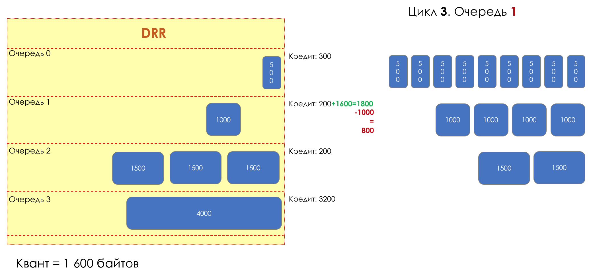
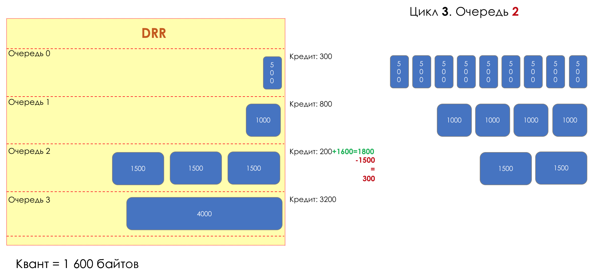
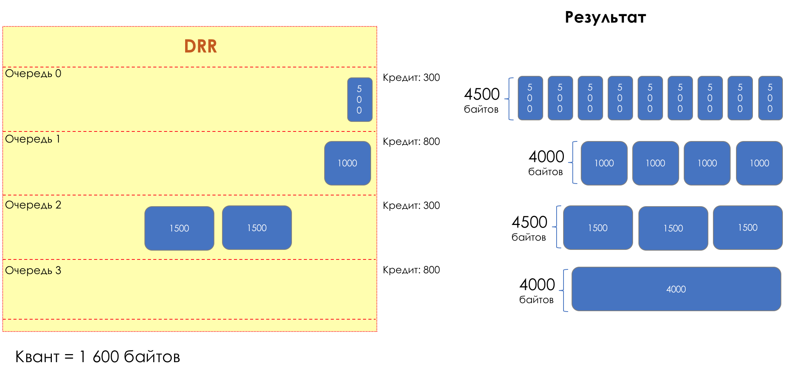
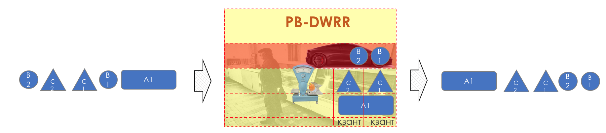

# RR — Round-Robin

## RR - Round Robin

Рука об руку с FQ шёл и **RR**.

Один был честен, но не прост. Другой совсем наоборот.

RR перебирал очереди, извлекая из них равное число пакетов. Подход более примитивный, чем FQ, и оттого нечестный по отношению к различным потокам. Агрессивные источники легко могли затопить полосу пакетами размером в 1500 байтов.

Однако он очень просто реализовывался — не нужно знать размер пакета в очереди, фрагментировать его и собирать потом обратно.  
Однако его несправедливость в распределении полосы перекрыла ему путь в мир — в мире сетей чистый Round-Robin не был реализован.

## WRR — Weighted Round Robin

Та же судьба и у WRR, который придавал очередям вес на основе IP Precedence. В WRR вынималось не равное число пакетов, а кратное весу очереди.

Можно было бы давать больший вес очередям с более мелкими пакетами, но делать это динамически не представлялось возможным.

## DWRR — Deficit Weighted Round Robin

И вдруг, крайне любопытный подход в 1995-м году предложили M. Shreedhar and G. Varghese.

Каждая очередь имеет отдельную **кредитную линию** в битах.  
При проходе из очереди выпускается столько пакетов, на сколько хватает кредита.  
Из суммы кредита вычитается размер того пакета, что в голове очереди.  
Если разность больше нуля, этот пакет изымается, и проверяется следующий. Так до тех пор, пока разность не окажется меньше нуля.  
Если даже первому пакету не хватает кредита, что ж, увы-селявы, он остаётся в очереди.  
Перед следующим проходом кредит каждой очереди увеличивается на определённую сумму, называемую **квант**.  
Для разных очередей квант разный — чем большую полосу нужно дать, тем больше квант.

Таким образом все очереди получают гарантированную полосу, независимо от размера пакетов в ней.

Мне бы из объяснения выше не было понятно, как это работает.

### **Давайте по шагам разрисуем**

* DRR \(без W\),
* 4 очереди,
* в 0-й все пакеты по 500 байтов,
* В 1-й — по 1000,
* Во 2-й по 1500,
* А в 3-й лежит одна колбаса на 4000,
* Квант — 1600 байтов.

#### **Цикл 1**

**Цикл 1. Очередь 0**  
Начинается первый цикл, каждой очереди выделяется по 1600 байтов \(квант\)  
Обработка начинается с 0-й очереди. Диспетчер считает:  
Первый пакет в очереди проходит — Пропускаем \(1600 — 500 = 1100\).  
Второй — проходит — пропускаем \(1100 — 500 = 600\).  
Третий — проходит — пропускаем \(600 — 500 = 100\).  
Четвёртый — уже не проходит \(100 — 500 = -400\). Переходим к следующей очереди.  
Финальный кредит — 100 байтов.

**Цикл 1. Очередь 1**  
Первый пакет проходит — пропускаем \(1600 — 1000 = 600\).  
Второй не проходит \(600 — 1000 = -400\). Переходим к следующей очереди.  
Финальный кредит — 600 байтов.

**Цикл 1. Очередь 2**  
Первый пакет проходит — пропускаем \(1600 — 1500 = 100\).  
Второй не проходит \(100 — 1000 = -900\). Переходим к следующей очереди.  
Финальный кредит — 100 байтов.

**Цикл 1. Очередь 3**  
Первый пакет уже не проходит. \(1600 — 4000 = -2400\).  
Переходим к следующей очереди.  
Финальный кредит — те же 1600 байтов.

Итак, по окончании первого цикла работы диспетчера пропустили:

* Очередь 0 — 1500
* Очередь 1 — 1000
* Очередь 2 — 1500
* Очередь 3 — 0

  Имеющийся кредит:

* Очередь 0 — 100
* Очередь 1 — 600
* Очередь 2 — 100
* Очередь 3 — 1600

#### **Цикл 2**

В начале цикла к кредиту очереди прибавляется заданный квант — то есть 1600 байтов.

**Цикл 2. Очередь 0**  
Кредит увеличивается до 1700 \(100 + 1600\).  
Первые три пакета в очереди проходят — пропускаем их \(1700 — 3\*500 = 200\).  
Четвёртому уже не хватает кредита.  
Финальный кредит — 200 байтов.

**Цикл 2. Очередь 1**  
Кредит увеличивается до 2200 \(600 + 1600\).  
Первые два пакета в очереди проходят — пропускаем их \(2200 — 2\*1000 = 200\).  
Третий уже не проходит.  
Финальный кредит — 200 байтов.

**Цикл 2. Очередь 2**  
Кредит увеличивается до 1700 \(100 + 1600\).  
Первый пакет в очереди проходит — пропускаем его \(2200 — 1500 = 200\).  
А второй — уже нет.  
Финальный кредит — 200 байтов.

**Цикл 2. Очередь 3**  
Кредит увеличивается до 3200 \(1600 + 1600\).  
Но она всё равно в пролёте \(3200 — 4000 = -800\)  
Финальный кредит — 3200 байтов.

Итак, по окончании второго цикла работы диспетчера пропустили:

* Очередь 0 — 3000
* Очередь 1 — 3000
* Очередь 2 — 3000
* Очередь 3 — 0

  Имеющийся кредит:

* Очередь 0 — 200
* Очередь 1 — 200
* Очередь 2 — 200
* Очередь 3 — 3200

#### **Цикл 3**

В начале каждого цикла к кредиту очереди прибавляется квант — 1600 байтов.

**Цикл 3. Очередь 0**  
Кредит увеличивается до 1800 \(200 + 1600\).  
И снова три пакета в очереди проходят — пропускаем их \(1800 — 3\*500 = 300\).  
Четвёртому опять не хватает кредита.  
Финальный кредит — 300 байтов.

**Цикл 3. Очередь 1**  
Кредит увеличивается до 1800 \(200 + 1600\).  
Один пакет проходит — пропускаем \(1800 — 1000 = 800\).  
Финальный кредит — 800 байтов.

**Цикл 3. Очередь 2**  
Кредит увеличивается до 1800 \(200 + 1600\).  
Один пакет проходит — пропускаем \(1800 — 1500 = 300\).  
Финальный кредит — 300 байтов.

**Цикл 3. Очередь 3**  
Будет и в 3-й очереди праздник!  
Кредит увеличивается до 4800 \(3200 + 1600\).  
Пакет наконец проходит — пропускаем \(4800 — 4000 = 800\).  
Финальный кредит — 800 байтов.

Итак, по окончании третьего цикла работы диспетчера пропустили:

* Очередь 0 — 4500
* Очередь 1 — 4000
* Очередь 2 — 4500
* Очередь 3 — 4000

  Имеющийся кредит:

* Очередь 0 — 300
* Очередь 1 — 800
* Очередь 2 — 300
* Очередь 3 — 800

Достаточно наглядна здесь работа DRR. В масштабах многих итераций все очереди получат причитающуюся часть полосы.  
Если кому не лень, смотрите анимации.

Отличие DWRR от DRR только в том, что в начале цикла каждой очереди выделяется квант, полагающийся именно ей, а не одинаковый для всех.

Выше был описан подход DRR, в котором очереди нельзя уходить в минус — если кредитов не хватает, пакет не пропускается.

Однако есть и более либеральный: пакеты пропускаются, пока очередь не в минусе. В следующий раз пакет пройдёт как только кредит окажется опять положительным.

С DWRR всё же остаётся вопрос с гарантией задержек и джиттера — вес его никак не решает.

Теоретически, здесь можно поступить как и с CB-WFQ, добавив LLQ.  
Однако это лишь один из возможных сценариев набирающего сегодня популярность

## PB-DWRR — Priority-Based DWRR

Собственно практически мейнстримом сегодня становится PB-DWRR — Priority Based Deficit Weighted Round Robin.  
Это тот же старый злой DWRR, в который добавлена ещё одна очередь — приоритетная, пакеты в которой обрабатываются с более высоким приоритетом. Это не значит, что ей отдаётся бóльшая полоса, но то, что оттуда пакеты будут забираться чаще.

Существует несколько подходов к реализации PB-DWRR. В одних из них, как в PQ, любой пришедший в приоритетную очередь пакет изымается сразу. В других, обращение к ней происходит каждый раз при переходе диспетчера между очередями. В третьих и для неё вводится кредит и квант, чтобы приоритетная очередь не могла отжать всю полосу.

Разбирать мы их, конечно, не будем.

