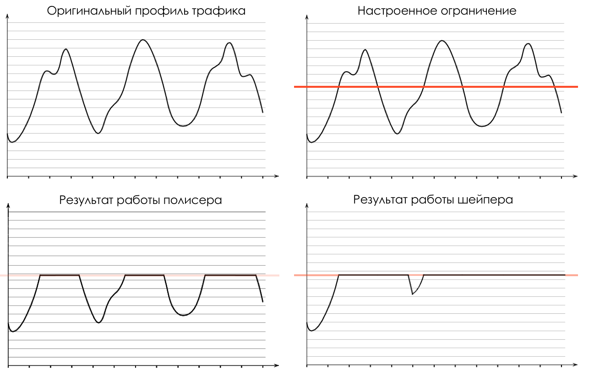

# Шейпинг против полисинга

Работа полисера похожа на нож, который, двигаясь по поверхности масла, срезает острой стороной бугорки.

Работа же шейпера похожа на валик, который разглаживает бугорки, распределяя их равномерно по поверхности.  
Шейпер старается не отбрасывать пакеты, пока они помещаются в буфер ценою увеличения задержки.  
Полисер не вносит задержек, но с большей готовностью отбрасывает пакеты.

Приложения, нечувствительные к задержкам, но для которых нежелательны потери, лучше ограничивать шейпером.

Для тех же, для которых опоздавший пакет всё равно, что потерянный, лучше его отбросить сразу — тогда полисинг.

Шейпер никак не влияет на заголовки пакетов и их судьбу за пределами узла, в то время как после полисинга устройство может перемарикровать класс в заголовке. Наример, на входе пакет имел класс AF11, метеринг покрасил его в жёлтый цвет внутри устройства, на выходе оно перемаркировало его класс на AF12 — на следующем узле у него будет более высокая вероятность отбрасывания.

