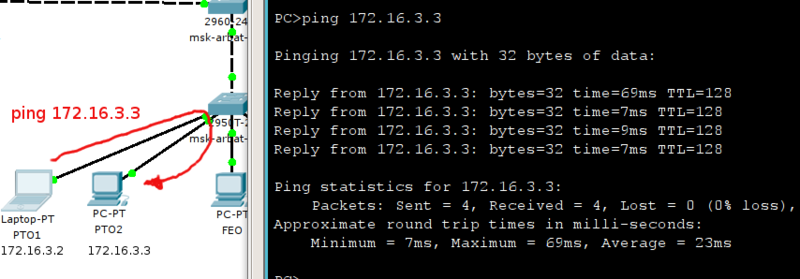

# Порты доступа (access)

Поэтому начнём с простого: настроим два порта на msk-arbat-asw3 как access для влана 101 (ПТО):

```
msk-arbat-asw3(config)#interface FastEthernet0/1
msk-arbat-asw3(config-if)#description PTO
msk-arbat-asw3(config-if)#switchport mode access
msk-arbat-asw3(config-if)#switchport access vlan 101
% Access VLAN does not exist. Creating vlan 101
msk-arbat-asw3(config)#interface FastEthernet0/2
msk-arbat-asw3(config-if)#description PTO
msk-arbat-asw3(config-if)#switchport access vlan 101
msk-arbat-asw3(config-if)switchport mode access
```

_Все настройки делаем сразу в соответствии с планом._

Заметили, что коммутатор ругается на отсутствие влана? Тут надо быть аккуратным. Некоторые версии ПО работают несколько нелогично.\
Даже если вы его не создадите, то настройки применятся и при отладке на первый взгляд всё будет нормально, но связи не будет. Причём коварство заключается в том, что фраза **`Creating vlan 101`** вовсе не означает, что этот самый влан будет создан. Поэтому отправляемся в режим глобальной конфигурации и создаём его (а заодно и все другие вланы, нужные на этом коммутаторе):

```
msk-arbat-asw3>enable
msk-arbat-asw3#configure terminal
msk-arbat-asw3(config)#vlan 2
msk-arbat-asw3(config-vlan)#name Management
msk-arbat-asw3(config-vlan)#vlan 101
msk-arbat-asw3(config-vlan)#name PTO
msk-arbat-asw3(config-vlan)#vlan 102
msk-arbat-asw3(config-vlan)#name FEO
msk-arbat-asw3(config-vlan)#vlan 103
msk-arbat-asw3(config-vlan)#name Accounting
msk-arbat-asw3(config-vlan)#vlan 104
msk-arbat-asw3(config-vlan)#name Other
```

Теперь подключите компьютеры к портам FE0/1 и FE0/2, настройте на них адреса 172.16.3.2 и 172.16.3.3 с маской подсети 255.255.255.0 и шлюзом 172.16.3.1 и проверьте связь:

<figure><figcaption></figcaption></figure>

После того, как это получилось, настроим порт FE0/16, как access, для 104-го влана (сеть других пользователей):

```
msk-arbat-asw3(config)#interface FastEthernet0/16
msk-arbat-asw3(config-if)#description Other
msk-arbat-asw3(config-if)#switchport access vlan 104
msk-arbat-asw3(config-if)switchport mode access
```

Подключите к нему компьютер и настройте адрес из той же подсети, что ПТО, например, 172.16.3.5 с маской 255.255.255.0.\
Если вы попытаетесь теперь пропинговать этот адрес, то у вас не должно этого получиться — компьютеры находятся в разных вланах и изолированы друг от друга:

<figure><figcaption></figcaption></figure>

То есть ещё раз, что происходит? От вашего компьютера приходит на 1-й порт широковещательный запрос: “Кто такой 172.16.3.5”, потому что сам компьютер пока не знает MAC-адреса получателя. Кадр, который несёт в себе этот запрос помечается, как принадлежащий 101-му VLAN’у в соответствии с портом, на который он поступил. И далее, чтобы узнать где-же находится компьютер 172.16.3.5, кадр рассылается на все порты-члены 101-го VLAN’а. А в их числе нет порта FE0/16, поэтому, естественно, этот адрес считается недостижимым, что приводит к ответу “Request timed out”.


_**Внимание!** Если в этом VLAN’е все-таки окажется устройство с таким IP, то это не будет тем же самым ноутбуком Other и при этом они не буду конфликтовать друг с другом, поскольку логически находятся в разных широковещательных доменах._

