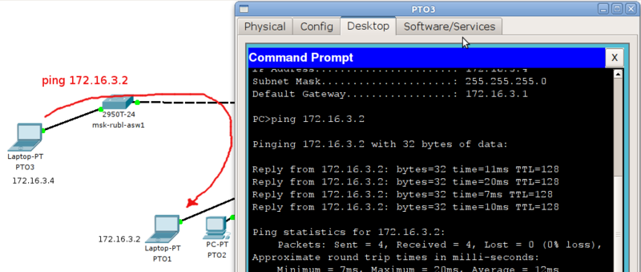
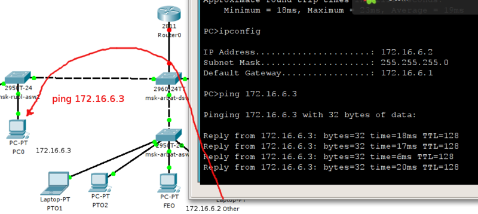

# Транковые порты (trunk)

Итак, врата для вас открылись, теперь вам предстоит создать коридор — транк между тремя коммутаторами: msk-arbat-asw3, msk-arbat-dsw1 и msk-rubl-asw1.

Uplink портом на msk-arbat-asw3 является GE1/1. Ну а поскольку нам всё равно все вланы нужно будет пробросить, то сделаем это сейчас, то есть помимо 101 и 104 пропишем 2, 102 и 103:

```
msk-arbat-asw3(config)#interface GigabitEthernet1/1
msk-arbat-asw3(config-if)#description msk-arbat-dsw1
msk-arbat-asw3(config-if)#switchport trunk allowed vlan 2,101-104
msk-arbat-asw3(config-if)#switchport mode trunk
```

На самом деле на интерфейсе достаточно команды **#switchport mode trunk**, чтобы у вас через этот порт уже пошли тегированные кадры всех вланов, потому что по умолчанию транковый порт пропускает всё. Но мы же инженеры, а не эникейщики. Где это видано, чтобы безлимит творился за нашей спиной? Поэтому через нас проходит только то, что мы разрешаем. Как только вы дали команду **switchport trunk allowed vlan 101**, через порт не пройдёт кадр никаких вланов, кроме 101 (VLAN 1 ходит по умолчанию и нетегированным).

**Внимание!** Если вы хотите в транковый порт добавить ещё один влан, то вам необходимо использовать следующий синтаксис команды:

```
msk-arbat-dsw1(config-if)#switchport trunk allowed vlan add 105
```

В противном случае (написав **switchport trunk allowed vlan 105**) вы сотрёте все старые разрешения и добавите новый 105-й влан. И хорошо ещё, если при этом вы не потеряете доступ на этот коммутататор. Но за простой связи всё равно вы получите по пятое число)

Переходим к msk-arbat-dsw1. На нём необходимо создать все вланы и настроить два порта:\
GE1/2 в сторону msk-arbat-asw3\
FE0/1 в сторону msk-rubl-asw1:

```
msk-arbat-dsw1(config)#interface GigabitEthernet1/2
msk-arbat-dsw1(config-if)#description msk-arbat-asw3
msk-arbat-dsw1(config-if)#switchport trunk allowed vlan 2,101-104
msk-arbat-dsw1(config-if)#switchport mode trunk
msk-arbat-dsw1(config)#interface FastEthernet0/1
msk-arbat-dsw1(config-if)#description msk-rubl-asw1
msk-arbat-dsw1(config-if)#switchport trunk allowed vlan 2,101,104
msk-arbat-dsw1(config-if)#switchport mode trunk
```

Ну и настроим, конечно, порты на msk-rubl-asw1:

```
msk-rubl-asw1(config)interface FastEthernet0/24
msk-rubl-asw1(config-if)#description msk-arbat-dsw1
msk-rubl-asw1(config-if)switchport trunk allowed vlan 2,101,104
msk-rubl-asw1(config-if)switchport mode trunk
msk-rubl-asw1(config)#int FastEthernet0/1
msk-rubl-asw1(config-if)#description PTO
msk-rubl-asw1(config-if)#switchport mode access 
msk-rubl-asw1(config-if)#switchport access vlan 101
% Access VLAN does not exist. Creating vlan 101
```

Снова нужно настроить вланы. И заметьте, при настройке транковых портов никаких сообщений нет.

Если вы всё настроили правильно (в чём не приходится сомневаться), то с первого порта msk-rubl-asw1 вы увидите компьютеры ПТО, подключённые к msk-arbat-asw3.

<figure><figcaption></figcaption></figure>

Для уверенности проверим ещё и 104-й влан. Через транк мы его сюда уже доставили.

```
msk-rubl-asw1(config)#interface FastEthernet 0/16
msk-rubl-asw1(config-if)#switchport mode access 
msk-rubl-asw1(config-if)#switchport access vlan 104
```

Подключаем компьютер к 16-му порту и настраиваем на нём IP-адрес 172.16.6.3 с маской 255.255.255.0 и шлюзом 172.16.6.1. А IP-адрес ноутбука на арбате поменяйте на 172.16.6.2 с теми же маской и шлюзом.

<figure><figcaption></figcaption></figure>
