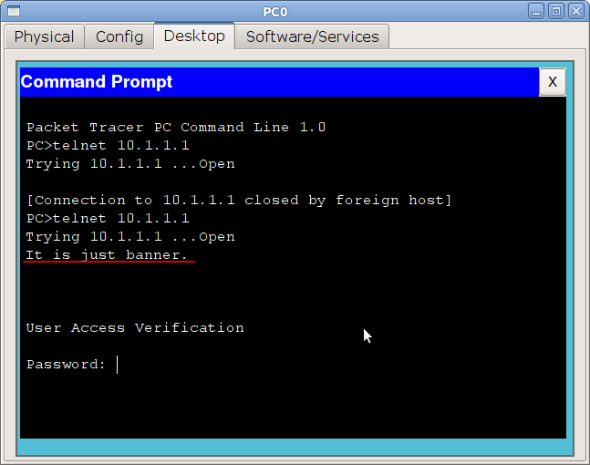

# Сеть управления и первичная настройка

Настроим IP-адрес для управления.\
В наших лабах они не понадобятся, потому что мы настраиваем устройство через окно РТ. А вот в реальной жизни это вам жизненно необходимо.\
Для этого мы создаём виртуальный интерфейс и указываем номер интересующего нас влана. А далее работаем с ним, как с самым обычным физическим интерфейсом.

**msk-arbat-dsw1:**

```
msk-arbat-dsw1(config)#interface vlan 2
msk-arbat-dsw1(config-if)#description Management
msk-arbat-dsw1(config-if)#ip address 172.16.1.2 255.255.255.0
```

**msk-arbat-asw3:**

```
msk-arbat-asw3(config)#vlan 2
msk-arbat-asw3(config)#interface vlan 2
msk-arbat-asw3(config-if)#description Management
msk-arbat-asw3(config-if)#ip address 172.16.1.5 255.255.255.0
```

С msk-arbat-asw3 запускаем пинг до msk-arbat-dsw1:

```
msk-arbat-asw3#ping 172.16.1.2

Type escape sequence to abort.
Sending 5, 100-byte ICMP Echos to 172.16.1.2, timeout is 2 seconds:
..!!!
Success rate is 60 percent (3/5), round-trip min/avg/max = 4/4/4 ms
```

Первые пару пакетов могут потеряться на работу протокола [ARP](http://xgu.ru/wiki/ARP): определение соответствия IP-адрес — MAC-адрес. При этом MAC-адрес, порт и номер влана добавляются в таблицу коммутатора.

Самостоятельно настройте IP-адреса сети управления на остальных коммутаторах и проверьте их доступность

Собственно вот и вся магия. Зачастую к подобного рода действиям и сводится вся настройка, если вы не работаете в провайдере. С другой стороны, если вы работаете в провайдере, то, наверняка, такие вещи вам объяснять не нужно. Если желаете знать больше об этом, читайте: [VTP](http://xgu.ru/wiki/VTP), [QinQ](http://www.hilik.org.ua/q-in-q-%D0%BD%D0%B0%D1%81%D1%82%D1%80%D0%BE%D0%B9%D0%BA%D0%B0-%D0%B2-cisco-catalyst-3750/), [зарезервированные номера VLAN](http://etherealmind.com/cisco-ios-vlan-1002-reserved-1005-purpose-function/)

Ещё один небольшой инструмент, который может немного увеличить удобство работы: banner. Это объявление, которое циска покажет перед авторизацией на устройство.

```
Switch(config)#banner motd q
Enter TEXT message. End with the character 'q'.
It is just banner.
q

Switch(config)#
```

После motd вы указываете символ, который будет служить сигналом о том, что строка закончена. В это примере мы поставили “q”.

<figure><figcaption></figcaption></figure>

> Относительно содержания баннера. Существует такая легенда: хакер вломился в сеть, что-то там поломал\украл, его поймали, а на суде оправдали и отпустили. Почему? А потому, что на пограничном роутере(между интернет и внутренней сетью), в banner было написано слово “Welcome”. “Ну раз просят, я и зашел”)). Поэтому считается хорошей практикой в баннере писать что-то вроде “Доступ запрещен!”.
