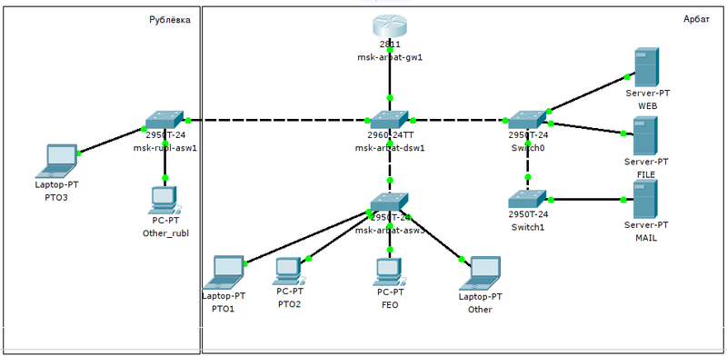

# Практика

Ну и наконец-то обратимся к настройке. Вива ля практис!

Будет у нас такая сеть:

<figure><figcaption>
sdsm net for linkmeup
</figcaption></figure>

Вспомним, как мы её планировали:

* [VLAN](https://linkmeup.gitbook.io/sdsm/0.-planirovanie/3.-spisok-vlan)
* [IP-план](https://linkmeup.gitbook.io/sdsm/0.-planirovanie/2.-ip-plan)
* [план коммутации](https://linkmeup.gitbook.io/sdsm/0.-planirovanie/4.-plan-podklyucheniya-oborudovaniya-po-portam)

Советуем на дополнительной вкладке отрыть их, потому что мы будем обращаться туда периодически.

Мы могли бы сейчас броситься сразу настраивать всё по порядку: полностью одно устройство, потом другое. Но так не будет, пожалуй, понимания значения процессов.
