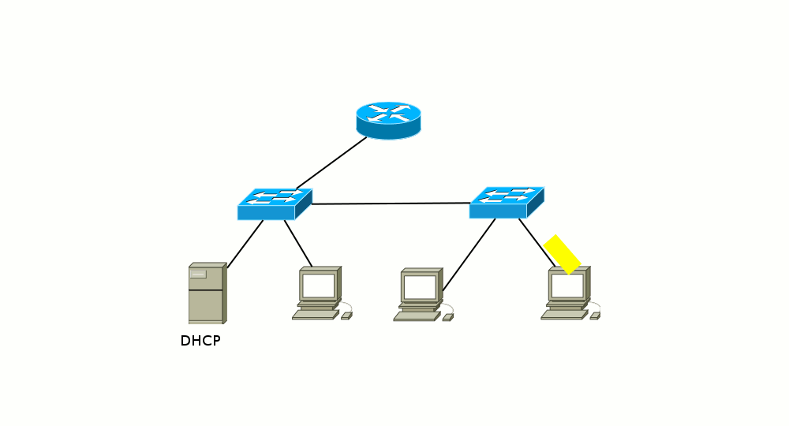
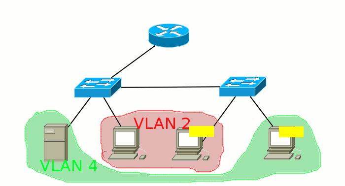

# Широковещательный домен

**Широковещательный домен** — область сети, в которой происходит обмен широковещательными сообщениями, и устройства могут отправлять друг другу сообщения непосредственно, без участия маршрутизатора.

О чём это мы тут говорим? Ну, например, послал ваш компьютер широковещательный запрос в сеть в поисках DHCP-сервера. _Фрейм_ этот (он же _кадр_) адресован всем устройствам и имеет MAC-адрес получателя FF:FF:FF:FF:FF:FF. Сначала он попадает на коммутатор, с которого его копии рассылаются на все порты. Потом часть попадает на другие компьютеры, часть уходят в соседние коммутаторы, кто-то доходит до маршрутизатора, а одну копию принимает-таки DHCP-сервер. И вот участок сети, внутри которого могут жить эти кадры и называется широковещательным доменом. А кончают свою жизнь они на конечных хостах (компьютеры, серверы) или на маршрутизаторах, которые их отбрасывают, если они им не предназначены:

<figure><figcaption>
Broadcast Example
</figcaption></figure>

Если же на коммутаторе заведены VLAN’ы, то они также разделяют широковещательные домены, потому что пакет между ними обязательно должен проходить через маршрутизатор, который отбросит широковещательные сообщения. Таким образом, один VLAN — это один широковещательный домен.

<figure><figcaption>
Broadcast with VLANs Example
</figcaption></figure>

Ещё раз: у нас есть три способа разграничить широковещательные домены:

1. Поставить маршрутизатор и разнести хосты в разные подсети
2. Разделить сеть VLAN’ами
3. Порвать кабель
