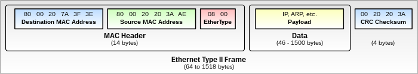

# OSI

Ну и самая жесть, которой часто сторонятся начинающие: [OSI](http://en.wikipedia.org/wiki/OSI\_model). Open System Interconnection. Вообще в двух словах, чтобы мозг не захламить за одно занятие. Эту модель называют эталонной, потому что в реальном мире дело не дошло до реализации. Но она само совершенство, поэтому инженеры и админы вворачивают это слово повсюду.

В основе лежат 7 китов сетевой иерархии: 7 уровней. Сегодня коснёмся двух нижних:

**Первый — физический** — это представление информации в виде сигналов, прямо скажем, битов. Задача этого уровня сгенерировать электрический, оптический или радиосигнал, передать его в среду и принять его. К нему относится вся физика: интерфейсы, кабели, антенны, медиаконвертеры (конвертеры среды), репитеры, старые хабы. В общем низкоуровневая это работа. Это первый уровень модели OSI и стека TCP/IP.

**Второй — канальный**. На этом уровне работают коммутаторы. Идентификатор устройства здесь, это [MAC-адрес](http://ru.wikipedia.org/wiki/MAC-%D0%B0%D0%B4%D1%80%D0%B5%D1%81). У каждого узла (компьютер, маршрутизатор, ноутбук, IP-телефон, любой Wi-Fi-клиент) есть этот уникальный адрес, который однозначно определяет устройство в локальной сети. В теории MAC-адреса не должны повторяться вообще, но на практике такое однако случается и в рамках одного широковещательного домена может приводить к сложноотлавливаемым проблемам.

Наиболее известным протоколом этого уровня является Ethernet. Данные на этом уровне передаются кусками, каждый из которых называется Ethernet-фрейм (он же Ethernet-кадр, он же [PDU](http://en.wikipedia.org/wiki/Protocol\_data\_unit) канального уровня). Что он представляет из себя?

<figure><figcaption><p>Ethernet-кадр</p></figcaption></figure>

```
*Картинку гнусно спёрли из википедии, потому что красивее не нарисуем*
```

_Payload_ — это полезная нагрузка — данные сетевого уровня, которые вкладываются (_инкапсулируются_) в кадр. _MAC Header (Заголовок)_ — это служебная информация канального (второго) уровня. Самые важные пока для нас элементы — это source MAC-address (адрес отправителя кадра) и Destination MAC-address (адрес получателя кадра).

**Третий уровень — сетевой (IP)**\
**Четвёртый — транспортный (TCP, UDP, ICMP)**\
С пятого по седьмой — сеансовый, представления и прикладной (в стеке TCP/IP они не различаются и называются просто прикладным. На нём работают протоколы вроде HTTP, FTP, telnet и многие другие)

> В [английской википедии](http://en.wikipedia.org/wiki/OSI\_model) утверждается, что ICMP относится к 3-му уровню, что является спорным моментом.

Сегодня мы акцентируемся на 1-м и 2-м уровнях, особенно на втором. Третьего и четвертого коснёмся в следующих выпусках.
