# Путь пакета

Теперь проследим нелёгкий путь кадра.\
Состояние покоя сети — утопия.

<figure>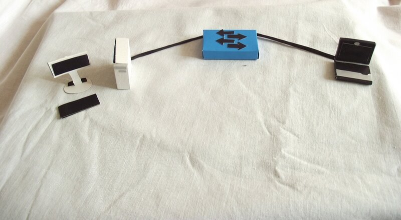<figcaption></figcaption></figure>

Вы пытаетесь пропинговать, например, адрес соседнего компьютера командой **ping 192.168.1.118**. Данные этого приложения показаны фиолетовым параллелепипедом.

<figure>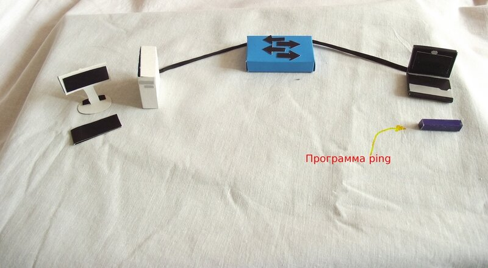<figcaption></figcaption></figure>

За это отвечает протокол [ICMP](http://ru.wikipedia.org/wiki/ICMP). В него инкапсулируется информация от приложения — это означает, что к данным 5-го уровня добавляется заголовок со служебной информацией 4-го уровня.

<figure>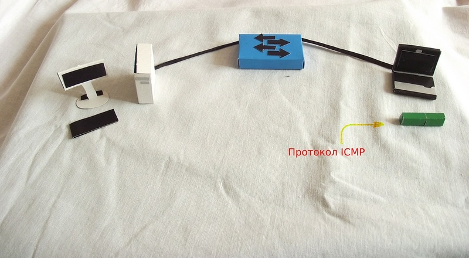<figcaption></figcaption></figure>

Его данные упаковываются (инкапсулируются) в IP-пакеты, где в заголовке указан IP-адрес получателя (192.168.1.118) и IP-адрес отправителя — логические адреса.

<figure>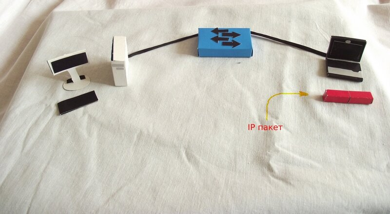<figcaption></figcaption></figure>

А затем всё это инкапсулируется в Ethernet-кадры с MAC-адресами отправителя и получателя — физическими адресами.

<figure>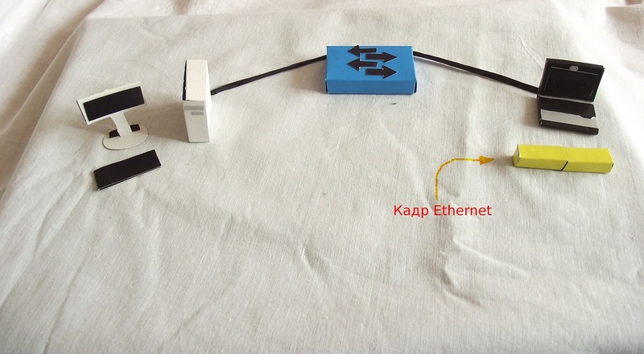<figcaption></figcaption></figure>

При формировании кадров в заголовке в качестве MAC-адреса источника (source) подставляется адрес вашего компьютера, а адресом получателя (destinantion) будет MAC-адрес компьютера — владельца IP-адреса 192.168.1.118 (о механизмах такого преобразования поговорим в следующий раз). То есть если бы вы смогли сфотографировать кадр, то вы бы увидели все эти данные в разрезе, так сказать.

На самом деле, нет ничего проще: запускаете какой-нибудь анализатор трафика, например, замечательный [Wireshark](http://www.wireshark.org/) и [Ethereal](http://www.ethereal.com), на своём компьютере и пингуете другой хост. Вот такую картину вы сможете лицезреть:

<figure>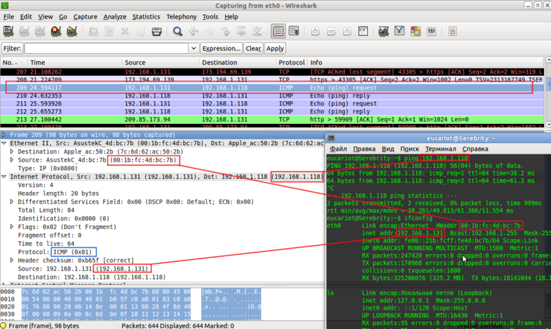<figcaption></figcaption></figure>

Вы это можете сделать прямо сейчас, читая эти строки, просто установив и запустив анализатор трафика.

В последнюю очередь сетевая карта вашего компьютера дробит фрейм на биты и отправляет их в кабель.

<figure>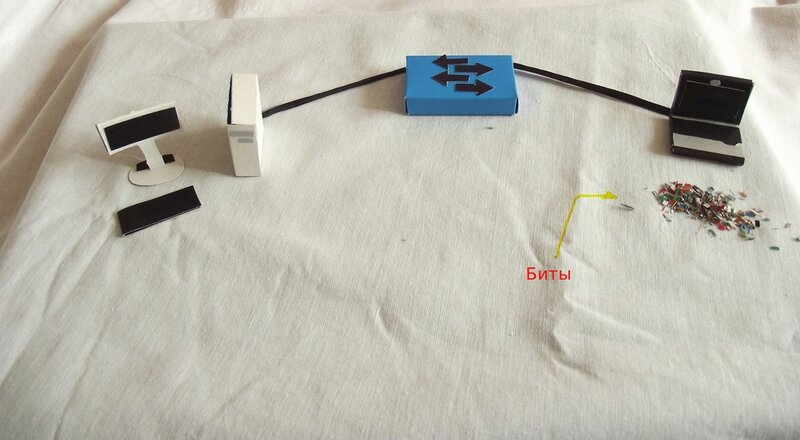<figcaption></figcaption></figure>

<figure>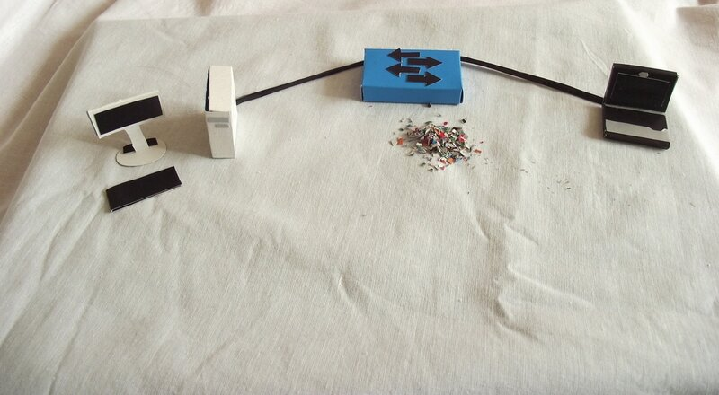<figcaption></figcaption></figure>

Коммутатор из поступивших битов собирает первоначальный кадр

<figure>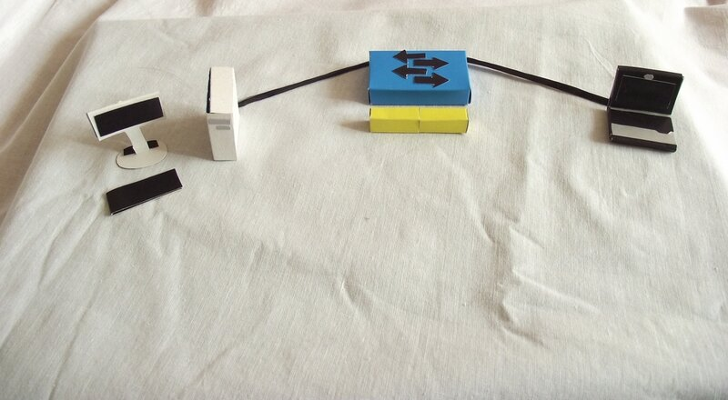<figcaption></figcaption></figure>

Далее начинается интеллектуальный труд: из заголовка извлекается адрес получателя, перетрясается таблица MAC-адресов на предмет совпадения и, как только оное найдено, кадр без изменений отправляется в указанный порт. Если же адреса пока ещё нет или кадр пришёл широковещательный, то он направляется на все порты, кроме того, откуда пришёл.

Если адреса отправителя в таблице до сих пор не было, то в этот момент коммутатор добавит его.\
Естественно, кадр опять передаётся в виде битов — это закон электроники, и вы должны просто всегда иметь это в виду.

<figure><figcaption></figcaption></figure>

<figure>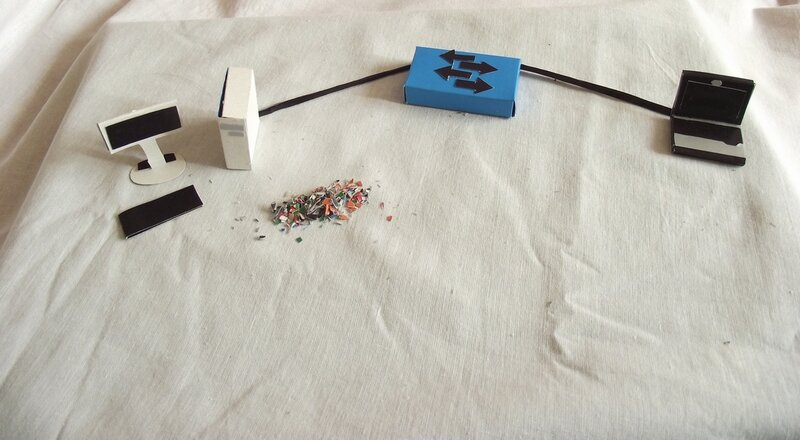<figcaption></figcaption></figure>

Конечный хост, получив поток битов, собирает из них кадр, ещё только предполагая, что он предназначается ему.

<figure>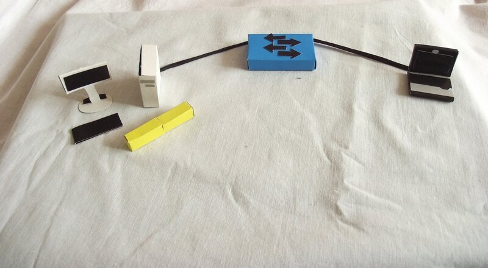<figcaption></figcaption></figure>

Далее он сравнивает MAC-адрес получателя со своим и, если они совпадают, то заголовок второго уровня отбрасывается, а IP-данные передаются на обработку вышестоящему протоколу. Если адреса не совпадают, то кадр отбрасывается вместе со всем содержимым.

<figure>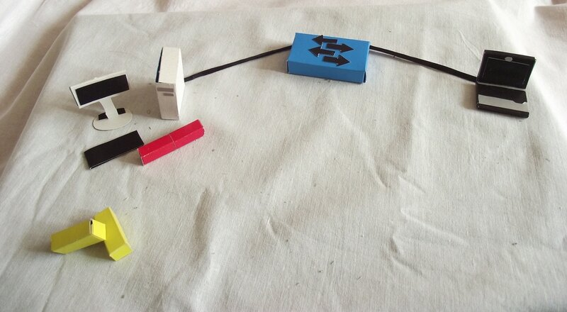<figcaption></figcaption></figure>

Далее сравниваются IP-адрес получателя и этого устройства. Если совпадают, то заголовок сетевого уровня отбрасывается, и данные передаются транспортному уровню (ICMP)

<figure>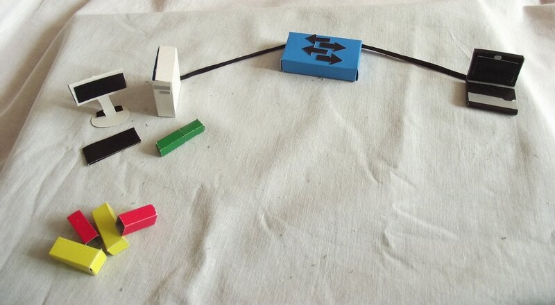<figcaption></figcaption></figure>

<figure>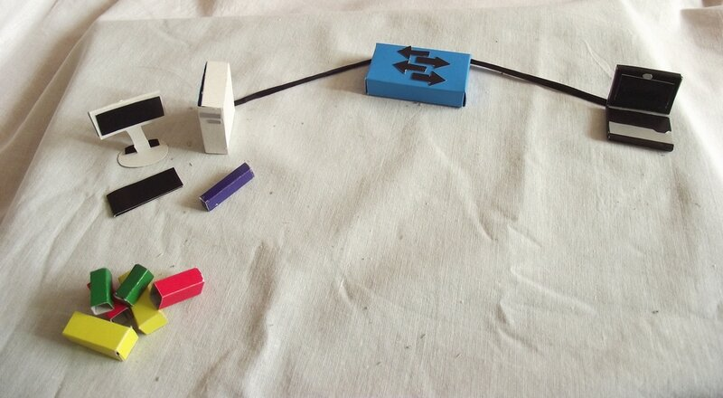<figcaption></figcaption></figure>

<figure>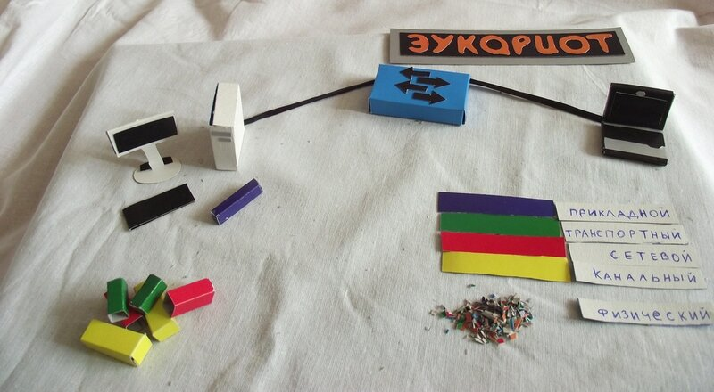<figcaption></figcaption></figure>

Конечный хост обработал ICMP-запрос (echo-request) и готов послать ICMP-ответ (echo-reply) вашему компьютеру с адресом 192.168.1.131 и далее пункты 1-3 повторяются уже для нового кадра

То, о чём мы писали до сих пор — это принцип работы любого коммутатора. Так делают даже простые длинки за 300 рублей.
