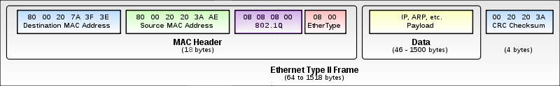

# VLAN

Ну а теперь, давайте, коллеги, финальный рывок: добавим сюда ещё VLAN’ы.

С ними работают уже только управляемые коммутаторы.\
Напомним, что вланы нужны для разделения сетей. Соответственно, появляется некий идентификатор, которым маркируется трафик разных подсетей на коммутаторе. Говоря о VLAN’ах, часто используют заклинание 802.1q. Это и есть стандарт, описывающий как именно кадр маркируется/тегируется. Пугаться такого шифра не стоит. Так же, например, Wi-Fi описывается стандартом 802.11n, а протокол аутентификации — 802.1x. Нам с этим предстоит столкнуться в будущем, поэтому отложите это в своей энергонезависимой памяти.

Что же именно происходит на кухне коммутации?\
Внутрь фрейма после Source MAC-адреса добавляется ещё одно поле, очень грубо говоря, содержащее номер VLAN’а. Длина, выделенная для номера влана равна 12 битам, это означает, что максимальное число вланов 4096. Мы хотим обратить внимание молодых инженеров на такие подробности. Дело в том, что мы в своём цикле в силу объективных причин, не можем обо всём рассказать, но такие вопросы, во-первых, часто задают на собеседованиях, во-вторых, это просто надо знать.

<figure><figcaption><p>Кадр Ethernet с полем 802.1q</p></figcaption></figure>

_Кадры первого влана обычно не тегируются — он является родным вланом (native vlan)._

Каждый коммутатор принимает теперь решение на основе этой метки-тега (или его отсутствия).\
В таблицу МАС-адресов добавляется ещё столбец с номером VLAN’а и при поиске пары MAC-адрес/порт теперь будет сравниваться тег кадра с номером VLAN’а в таблице.

Существует два типа портов:

1. _Access port_ — порт доступа — к нему подключаются, как правило, конечные узлы. Трафик между этим портом и устройством нетегированный. За каждым access-портом закреплён определённый VLAN, иногда этот параметр называют PVID. Весь трафик, приходящий на этот порт от конечного устройства, получает метку этого влана, а исходящий уходит без метки.
2.  _Trunk port_. У этого порта два основных применения — линия между двумя коммутаторами или от коммутатора к маршрутизатору. Внутри такой линии, называемой в народе, что логично, транком, передаётся трафик нескольких вланов. Разумеется, тут трафик уже идёт с тегами, чтобы принимающая сторона могла отличить кадр, который идёт в бухгалтерию, от кадра, предназначенного для ИТ-отдела. За транковым портом закрепляется целый диапазон вланов.

    Кроме того, существует вышеупомянутый _native vlan_. Трафик этого влана не тегируется даже в транке, по умолчанию это 1-й влан и по умолчанию он разрешён. Вы можете переопределить эти параметры.

    Нужен он для совместимости с устройствами, незнакомыми с инкапсуляцией 802.1q. Например, вам нужно через Wi-Fi мост передать 3 влана, и один из них является вланом управления. Если Wi-Fi-модули не понимают стандарт 802.1q, то управлять ими вы сможете, только если этот влан настроите, как native vlan с обеих сторон.

Что происходит в сети с вланами?

1\) Итак, от вашего компьютера с IP-адресом, например, 192.168.1.131 отправляется пакет другому компьютеру в вашей же сети. Этот пакет инкапсулируется в кадр, и пока никто ничего не знает о вланах, поэтому кадр уходит, как есть, на ближайший коммутатор.\
2\) На коммутаторе этот порт отмечен, как член, например, 2-го VLAN’а командой

```
Switch0#interface fa0/1
Switch0(config)#description “I am using simple frames”
Switch0(config-if)#switchport mode access
Switch0(config-if)#switchport access vlan 2
```

Это означает, что любой кадр, пришедший на этот интерфейс, автоматический тегируется: на него вешается ленточка с номером VLAN’а. В данном случае с номером 2.\
Далее коммутатор ищет в своей таблице MAC-адресов среди портов, принадлежащих 2-му влану, порт, к которому подключено устройство с MAC-адресом получателя.\
3\) Если получатель подключен к такому же access-порту, то ленточка с кадра отвязывается, и кадр отправляется в этот самый порт таким, каким он был изначально. То есть получателю также нет необходимости знать о существовании вланов.\
4\) Если же искомый порт, является транковым, то ленточка на нём остаётся.

```
Switch(config)#interface fa0/2
Switch(config-if)#description “I am using tagged frames”
Switch(config-if)#switchport mode trunk
```

Попробуем провести аналогию с реальными миром. Вы с другом, например, пакеты-туристы и летите отдыхать дикарями самолётом авиалиний Ethernet Airlines. Но по дороге вы поссорились, и потому, когда в аэропорту назначения, вас спрашивают в какую гостиницу вас везти, вы отвечаете “Рога”, а ваш товарищ говорит “Копыта”. И сразу после этого вас инкапсулируют в разные кадры-машины: вас в такси с тегом “Таксопарк “На рогах”, а вашего товарища с его грузом в КамАЗ с тегом “Транспортная компания “В копыто”. Теперь вам нельзя на автобусные полосы, а вашему другу под знаки, запрещающие проезд грузовиков.\
Так вот две гостиницы — это МАС-адреса назначения, а ограничения по маршруту — порты других вланов.\
Петляя, по улочкам, вам, как IP-пакету не о чем беспокоиться — кадр-автомобиль доставит вас до места назначения, и, грубо говоря, в зависимости от тега на каждом перекрёстке будет приниматься решение, как ехать дальше.
