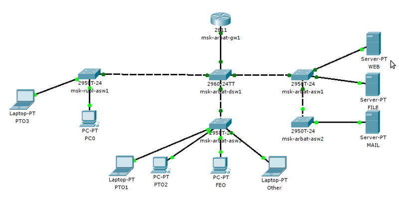
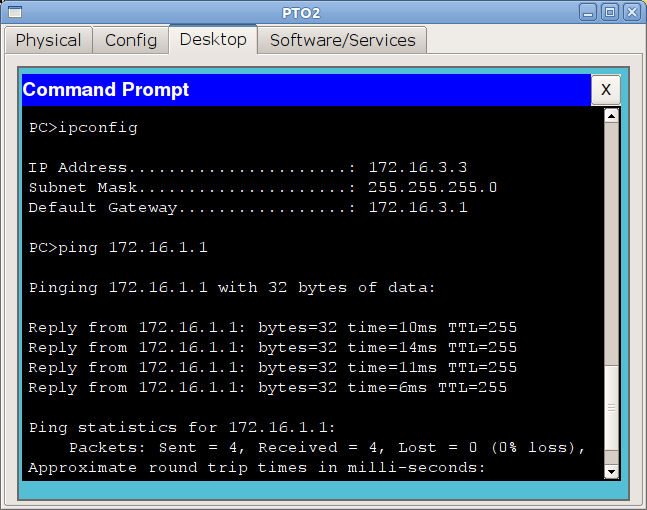
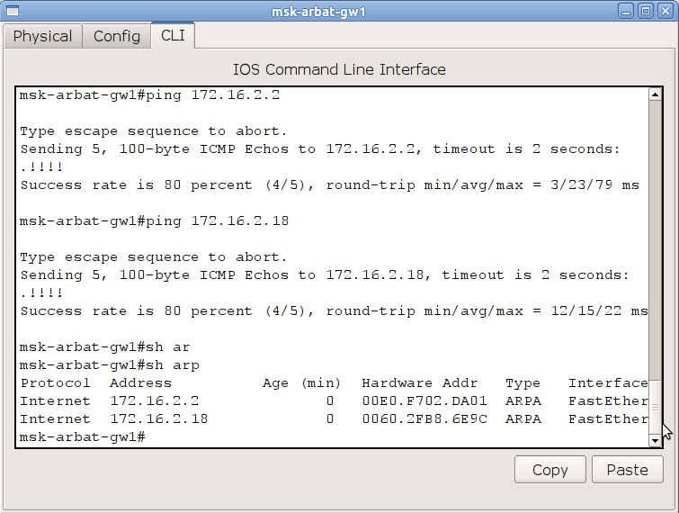
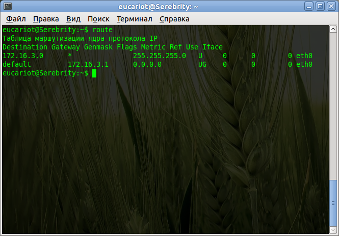
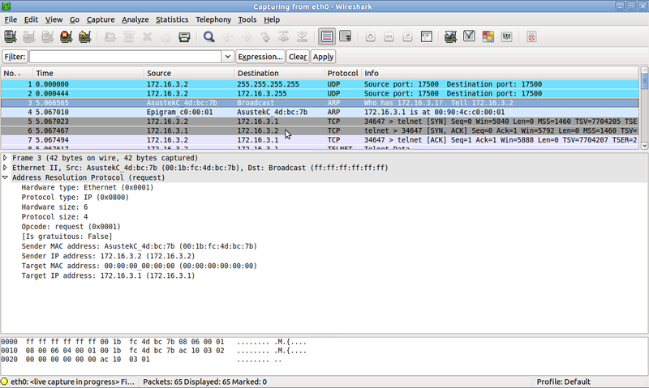
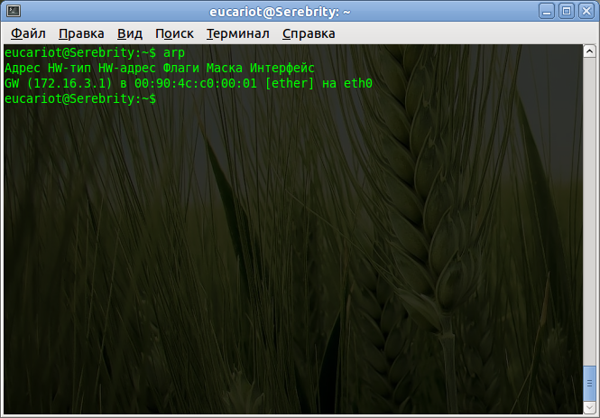

# InterVlan Routing

## InterVlan Routing

Чуточку практики для взбадривания.\
В [предыдущий](https://linkmeup.gitbook.io/sdsm/2.-switching) раз мы настроили коммутаторы нашей локальной сети. На данный момент устройства разных вланов не видят друг друга. То есть фактически ФЭО и ПТО, например, находятся в совершенно разных сетях и не связаны друг с другом. Так же и серверная сеть существует сама по себе. Надо бы исправить эту досадную неприятность.\
В нашей московской сети для маршрутизации между вланами мы будем использовать роутер cisco 2811. Иными словами он будет терминировать вланы. Кадры здесь заканчивают свою жизнь: из них извлекаются IP-пакеты, а заголовки канального уровня отбрасываются.

<figure><figcaption></figcaption></figure>

Процесс настройки маршрутизатора очень прост:

0\) Сначала закончим с коммутатором msk-arbat-dsw1. На нём нам нужно настроить транковый порт в сторону маршрутизатора, чего мы не сделали в прошлый раз.

```
msk-arbat-dsw1(config)#interface FastEthernet0/24
msk-arbat-dsw1(config-if)# description msk-arbat-gw1
msk-arbat-dsw1(config-if)# switchport trunk allowed vlan 2-3,101-104
msk-arbat-dsw1(config-if)# switchport mode trunk
```

1\) Назначаем имя маршрутизатора командой **hostname**, а для развития хорошего тона, надо упомянуть, что лучше сразу же настроить время на устройстве. Это поможет вам корректно идентифицировать записи в логах.

```
Router0#clock set 12:34:56 7 august 2012
Router0# conf t
Router0(config)#hostname msk-arbat-gw1
```

Желательно время на сетевые устройства раздавать через [NTP](http://ru.wikipedia.org/wiki/Ntp) (любую циску можно сделать NTP-сервером, кстати)

2\) Далее переходим в режим настройки интерфейса, обращённого в нашу локальную сеть и включаем его, так как по умолчанию он находится в состоянии Administratively down.

```
msk-arbat-gw1(config)#interface fastEthernet 0/0
msk-arbat-gw1(config-if)#no shutdown
```

3\) Создадим виртуальный интерфейс или иначе его называют подинтерфейс или ещё сабинтерфейс (sub-interface).

```
msk-arbat-gw1(config)#interface fa0/0.2
msk-arbat-gw1(config-if)#description Management
```

Логика тут простая. Сначала указываем обычным образом физический интерфейс, к которому подключена нужная сеть, а после точки ставим некий уникальный идентификатор этого виртуального интерфейса. Для удобства, обычно номер сабинтерфейса делают аналогичным влану, который он терминирует.

4\) Теперь вспомним о стандарте [802.1q](http://xgu.ru/wiki/802.1Q), который описывает тегирование кадра меткой влана. Следующей командой вы обозначаете, что кадры, исходящие из этого виртуального интерфейса будут помечены тегом 2-го влана. А кадры, входящие на физический интерфейс FastEthernet0/0 с тегом этого влана будут приняты виртуальным интерфейсом FastEthernet0/0.2.

```
msk-arbat-gw1(config-if)#encapsulation dot1Q 2
```

5\) Ну и как на обычном физическом L3-интерфейсе, определим IP-адрес. Этот адрес будет шлюзом по умолчанию (default gateway) для всех устройств в этом влане.

```
msk-arbat-gw1(config-if)#ip address 172.16.1.1 255.255.255.0
```

Аналогичным образом настроим, например, 101-й влан:

```
msk-arbat-gw1(config)#interface FastEthernet0/0.101
msk-arbat-gw1(config-if)#description PTO
msk-arbat-gw1(config-if)#encapsulation dot1Q 101
msk-arbat-gw1(config-if)#ip address 172.16.3.1 255.255.255.0
```

и теперь убедимся, что с компьютера из сети ПТО мы видим сеть управления:



Работает и отлично, настройте пока все остальные интерфейсы. Проблем с этим возникнуть не должно.

## Физика и логика процесса межвланной маршрутизации

Что происходит в это время с вашими данными? Мы рассуждали в [прошлый раз](https://linkmeup.gitbook.io/sdsm/2.-switching), что происходит, если вы пытаетесь связаться с устройством из той же самой подсети, в которой находитесь вы. Под той же самой подсетью мы понимаем следующее: например, на вашем компьютере настроено следующее:\
IP: 172.16.3.2\
Mask: 255.255.255.0\
GW: 172.16.3.1

Все устройства, адреса которых будут находиться в диапазоне 172.16.3.1-172.16.3.254 с такой же маской, как у вас, будут являться членами вашей подсети. Что происходит с данными, если вы отправляете их на устройство с адресом из этого диапазона? Повторим это с некоторыми дополнениями.

Для отправки данных они должны быть упакованы в Ethernet-кадр, в заголовок которого должен быть вставлен MAC-адрес удалённого устройства. Но откуда его взять?\
Для этого ваш компьютер рассылает широковещательный ARP-запрос. В качестве IP-адреса узла назначения в APR-запросе будет указан адрес искомого хоста. Сетевая карта при инкапсуляции указывает MAC-адрес FF:FF:FF:FF:FF:FF — это значит, что кадр предназначен всем устройствам. Далее он уходит на ближайший коммутатор и копии рассылаются на все порты нашего влана (ну, кроме, конечно, порта, из которого получен кадр). Получатели видят, что запрос широковещательный и они могут оказаться искомым хостом, поэтому извлекают данные из кадра. Все те устройства, которые не обладают указанным в ARP-запросе IP-адресом, просто игнорируют запрос, а вот устройство-настоящий получатель ответит на него и вышлет первоначальному отправителю свой MAC-адрес. Отправитель (в данном случае, наш компьютер) помещает полученный MAC в свою таблицу соответствия IP и MAC адресов ака ARP-кэш. Как выглядит ARP-кэш на вашем компьютере прямо сейчас, вы можете посмотреть с помощью команды **arp -a**



Потом ваши полезные данные упаковываются в IP-пакет, где в качестве получателя ставится тот адрес, который вы указали в команде/приложении, затем в Ethernet-кадр, в заголовок которого помещается полученный ARP-запросом MAC-адрес. Далее кадр отправляется на коммутатор, который, согласно своей таблице MAC-адресов, решает, в какой порт его переправить дальше.

Но что происходит, если вы пытаетесь достучаться до устройства в другом влане? ARP-запрос ничего не вернёт, потому что широковещательные L2 сообщения кончаются на маршрутизаторе(т.е., в пределах широковещательного L2 домена), нужная сеть находится за ним, а коммутатор не пустит кадры из одного влана в порт другого. И вот для этого нужен шлюз по умолчанию (default gateway) на вашем компьютере. То есть, если устройство-получатель в вашей же подсети, кадр просто отправляется в порт с мак-адресом конечного получателя. Если же сообщение адресовано в любую другую подсеть, то кадр отправляется на шлюз по умолчанию, поэтому в качестве MAC-адреса получателя подставится MAC-адрес маршрутизатора.

Проследим за ходом событий.

1\) ПК с адресом 172.16.3.2/24 хочет отправить данные компьютеру с адресом 172.16.4.5.\
\
Он видит, что адрес из другой подсети, следовательно, данные должны уйти на шлюз по умолчанию. Но в таком случае, ПК нужен MAC-адрес шлюза. ПК проверяет свой ARP-кэш в поисках соответствия IP-адрес шлюза — MAC-адрес и не находит нужного


2\) ПК отправляет широковещательный ARP-запрос в локальную сеть. Структура ARP-запроса:\
— на канальном уровне в качестве получателя — широковещательный адрес ( FF:FF:FF:FF:FF:FF), в качестве отправителя — MAC-адрес интерфейса устройства, пытающегося выяснить IP\
— на сетевом — собственно ARP-запрос, в нем содержится информация о том, какой IP и кем ищется.\




3\) Коммутатор, на который попал кадр, рассылает его копии во все порты этого влана (того, которому принадлежит изначальный хост), кроме того, откуда он получен.\
4\) Все устройства, получив этот кадр и, видя, что он широковещательный, предполагают, что он адресован им.\
5\) Распаковав кадр, все хосты, кроме маршрутизатора, видят, что в ARP-запросе не их адрес. А маршрутизатор посылает [unicast’овый](http://eucariot.livejournal.com/62043.html) ARP-ответ со своим MAC-адресом.\
6\) Изначальный хост получает ARP-ответ, теперь у него есть MAC-адрес шлюза. Он формирует пакет из тех данных, что ему нужно отправить на 172.16.4.5. **В качестве** _**MAC-адреса**_ **получателя ПК ставит адрес шлюза. При этом** _**IP-адрес**_ **получателя в пакете остаётся 172.16.4.5**\




7\) Кадр посылается в сеть, коммутаторы доставляют его на маршрутизатор.\
8\) На маршрутизаторе, в соответствии с меткой влана, кадр принимается конкретным сабинтерфейсом. **Данные канального уровня откидываются**.\
9\) Из заголовка IP-пакета, рутер узнаёт адрес получателя, а из своей таблицы маршрутизации видит, что тот находится в непосредственно подключенной к нему сети на определённом сабинтерфейсе (в нашем случае FE0/0.102).

```
C 172.16.0.0/24 is directly connected, FastEthernet0/0.3
C 172.16.1.0/24 is directly connected, FastEthernet0/0.2
C 172.16.2.16/30 is directly connected, FastEthernet0/1.5
C 172.16.3.0/24 is directly connected, FastEthernet0/0.101
C 172.16.4.0/24 is directly connected, FastEthernet0/0.102
C 172.16.5.0/24 is directly connected, FastEthernet0/0.103
C 172.16.6.0/24 is directly connected, FastEthernet0/0.104
```

10\) Маршрутизатор отправляет ARP-запрос с этого сабинтерфейса — узнаёт MAC-адрес получателя.\
11\) Изначальный IP-пакет, не **изменяясь** инкапсулируется в **новый кадр**, при этом:

* в качестве MAC-адреса источника указывается адрес интерфейса шлюза
* IP-адрес источника — адрес изначального хоста (в нашем случае 172.16.3.2)
* в качестве MAC-адреса получателя указывается адрес конечного хоста
* IP-адрес получателя — адрес конечного хоста (в нашем случае 172.16.4.5)

и отправляется в сеть с сабинтерфейса FastEthernet0/0.102, получая при этом метку 102-го влана.

12\) Кадр доставляется коммутаторами до хоста-получателя.
